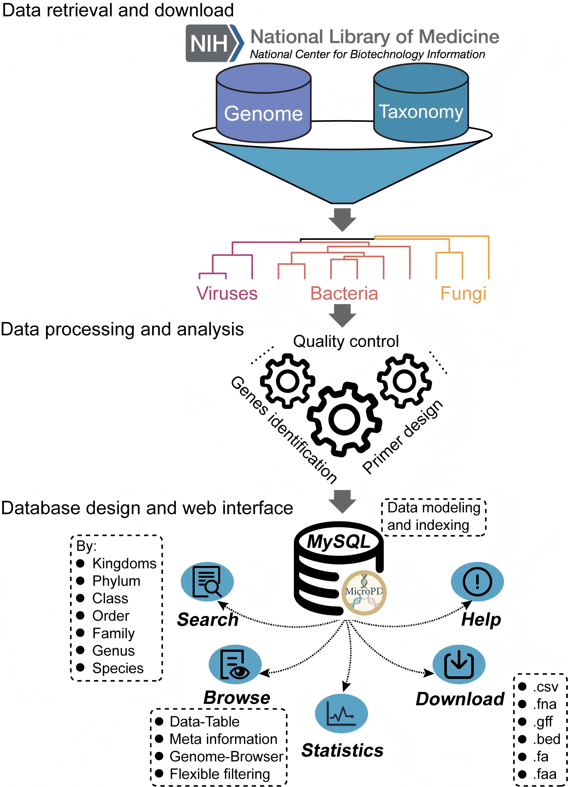

# MicroPD: a functional gene-based PCR primer database for comprehensive microbial detection



---

### Web interface  
🔗 [https://www.primerbanks.com/](https://www.primerbanks.com/)

---

## Script Description

All scripts are located in the `scripts/` directory and are numbered according to their execution order.  
Each script handles a specific part of the MicroPD data processing workflow.

📂 *Directory structure example:*
```bash
scripts/
├── 10_filter_table_by_threshold.py
├── 11_run_prokka_annotation.sh
├── 12_fetch_cds_dna_seq_bacteria.R
├── 13_extract_long_genes.sh
├── 14_fetch_specifi_gene_fq.py
├── 15_fetch_specifi_gene_fq.sh
├── 16_merge_fa.sh
├── 17_cdhit_cluster_analysis.sh
├── 18_merge2fasta.py
└── 19_rebuild_fasta.sh
...
```

#### 10_filter_table_by_threshold.py  
Based on the results of the MASH algorithm, filter out similar genomes.

#### 11_run_prokka_annotation.sh  
Runs Prokka in batch mode to annotate genome files (`.fna`).  
Generates amino acid (`.faa`), nucleotide (`.ffn`), and annotation tables (`.tsv`).  
Parallel processing is used to enhance efficiency.

#### 12_fetch_cds_dna_seq_bacteria.R  
Extracts CDS DNA sequences from Prokka annotation tables (`.tsv`) and outputs FASTA files.


