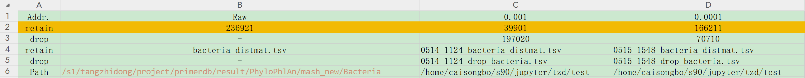

# Welcome to MicroPD
> MicroPD (https://www.primerbanks.com/) is the largest dedicated PCR-primer resource for microbial detection, offering more than 33,600,000 rigorously evaluated primer pairs that target 10,309,494 functional genes across 36,461 bacterial, 10,430 viral and 342 fungal genomes. By focusing on functional genes (rather than traditional 16S rRNA or ITS regions), MicroPD achieves strain-level specificity and heightened sensitivity in complex mixed samples.

> This document describes the standard workflow for microbial genome annotation, sequence filtering, and gene clustering using Prokka, CD-HIT, and related tools. All software setup, scripts, and command-line operations are included below.

# 🚂 Standard Version




# Part 1 一 Prologue

软件版本

```Shell
Prokka:1.14.6
Diamond:2.1.9
Pysam:0.22.1
Biopython:1.78
perl:5.34.0
Bowtie2:2.5.4
cd-hit-est:4.8.1
----
primer3-py:0.6.1
pandas:1.5.3
numpy-1.21.2
python 3.9
pysam_0.17.0
-----
samtools v1.21
blastn: 2.15.0+
```

/s1/store91/woodman/jupyter/tzd/test

测试阶段

```Bash
# bacteria_distmat.tsv -> 300+G
# 取1000*1000测试代码
awk 'NR <= 1000' /s1/tangzhidong/project/primerdb/result/PhyloPhlAn/mash_new/Bacteria/bacteria_distmat.tsv | cut -f 1-1000 > dis_1k.tsv

# 阈值为0.001过滤出的39901个核酸序列的距离矩阵
awk 'NR <= 10000' ./output/0514_1003_bacteria_distmat.tsv | cut -f 1-10000 > dis_filter_1w.tsv
awk 'NR == 1 || (NR >= 100001 && NR <= 200000)'
# 取第一列,作为label,同时也是刷选fna的依据
cut -f 1 ./bacteria_distmat.tsv > row_1.txt 
awk -F'\t' '{print $1}' ./bacteria_distmat.tsv > row_1.txt 

# 取最后一列,当成label
# 效率较高。cut 命令可以直接定位到最后一列，而无需处理整个文件。对于大型文件，这是一个很大的优势。
cut -f -1 300g.tsv > last_col.txt
# 效率最高。awk 命令也非常高效，可以直接访问最后一列 ($NF)，并避免处理整个文件。
awk -F'\t' '{print $NF}' 300g.tsv > last_col.txt
```

tsv—>fna_list,   
 result：tsv_label.tgz(all)

```Bash
import numpy as np
import csv,time
from tqdm import tqdm
import os

def try_float(item):
    """尝试将输入转换为浮点数，如果失败则返回一个很大的数"""
    try:
        return float(item)
    except ValueError:
        return float('inf')

file_path = '/s1/tangzhidong/project/primerdb/result/PhyloPhlAn/mash_new/Bacteria/bacteria_distmat.tsv'
suf = time.strftime("%m%d_%H%M", time.localtime())
output_path = f'./test/{suf}_bacteria_distmat.tsv'
drop_path = f'./test/{suf}_drop_bacteria.tsv'
threshold_value = 0.0001#default:0.001

# # 从 r1.txt 读取第一列数据
first_column  = np.genfromtxt(file_path, delimiter='\t', max_rows=1, dtype='str')[1:]
first_column = np.array([line.split('/')[-1] for line in first_column])

to_remove = set()

with open(file_path, 'r', encoding='utf-8') as file:
    reader = csv.reader(file, delimiter='\t')
    next(reader)  # 跳过第一行（标题行）
    
    for i, row in tqdm(enumerate(reader), desc="Analyzing rows"):
        # 计算大于0且小于等于0.01的值的数量
        count = sum(1 for item in row[1:] if item and try_float(item) <= threshold_value)#0.0001)
        if count >= 2:
            to_remove.add(i)

# + editable=true slideshow={"slide_type": ""}
with open(file_path, 'r', encoding='utf-8') as infile, \
     open(output_path, 'w', newline='', encoding='utf-8') as outfile, \
     open(drop_path, 'w', newline='', encoding='utf-8') as dropfile:
    reader = csv.reader(infile, delimiter='\t')
    writer = csv.writer(outfile, delimiter='\t')
    drop_writer = csv.writer(dropfile, delimiter='\t')
    
    # 写入标题行
    header = next(reader)
    writer.writerow([''] + [first_column[i] for i in range(len(first_column)) if i not in to_remove])
    drop_writer.writerow([''] + [first_column[i] for i in range(len(first_column)) if i in to_remove])
    
    for i, row in tqdm(enumerate(reader), desc="Writing filtered data"):
        if i not in to_remove:
            writer.writerow([first_column[i]] + [row[j + 1] for j in range(len(row) - 1) if j not in to_remove])
        else:
            drop_writer.writerow([first_column[i]] + [row[j + 1] for j in range(len(row) - 1) if j in to_remove])
```

安装依赖软件，建议全用anaconda
可以直接部署在conda里面。prokka,diamond 和bowtie2

```Bash
# https://github.com/bbuchfink/diamond/releases
wget https://github.com/bbuchfink/diamond/releases/download/v2.1.9/diamond-linux64.tar.gz
tar xzf diamond-linux64.tar.gz
mv diamond /usr/local/bin/
```

# Part 2 — Prokka

https://github.com/tseemann/prokka
2.1  fna—>faa,fnn,tsv,fna(每行长度从80→60)

```Python
#!/bin/bash
# conda activate Bio prokka_diamond
output='./output'
list_file="/s2/woodman/Prokka2/labels/part_00_aj"

cd $output
echo $(date +%F_%H:%M:%S)
parallel -j 8 '
    name=$(basename "{}" | sed 's/_genomic.*//')
    #mkdir -p "$name"
    prokka "/s2/woodman/Prokka2/twelve_bacterial_fa_qc/{}" --prefix "$name" --cpus 8 --kingdom Bacteria
' < "$list_file"

echo $(date +%F_%H:%M:%S)
```


## 2.2 ffn+tsv⇒fasta

R：fetch_cds_dna_seq_bacteria.r

```R
rm(list = ls())
library(Biostrings)
setwd("./test/")
output_path <- "/s3/SHARE/woodman/Prokka2/bacteria_cds/"
file_folder <- list.files()
for(i in 1:length(file_folder))
{
    anno_file_path <- paste0(file_folder[i], "/", file_folder[i], ".tsv")
    anno_file <- read.delim(anno_file_path, sep = "\t", header = T)
    if(dim(anno_file)[1] > 0)
    {
        cds_anno <- anno_file[which(anno_file$ftype == "CDS"), ]
        if(dim(cds_anno)[1] > 0)
        {
            cds_id <- paste0(cds_anno$locus_tag, " ", cds_anno$product)
            fa_file_path <- paste0(file_folder[i], "/", file_folder[i], ".ffn")
            fa_file <- readDNAStringSet(fa_file_path)
            sub_fa_file <- fa_file[cds_id]
            out_path <- paste0(output_path, file_folder[i], ".fasta")
            writeXStringSet(sub_fa_file, out_path, format="fasta")
        }
    }
}
```

R：cds_dna_sqe.r（recommend）
检测是否有已运行的，若已存在则跳过，进入下一个迭代。

```R
# 输出当前工作目录
print(getwd())
cat("Starting script execution...\n")

# 清除工作环境
rm(list = ls())
library(Biostrings)

# 设置工作目录和输出路径
setwd("/s3/SHARE/woodman/Prokka2/output/")
output_path <- "/s3/SHARE/woodman/Prokka2/bacteria_cds/12w/"

# 创建输出路径和日志文件路径
if (!dir.exists(output_path)) {
    dir.create(output_path, recursive = TRUE)
}
log_dir <- "/s3/SHARE/woodman/Prokka2/logs"
if (!dir.exists(log_dir)) {
    dir.create(log_dir)
}
error_log_path <- file.path(log_dir, "tsv_error.log")

# 获取文件夹列表
file_folder <- list.files()

# 处理每个文件夹
for (i in 1:length(file_folder)) {
    anno_file_path <- paste0(file_folder[i], "/", file_folder[i], ".tsv")
    out_files <- paste0(output_path, file_folder[i], ".fasta")
    
    # 检查输出文件是否已存在
    if (file.exists(out_files)) {
        cat(file_folder[i], "already processed, skipping.\n")
        next
    }

    # 检查注释文件是否存在
    if (file.exists(anno_file_path)) {
        anno_file <- read.delim(anno_file_path, sep = "\t", header = TRUE)
        
        if (dim(anno_file)[1] > 0) {
            cds_anno <- anno_file[which(anno_file$ftype == "CDS"), ]
            if (dim(cds_anno)[1] > 0) {
                cds_id <- paste0(cds_anno$locus_tag, " ", cds_anno$product)
                fa_file_path <- paste0(file_folder[i], "/", file_folder[i], ".ffn")
                
                if (file.exists(fa_file_path)) {
                    fa_file <- readDNAStringSet(fa_file_path)
                    sub_fa_file <- fa_file[cds_id]
                    writeXStringSet(sub_fa_file, out_files, format = "fasta")
                } else {
                    cat(file_folder[i], "\n", file = error_log_path, append = TRUE)
                }
            }
        }
    } else {
        cat(file_folder[i], "\n", file = error_log_path, append = TRUE)
    }
}

cat("Script execution completed.\n")
```

output

```Shell
$ls bacteria_cds/12w/ | head
GCF_000006645.1_ASM664v1.fasta
GCF_000006665.1_ASM666v1.fasta
GCF_000006745.1_ASM674v1.fasta
GCF_000006825.1_ASM682v1.fasta
GCF_000006845.1_ASM684v1.fasta
GCF_000006905.1_ASM690v1.fasta
GCF_000006925.2_ASM692v2.fasta
GCF_000007025.1_ASM702v1.fasta
GCF_000007205.1_ASM720v1.fasta
GCF_000007245.1_ASM724v1.fasta
------------------------------------------
>JILGOOHL_00001 Protein MioC
ATGGCTGACATAACGTTGATAAGTGGCAGTACGCTTGGTAGTGCTGAATATGTTGCTGAACATTTAGCGGATAAATTAGA
AGAAGCTGGGTTTTCTACAGAAATACTTCATGGCCCAGAGTTGGACGAACTTACGCTGAATGGCCTGTGGTTAATCGTGA
CATCCACTCATGGTGCCGGGGATCTACCTGATAACTTGCAGCCATTATTAGAACAGATCGAACAACAAAAGCCTGATTTA
TCCCAAGTACGCTTTGGGGCGGTTGGTTTAGGCAGCTCAGAATATGACACTTTCTGCGGTGCAATCATAAAACTGGATCA
ACAATTGATCGCACAAGGTGCTCAACGGTTGGGTGAAATATTAGAAATTGACGTCATCCAACATGAAATACCAGAGGATC
CAGCAGAGATTTGGGTCAAAGATTGGATTAATTTACTCTAA
>JILGOOHL_00002 Regulatory protein AsnC
ATGAGTGAAATTTATCAGATCGATAATCTCGATCGCAGCATCCTGAAAGCATTAATGGAAAATGCACGCACACCCTATGC
TGAATTAGCCAAAAACCTCGCTGTTAGCCCCGGAACTATTCATGTAAGAGTAGAAAAGATGCGGCAAGCAGGGATCATTA
CCGCAGCTTGTGTACACGTTAACCCAAAACAACTGGGTTACGACGTTTGCTGCTTTATTGGCATAATCTTGAAAAGTGCC
AAAGATTACCCTTCCGCCTTGAAAAAATTGGAAAGCTTAGAAGAAGTGGTTGAGGCCTATTACACCACTGGCCACTACAG
CATATTTATTAAAGTGATGTGTAAATCCATTGATGCATTGCAGCAGGTACTTATCAACAAAATCCAGACTATTGATGAGA
TCCAGTCAACCGAGACACTAATATCACTGCAAAACCCTATCATGCGTACGATCGTTCCTTAA
>JILGOOHL_00003 Aspartate--ammonia ligase
ATGAAAAAACAATTTATCCAAAAACAACAACAAATCAGCTTCGTAAAATCATTCTTTTCCCGCCAATTAGAGCAACAACT
TGGCTTGATCGAAGTCCAGGCTCCTATTTTGAGCCGTGTGGGTGATGGAACCCAAGATAACCTTTCTGGTTCTGAGAAAG
CGGTACAGGTAAAAGTTAAGTCATTGCCGGATTCAACTTTTGAAGTTGTACATTCATTAGCGAAGTGGAAACGTAAAACC
TTAGGGCGTTTTGATTTTGGTGCTGACCAAGGGGTGTATACCCATATGAAAGCATTGCGCCCAGATGAAGATCGCCTGAG
TGCTATTCATTCTGTATATGTAGATCAGTGGGATTGGGAACGGGTTATGGGGGACGGTGAACGTAACCTGGCTTACCTGA
AATCGACTGTTAACAAGATTTATGCAGCGATTAAAGAAACTGAAGCGGCGATCAGTGCTGAGTTTGGTGTGAAGCCTTTC
CTGCCGGATCATATTCAGTTTATCCACAGTGAAAGCCTGCGGGCCAGATTCCCTGATTTAGATGCTAAAGGCCGTGAACG
TGCAATTGCCAAAGAGTTAGGTGCTGTCTTCCTTATAGGGATTGGTGGCAAATTGGCAGATGGTCAATCCCATGATGTTC
GTGCGCCAGATTATGATGATTGGACCTCTCCGAGTGCGGAAGGTTTCTCTGGATTAAACGGCGACATTATTGTCTGGAAC
CCAATATTGGAAGATGCCTTTGAGATATCTTCTATGGGAATTCGTGTTGATGCCGAAGCTCTTAAGCGTCAGTTAGCCCT
GACTGGCGATGAAGACCGCTTGGAACTGGAATGGCATCAATCACTGTTGCGCGGTGAAATGCCACAAACTATCGGGGGAG
GTATTGGTCAGTCCCGCTTAGTGATGTTATTGCTGCAGAAACAACATATTGGTCAGGTGCAATGTGGTGTTTGGGGCCCT
GAAATCAGCGAGAAAGTTGATGGCCTGCTGTAA
......
```

## 2.3 Cd-hit

### 2.3.1 过滤大于10k的基因

gene_length

```Shell
#!/bin/bash
#

root_dir="/s1/store91/woodman/jupyter/tzd/Prokka"

fasta_dir="${root_dir}/bacteria_cds/4w"

output="$root_dir/gene_len/4w"

#list_file="$1"

export root_dir fasta_dir output

echo "$(date +%F_%H:%M:%S)"

mkdir -p "$output"

# Parallel processing of files
ls "$fasta_dir" |parallel -j --bar 32 '
    i="{}"
    gene_name="${i%.fasta}"

    # Check if the output file already exists
    if [ ! -f "$output/$gene_name.txt" ]; then
        seqkit fx2tab -n -i -l "$fasta_dir/$i" > "$output/$gene_name.txt"
    else
        echo "$gene_name exists."
    fi
'
# < "$list_file"

echo "$(date +%F_%H:%M:%S)"
echo "Merging files..."

# Merge the output files into gene_lengths.txt
find "$output" -type f -name "*.txt" | xargs -n 1000 cat >> ../4w_cds_gene_names.txt

echo "Finished."
```

bash gene_length.sh ../fasta_126310 
$ head fasta_126310
GCF_000006645.1_ASM664v1.fasta
GCF_000006665.1_ASM666v1.fasta
GCF_000006745.1_ASM674v1.fasta
GCF_000006825.1_ASM682v1.fasta
GCF_000006845.1_ASM684v1.fasta
GCF_000006905.1_ASM690v1.fasta
GCF_000006925.2_ASM692v2.fasta
GCF_000007025.1_ASM702v1.fasta
GCF_000007205.1_ASM720v1.fasta
GCF_000007245.1_ASM724v1.fasta

```Shell
# result
$head gene_name/12w/GCF_000006645.1_ASM664v1.txt
JILGOOHL_00001
JILGOOHL_00002
JILGOOHL_00003
JILGOOHL_00004
JILGOOHL_00005
JILGOOHL_00006
JILGOOHL_00007
JILGOOHL_00008
JILGOOHL_00009
JILGOOHL_00010
-------------------
$seqkit fx2tab -n -l -i /s3/SHARE/woodman/Prokka2/bacteria_cds/12w/* > 12w_cds_gene_lengths.txt
$awk '$2 > 10000 {print $1}' 12w_cds_gene_lengths.txt > 12w_cds_gene_more_than_1w.txt
$head 12w_cds_gene_more_than_1w.txt 
JILGOOHL_03394
LOJAPNPG_00534
EOICLBKK_01417
LPKLADBE_00063
FEAOMMGP_01067
FEAOMMGP_01356
OCPGFJMA_01622
OCPGFJMA_02523
OCPGFJMA_02715
OCPGFJMA_05073
```

fetch_specifi_gene_fq

```Shell
#!/bin/bash

root_dir="/home/caisongbo/lexicmap730"

out_fa_dir="$root_dir/bacteria_cds/12w_cds_filter_fa"
fil_fa_dir="$root_dir/bacteria_cds/12_cds_1w_plus"
py_file="$root_dir/script/fetch_specifi_gene_fq.py"
fasta_dir="/s3/SHARE/woodman/Prokka2/bacteria_cds/12w"

genome_txt="$root_dir/fasta_126310"

mkdir -p "$out_fa_dir"
mkdir -p "$fil_fa_dir"

export root_dir out_fa_dir fil_fa_dir py_file fasta_dir

cat "$genome_txt" | parallel --bar -j 32 '
    i="{}"
    gene_name="${i%.fasta}"

    if [ ! -f "$out_fa_dir/$gene_name.fa" ]; then
        python "$py_file" -i "$fasta_dir/${gene_name}.fasta" \
                           -r "$root_dir/12w_cds_gene_more_than_1w.txt" \
                           -o "$out_fa_dir/${gene_name}.fa" \
                           -f "$fil_fa_dir/${gene_name}.fa"
    fi
'
```

```Python
import pysam
# from Bio.SeqIO.QualityIO import FastqGeneralIteratorq
import argparse

ap = argparse.ArgumentParser()
ap.add_argument("-i", "--input", required=True, help="input file from fasta")
ap.add_argument("-r", "--background", required=True, help="input txt file include gene names")
ap.add_argument("-o", "--output", required=True, help="output file")
ap.add_argument("-f", "--filter", required=True, help="filter file")

args = vars(ap.parse_args())

input_fa = args["input"]
input_txt = args["background"]#12w_cds_gene_more_than_1w.txt 
output_fa = args["output"]
filter_fa = args["filter"]

with pysam.FastxFile(input_fa, "r") as fi_fa, open(input_txt, 'r') as fi_txt, open(output_fa, "w") as fo, open(filter_fa,"w") as ff:
    gene_ids = [line.strip() for line in fi_txt]  
    # print(f"Gene IDs to search: {gene_ids}")

    for entry in fi_fa:
        sequence_name = entry.name
        sequence = entry.sequence
        if sequence_name not in gene_ids:
            # print(f"Found match for gene_id: {sequence_name}")
            fo.write(">" + sequence_name + "\n")
            fo.write(sequence + "\n")
        else:
            # print(f"Found match for gene_seq more than ten thousands: {sequence_name}")
            ff.write(">" + sequence_name + "\n")
            ff.write(sequence + "\n")
```

### 2.3.2 去除冗余

merge_fa.sh

```Shell
#!/bin/bash

# 定义目录路径
root_dir="/home/caisongbo/lexicmap730"
# input_dir="cds_filter_fa"
input_dir="$root_dir/bacteria_cds/12w_cds_filter_fa"
output_dir="$root_dir/12w_cds_merge_fa"

mkdir -p $output_dir

total_files=$(ls $input_dir | wc -l)
files_per_batch=1000
batch_number=1

# 初始化文件计数
file_count=0

# 创建一个临时文件来存储文件名
temp_file_list="file_list.txt"

# 清空临时文件（如果之前存在）
> $temp_file_list

# 遍历目录下的所有文件
for file in $input_dir/*; do
    echo $file >> $temp_file_list
    ((file_count++))

    # 每1000个文件合并一次
    if [ $file_count -eq $files_per_batch ]; then
        cat $(cat $temp_file_list) > $output_dir/merged_batch_${batch_number}.fa
        ((batch_number++))
        file_count=0
        > $temp_file_list
    fi
done

# 处理剩余的文件
if [ $file_count -gt 0 ]; then
    cat $(cat $temp_file_list) > $output_dir/merged_batch_${batch_number}.fa
fi

# 删除临时文件
rm $temp_file_list

echo "文件合并完成，共 $batch_number 个批次。"

------------------
ls 12w_cds_merge_fa/
merged_batch_100.fa  merged_batch_10.fa   merged_batch_119.fa  merged_batch_12.fa  merged_batch_21.fa  merged_batch_30.fa  merged_batch_3.fa   merged_batch_49.fa  merged_batch_58.fa  merged_batch_67.fa  merged_batch_76.fa  merged_batch_85.fa  merged_batch_94.fa
merged_batch_101.fa  merged_batch_110.fa  merged_batch_11.fa   merged_batch_13.fa  merged_batch_22.fa  merged_batch_31.fa  merged_batch_40.fa  merged_batch_4.fa   merged_batch_59.fa  merged_batch_68.fa  merged_batch_77.fa  merged_batch_86.fa  merged_batch_95.fa
merged_batch_102.fa  merged_batch_111.fa  merged_batch_120.fa  merged_batch_14.fa  merged_batch_23.fa  merged_batch_32.fa  merged_batch_41.fa  merged_batch_50.fa  merged_batch_5.fa   merged_batch_69.fa  merged_batch_78.fa  merged_batch_87.fa  merged_batch_96.fa
merged_batch_103.fa  merged_batch_112.fa  merged_batch_121.fa  merged_batch_15.fa  merged_batch_24.fa  merged_batch_33.fa  merged_batch_42.fa  merged_batch_51.fa  merged_batch_60.fa  merged_batch_6.fa   merged_batch_79.fa  merged_batch_88.fa  merged_batch_97.fa
merged_batch_104.fa  merged_batch_113.fa  merged_batch_122.fa  merged_batch_16.fa  merged_batch_25.fa  merged_batch_34.fa  merged_batch_43.fa  merged_batch_52.fa  merged_batch_61.fa  merged_batch_70.fa  merged_batch_7.fa   merged_batch_89.fa  merged_batch_98.fa
merged_batch_105.fa  merged_batch_114.fa  merged_batch_123.fa  merged_batch_17.fa  merged_batch_26.fa  merged_batch_35.fa  merged_batch_44.fa  merged_batch_53.fa  merged_batch_62.fa  merged_batch_71.fa  merged_batch_80.fa  merged_batch_8.fa   merged_batch_99.fa
merged_batch_106.fa  merged_batch_115.fa  merged_batch_124.fa  merged_batch_18.fa  merged_batch_27.fa  merged_batch_36.fa  merged_batch_45.fa  merged_batch_54.fa  merged_batch_63.fa  merged_batch_72.fa  merged_batch_81.fa  merged_batch_90.fa  merged_batch_9.fa
merged_batch_107.fa  merged_batch_116.fa  merged_batch_125.fa  merged_batch_19.fa  merged_batch_28.fa  merged_batch_37.fa  merged_batch_46.fa  merged_batch_55.fa  merged_batch_64.fa  merged_batch_73.fa  merged_batch_82.fa  merged_batch_91.fa
merged_batch_108.fa  merged_batch_117.fa  merged_batch_126.fa  merged_batch_1.fa   merged_batch_29.fa  merged_batch_38.fa  merged_batch_47.fa  merged_batch_56.fa  merged_batch_65.fa  merged_batch_74.fa  merged_batch_83.fa  merged_batch_92.fa
merged_batch_109.fa  merged_batch_118.fa  merged_batch_127.fa  merged_batch_20.fa  merged_batch_2.fa   merged_batch_39.fa  merged_batch_48.fa  merged_batch_57.fa  merged_batch_66.fa  merged_batch_75.fa  merged_batch_84.fa  merged_batch_93.fa
```

cd-hit-est

```Shell
#!/bin/bash

set -e

# Activate the conda environment
source /home/caisongbo/anaconda3/bin/activate flyyuan

# Define variables
target_date="$(date +%F)"
root_dir="/home/caisongbo/lexicmap730/bacteria_cds"
input_dir="$root_dir/12w_cds_filter_fa"
output_dir="$root_dir/output_12w/$target_date"
# filter_dir="$root_dir/filter"

# Create base output and filter directories
mkdir -p "$output_dir"
# mkdir -p "$filter_dir"

# Set parameters for cd-hit-est and seqkit
identity=0.95            # -c parameter
memory=400000            # -M parameter (in MB)
threads=24               # -T parameter
word_length=10           # -n parameter
alignment=0.9            # -aS parameter

# Loop through each file in the input directory
for fast_file in "$input_dir"/*; do
    echo `date +%H%M%S`
    gene_name=$(basename "${fast_file%.fa}")
    out_file="$output_dir/${gene_name}.fasta"
    # filter_file="$filter_dir/${gene_name}_filter.fasta"
    logs="$output_dir/${gene_name}.log"

    if [[ -f "$out_file" ]]; then
        echo "Output file '$out_file' already exists. Skipping."
        continue  # Skip to the next iteration of the loop
    fi
    # Run cd-hit-est
    cd-hit-est -i "${fast_file}" \
               -o "${out_file}" \
               -G 0 \
               -n ${word_length} \
               -aS ${alignment} \
               -c ${identity} \
               -M ${memory} \
               -d 0 \
               -r 1 \
               -g 1 \
               -T ${threads} \
               -B 0 \
               &> "$logs"
    # wait
    # # Run seqkit to filter sequences not in the output file
    # seqkit grep -v -f <(seqkit seq -n -i "${out_file}") "${fast_file}" -o "${filter_file}"
done
```

cd-hit,98

```Shell
#!/bin/bash

set -e

# Activate the conda environment
source /home/caisongbo/anaconda3/bin/activate cdhit

# Define variables
#target_date="$(date +%F)"
target_date="2024-09-28"
root_dir="/s98/lab/woodman/primer/cdhit"
input_dir="$root_dir/12w_cds_merge_fa"
output_dir="$root_dir/output_12w/$target_date"

# Create base output and filter directories
mkdir -p "$output_dir"

# Set parameters for cd-hit-est and seqkit
identity=0.95            # -c parameter
memory=400000            # -M parameter (in MB)
threads=24               # -T parameter
word_length=10           # -n parameter
alignment=0.9            # -aS parameter

# Loop through each file in the input directory
for fast_file in "$input_dir"/*; do
    echo `date +%H%M%S`
    gene_name=$(basename "${fast_file%.fa}")
    out_file="$output_dir/${gene_name}.fasta"
    logs="$output_dir/${gene_name}.log"

    if [[ -f "$out_file" ]]; then
        echo "Output file '$out_file' already exists. Skipping."
        continue  # Skip to the next iteration of the loop
    fi
    # Run cd-hit-est
    cd-hit-est -i "${fast_file}" \
               -o "${out_file}" \
               -G 0 \
               -n ${word_length} \
               -aS ${alignment} \
               -c ${identity} \
               -M ${memory} \
               -d 0 \
               -r 1 \
               -g 1 \
               -T ${threads} \
               -B 0 > "$logs" 2>&1
              # &> "$logs"
done
---------------
ls 2024-09-28/*.fasta
2024-09-28/merged_batch_100.fasta  2024-09-28/merged_batch_115.fasta  2024-09-28/merged_batch_14.fasta  2024-09-28/merged_batch_29.fasta  2024-09-28/merged_batch_43.fasta  2024-09-28/merged_batch_58.fasta  2024-09-28/merged_batch_72.fasta  2024-09-28/merged_batch_87.fasta
2024-09-28/merged_batch_101.fasta  2024-09-28/merged_batch_116.fasta  2024-09-28/merged_batch_15.fasta  2024-09-28/merged_batch_2.fasta   2024-09-28/merged_batch_44.fasta  2024-09-28/merged_batch_59.fasta  2024-09-28/merged_batch_73.fasta  2024-09-28/merged_batch_88.fasta
2024-09-28/merged_batch_102.fasta  2024-09-28/merged_batch_117.fasta  2024-09-28/merged_batch_16.fasta  2024-09-28/merged_batch_30.fasta  2024-09-28/merged_batch_45.fasta  2024-09-28/merged_batch_5.fasta   2024-09-28/merged_batch_74.fasta  2024-09-28/merged_batch_89.fasta
2024-09-28/merged_batch_103.fasta  2024-09-28/merged_batch_118.fasta  2024-09-28/merged_batch_17.fasta  2024-09-28/merged_batch_31.fasta  2024-09-28/merged_batch_46.fasta  2024-09-28/merged_batch_60.fasta  2024-09-28/merged_batch_75.fasta  2024-09-28/merged_batch_8.fasta
2024-09-28/merged_batch_104.fasta  2024-09-28/merged_batch_119.fasta  2024-09-28/merged_batch_18.fasta  2024-09-28/merged_batch_32.fasta  2024-09-28/merged_batch_47.fasta  2024-09-28/merged_batch_61.fasta  2024-09-28/merged_batch_76.fasta  2024-09-28/merged_batch_90.fasta
2024-09-28/merged_batch_105.fasta  2024-09-28/merged_batch_11.fasta   2024-09-28/merged_batch_19.fasta  2024-09-28/merged_batch_33.fasta  2024-09-28/merged_batch_48.fasta  2024-09-28/merged_batch_62.fasta  2024-09-28/merged_batch_77.fasta  2024-09-28/merged_batch_91.fasta
2024-09-28/merged_batch_106.fasta  2024-09-28/merged_batch_120.fasta  2024-09-28/merged_batch_1.fasta   2024-09-28/merged_batch_34.fasta  2024-09-28/merged_batch_49.fasta  2024-09-28/merged_batch_63.fasta  2024-09-28/merged_batch_78.fasta  2024-09-28/merged_batch_92.fasta
2024-09-28/merged_batch_107.fasta  2024-09-28/merged_batch_121.fasta  2024-09-28/merged_batch_20.fasta  2024-09-28/merged_batch_35.fasta  2024-09-28/merged_batch_4.fasta   2024-09-28/merged_batch_64.fasta  2024-09-28/merged_batch_79.fasta  2024-09-28/merged_batch_93.fasta
2024-09-28/merged_batch_108.fasta  2024-09-28/merged_batch_122.fasta  2024-09-28/merged_batch_21.fasta  2024-09-28/merged_batch_36.fasta  2024-09-28/merged_batch_50.fasta  2024-09-28/merged_batch_65.fasta  2024-09-28/merged_batch_7.fasta   2024-09-28/merged_batch_94.fasta
2024-09-28/merged_batch_109.fasta  2024-09-28/merged_batch_123.fasta  2024-09-28/merged_batch_22.fasta  2024-09-28/merged_batch_37.fasta  2024-09-28/merged_batch_51.fasta  2024-09-28/merged_batch_66.fasta  2024-09-28/merged_batch_80.fasta  2024-09-28/merged_batch_95.fasta
2024-09-28/merged_batch_10.fasta   2024-09-28/merged_batch_124.fasta  2024-09-28/merged_batch_23.fasta  2024-09-28/merged_batch_38.fasta  2024-09-28/merged_batch_52.fasta  2024-09-28/merged_batch_67.fasta  2024-09-28/merged_batch_81.fasta  2024-09-28/merged_batch_96.fasta
2024-09-28/merged_batch_110.fasta  2024-09-28/merged_batch_125.fasta  2024-09-28/merged_batch_24.fasta  2024-09-28/merged_batch_39.fasta  2024-09-28/merged_batch_53.fasta  2024-09-28/merged_batch_68.fasta  2024-09-28/merged_batch_82.fasta  2024-09-28/merged_batch_97.fasta
2024-09-28/merged_batch_111.fasta  2024-09-28/merged_batch_126.fasta  2024-09-28/merged_batch_25.fasta  2024-09-28/merged_batch_3.fasta   2024-09-28/merged_batch_54.fasta  2024-09-28/merged_batch_69.fasta  2024-09-28/merged_batch_83.fasta  2024-09-28/merged_batch_98.fasta
2024-09-28/merged_batch_112.fasta  2024-09-28/merged_batch_127.fasta  2024-09-28/merged_batch_26.fasta  2024-09-28/merged_batch_40.fasta  2024-09-28/merged_batch_55.fasta  2024-09-28/merged_batch_6.fasta   2024-09-28/merged_batch_84.fasta  2024-09-28/merged_batch_99.fasta
2024-09-28/merged_batch_113.fasta  2024-09-28/merged_batch_12.fasta   2024-09-28/merged_batch_27.fasta  2024-09-28/merged_batch_41.fasta  2024-09-28/merged_batch_56.fasta  2024-09-28/merged_batch_70.fasta  2024-09-28/merged_batch_85.fasta  2024-09-28/merged_batch_9.fasta
2024-09-28/merged_batch_114.fasta  2024-09-28/merged_batch_13.fasta   2024-09-28/merged_batch_28.fasta  2024-09-28/merged_batch_42.fasta  2024-09-28/merged_batch_57.fasta  2024-09-28/merged_batch_71.fasta  2024-09-28/merged_batch_86.fasta
[output_12w]$ ls 2024-09-28/*.fasta | wc -l
127
```

rebuild_fasta

```Shell
#!/bin/bash
# 20240907

# Load conda environment
source /home/caisongbo/s1/anaconda3/bin/activate web

set -e 
# Define paths
root_dir="/home/caisongbo/lexicmap730"
merged_fa_dir="$root_dir/bacteria_cds/output/cds_hit_filter"  # Directory with merged fasta files
# merged_fa_dir="$root_dir/bacteria_cds/test"
gene_name_dir="$root_dir/unique/gene_name"  # Directory with gene name txt files
output_dir="$root_dir/remove_redundancy_fa"  # Directory for output genome-specific fasta files
py_script="$root_dir/merge2fasta.py"  # Python script path
 

# Run the Python script
python "$py_script" -m "$merged_fa_dir" -g "$gene_name_dir" -o "$output_dir"
```

```Python
# merge2fasta.py
import os
import argparse
import pysam
from tqdm import tqdm
# from collections import defaultdict

# Parse command-line arguments
parser = argparse.ArgumentParser(description="Split merged fasta files into genome-specific fasta files.")
parser.add_argument("-m", "--merged_fasta_dir", required=True, help="Directory of merged fasta files")
parser.add_argument("-g", "--gene_name_dir", required=True, help="Directory of gene name txt files")
parser.add_argument("-o", "--output_dir", required=True, help="Output directory for genome-specific fasta files")
args = parser.parse_args()

merged_fasta_dir = args.merged_fasta_dir
gene_name_dir = args.gene_name_dir
output_dir = args.output_dir

os.makedirs(output_dir, exist_ok=True)

# Load merged fasta files into a dictionary, using pysam for efficient reading
def load_fasta_to_dict(merged_fasta_dir):
    fasta_dict = {}
    print("Loading merged fasta files into memory...")
    
    # Loop through all merged fasta files
    for fasta_file in os.listdir(merged_fasta_dir):
        fasta_path = os.path.join(merged_fasta_dir, fasta_file)
        
        with pysam.FastxFile(fasta_path, "r") as fi_fa:
            for entry in fi_fa:
                fasta_dict[entry.name] = entry.sequence
    
    print(f"Loaded {len(fasta_dict)} genes into memory.")
    return fasta_dict

# Process each gene ID file and generate genome-specific fasta files
def process_gene_name_files(gene_file, fasta_dict, fasta_ids, output_dir):
    genome_name = gene_file.replace('.txt', '')
    output_fasta = os.path.join(output_dir, f"{genome_name}.fasta")

    with open(os.path.join(gene_name_dir, gene_file), 'r') as gf, open(output_fasta, 'w') as of:
        gene_ids = {line.strip() for line in gf} # Read gene names into a set

        # Find the intersection of gene IDs with the fasta dictionary keys and sort them
        matched_ids = sorted(gene_ids.intersection(fasta_ids))
        
        for gene_id in matched_ids:
            of.write(f">{gene_id}\n")
            of.write(f"{fasta_dict[gene_id]}\n")
    
    # print(f"Written {len(matched_ids)} genes to {output_fasta}.")

# Main function
def main():
    # Load merged fasta files into a dictionary
    fasta_dict = load_fasta_to_dict(merged_fasta_dir)
    fasta_ids = set(fasta_dict.keys())
    
    gene_files = os.listdir(gene_name_dir)
    
    # Process gene ID files and generate new fasta files
    for gene_file in tqdm(gene_files, desc="Processing"):
        process_gene_name_files(gene_file, fasta_dict, fasta_ids, output_dir)

if __name__ == "__main__":
    main()
```

rebuild_fasta

```Python
import pysam
import argparse
import os

# 解析命令行参数
ap = argparse.ArgumentParser()
ap.add_argument("-i", "--input", required=True, help="input directory of merged fasta files")
ap.add_argument("-r", "--background", required=True, help="input txt file with gene names")
ap.add_argument("-o", "--output", required=True, help="output fasta file for the genome")
args = vars(ap.parse_args())

merged_fasta_dir = args["input"]
input_txt = args["background"]
output_fa = args["output"]

# 读取基因ID列表
with open(input_txt, 'r') as fi_txt:
    gene_ids = set(line.strip() for line in fi_txt)

# 打开输出文件
with open(output_fa, "w") as fo:
    # 遍历合并的fasta文件目录下的所有fasta文件
    for fasta_file in os.listdir(merged_fasta_dir):
        if fasta_file.endswith(".fasta"):
            fasta_path = os.path.join(merged_fasta_dir, fasta_file)
            # 使用pysam读取fasta文件
            with pysam.FastxFile(fasta_path, "r") as fi_fa:
                for entry in fi_fa:
                    sequence_name = entry.name
                    sequence = entry.sequence
                    # 如果基因ID在gene_ids列表中，写入到输出文件
                    if sequence_name in gene_ids:
                        fo.write(f">{sequence_name}\n{sequence}\n")
```

```Shell
$wc -l 12w_cds_gene_names.txt 
488249646 12w_cds_gene_names.txt

# 18.93%
Loaded 92420002 genes into memory.
```

## 2.4 Split_cds

start_split150nt.sh

```Shell
#!/bin/bash
# 20240928

# Activate the specified Anaconda environment `primer`
source /home/caisongbo/anaconda3/bin/activate primer

set -e 

# Define directories and variables
root_dir="/home/caisongbo"
swd_dir="$root_dir/s97/SHARE/caisongbo"

# Path to the Python script for processing files
bins="$root_dir/opt/split_to150.py"
data_dir="$swd_dir/remove_redundancy_fa/12w"
fastq_dir="$swd_dir/result/split150/bacteria/fastq"
txt_dir="$swd_dir/result/split150/bacteria/txt"

# Get the current date and time for logging
target_date="$(date +%F)"
current="$(date +%H%M%S)"
log_dir="$swd_dir/result/logs/${target_date}"
log_file="$log_dir/${current}_process.log"
exist_file="$log_dir/${current}_exist.log"
works="40"

# Create necessary directories
mkdir -p $fastq_dir
mkdir -p $txt_dir
mkdir -p $log_dir

# Export variables for use in the parallel environment
export data_dir fastq_dir txt_dir bins exist_file log_file

# List all files in the data directory and process each file in parallel using GNU Parallel
ls "$data_dir"| parallel  --bar -j ${works} '
    j="{}"
    i=${j%.fasta}   # Remove `.fasta` suffix to get the base filename
    result_file="$fastq_dir/${i}.fastq"  # Path to the target fastq file

    # If the result file does not exist, perform the conversion
    if [ ! -e "$result_file" ]; then
        echo $i >> $log_file 

        # Run the Python script for file conversion
        python ${bins} -i $data_dir/$j -o $result_file -j $txt_dir/${i}.txt

    else
        echo $result_file >> $exist_file
    fi
'

# After the script completes, write a finish message to the log file
echo "Script execution finished." >> $log_file
```

```Bash
#!/bin/bash
#
# 20240619

source /home/caisongbo/anaconda3/bin/activate Bio
set -e 

list_file="$1"
root_dir="/home/caisongbo"
swd_dir="$root_dir/lexicmap730"

bins="$root_dir/lexicmap730/script/split_to150.py"
data_dir="$root_dir/lexicmap730/remove_redundancy_fa"
fastq_dir="$swd_dir/result/split150/bacteria/fastq"
txt_dir="$swd_dir/result/split150/bacteria/txt"
target_date="$(date +%F)"
current="$(date +%H%M%S)"
log_dir="$swd_dir/result/logs/${target_date}"
log_file="$log_dir/${current}_process.log"
exist_file="$log_dir/${current}_exist.log"
works="100"

mkdir -p $fastq_dir
mkdir -p $txt_dir
mkdir -p $log_dir

export data_dir fastq_dir txt_dir bins exist_file log_file

parallel  --bar -j ${works} '
    j="{}"
    i=${j%.fasta}
    result_file="$fastq_dir/${i}.fastq"

    if [ ! -e "$result_file" ]; then
        echo $i >> $log_file

        python ${bins} -i $data_dir/$j -o $result_file -j $txt_dir/${i}.txt

    else
        echo $result_file >> $exist_file
    fi
' :::: "$list_file"

echo "Script execution finished." >> $log_file
```

split_to150.py

```Python
import pysam
import argparse

#print(f"pysam 版本: {pysam.__version__}")

ap = argparse.ArgumentParser()
ap.add_argument("-i", "--input", required=True, help="input file ")
ap.add_argument("-o", "--output", required=True, help="output file")
ap.add_argument("-j", "--outnameinfo", required=True, help="output file of name information")
args = vars(ap.parse_args())
input_fa = args["input"]
output_fq = args["output"]
output_txt = args["outnameinfo"]

# set fragment length
fragment_length = 150

def split_sequence(sequence, fragment_length):
	fragments = [sequence[i:i+fragment_length] for i in range(0, len(sequence), fragment_length)]
	return fragments

with pysam.FastxFile(input_fa) as fh, open(output_fq, "w") as out_fq, open(output_txt, "w") as out_txt:
	for entry in fh:
		sequence_name = entry.name
		sequence = entry.sequence
		fragment_list = split_sequence(sequence, fragment_length)
		name_count = sequence_name + "\t" + str(len(fragment_list)) + "\n"
		out_txt.write(name_count)
		for i in range(0,len(fragment_list)):
			new_name = sequence_name + '/' + str(i)
			new_seq = fragment_list[i]
			new_qual = 'z'*len(new_seq)
			out_fq.write("@%s\n%s\n+\n%s\n" % (new_name, new_seq, new_qual))
```

output

```Shell
[Prokka2]$ ls result/split150/bacteria/txt/ | wc -l 
126310
[Prokka2]$ ls result/split150/bacteria/fastq/ | wc -l 
126310

[Prokka2]$tree result/split150/bacteria/fastq/ | head
result/split150/bacteria/fastq/
├── GCF_000006645.1_ASM664v1.fastq
├── GCF_000006665.1_ASM666v1.fastq
├── GCF_000006745.1_ASM674v1.fastq
├── GCF_000006825.1_ASM682v1.fastq
├── GCF_000006845.1_ASM684v1.fastq
├── GCF_000006905.1_ASM690v1.fastq
├── GCF_000006925.2_ASM692v2.fastq
├── GCF_000007025.1_ASM702v1.fastq
├── GCF_000007205.1_ASM720v1.fastq
[Prokka2]$tree result/split150/bacteria/txt/ | head
result/split150/bacteria/txt/
├── GCF_000006645.1_ASM664v1.txt
├── GCF_000006665.1_ASM666v1.txt
├── GCF_000006745.1_ASM674v1.txt
├── GCF_000006825.1_ASM682v1.txt
├── GCF_000006845.1_ASM684v1.txt
├── GCF_000006905.1_ASM690v1.txt
├── GCF_000006925.2_ASM692v2.txt
├── GCF_000007025.1_ASM702v1.txt
├── GCF_000007205.1_ASM720v1.txt

----------------------------------------------------------
@JILGOOHL_00001/0
ATGGCTGACATAACGTTGATAAGTGGCAGTACGCTTGGTAGTGCTGAATATGTTGCTGAACATTTAGCGGATAAATTAGAAGAAGCTGGGTTTTCTACAGAAATACTTCATGGCCCAGAGTTGGACGAACTTACGCTGAATGGCCTGTGG
+
zzzzzzzzzzzzzzzzzzzzzzzzzzzzzzzzzzzzzzzzzzzzzzzzzzzzzzzzzzzzzzzzzzzzzzzzzzzzzzzzzzzzzzzzzzzzzzzzzzzzzzzzzzzzzzzzzzzzzzzzzzzzzzzzzzzzzzzzzzzzzzzzzzzzzz
@JILGOOHL_00001/1
TTAATCGTGACATCCACTCATGGTGCCGGGGATCTACCTGATAACTTGCAGCCATTATTAGAACAGATCGAACAACAAAAGCCTGATTTATCCCAAGTACGCTTTGGGGCGGTTGGTTTAGGCAGCTCAGAATATGACACTTTCTGCGGT
+
zzzzzzzzzzzzzzzzzzzzzzzzzzzzzzzzzzzzzzzzzzzzzzzzzzzzzzzzzzzzzzzzzzzzzzzzzzzzzzzzzzzzzzzzzzzzzzzzzzzzzzzzzzzzzzzzzzzzzzzzzzzzzzzzzzzzzzzzzzzzzzzzzzzzzz
```

## 2.5 Bowtie2

fna—> index
https://sourceforge.net/projects/bowtie-bio
    #官网
https://sourceforge.net/projects/bowtie-bio/files/bowtie2/
Index location

```Shell
/nas12/SHARE/woodman/
├── bowtie2_A_nt
│   ├── md5.txt
│   ├── nt.p1.1.bt2l.gz
│   ├── nt.p1.2.bt2l.gz
│   ├── nt.p1.3.bt2l.gz
│   ├── nt.p1.4.bt2l.gz
│   ├── nt.p1.rev.1.bt2l.gz
│   └── nt.p1.rev.2.bt2l.gz
├── bowtie2_B_nt
│   ├── md5.txt
│   ├── nt.p2.1.bt2l.gz
│   ├── nt.p2.2.bt2l.gz
│   ├── nt.p2.3.bt2l.gz
│   ├── nt.p2.4.bt2l.gz
│   ├── nt.p2.rev.1.bt2l.gz
│   └── nt.p2.rev.2.bt2l.gz
└── bowtie2_index
    ├── bacteria.1.bt2l.gz
    ├── bacteria.2.bt2l.gz
    ├── bacteria.3.bt2l.gz
    ├── bacteria.4.bt2l.gz
    ├── bacteria.rev.1.bt2l.gz
    ├── bacteria.rev.2.bt2l.gz
    └── md5.txt.gz
```

### MD5

```Bash
# 16w
369ff7e367cb04e1921b0d6b5f282006  bacteria.fna
7478b5cf710ae0656f85ee8f9c5c43c7  bacteria.fna.gz

# bowtie2-build 建库默认按-bmax 的 75%开始尝试。
Using parameters --bmax 4976829462 --dcv 4096
  Doing ahead-of-time memory usage test
  Passed!  Constructing with these parameters: --bmax 4976829462 --dcv 4096
Constructing suffix-array element generator

# 超算 800G，25天左右
bowtie2-build -f --large-index --bmax 6247757312 --dcv 4096 --packed --threads 14 bacteria.fna bacteria
#
74463f77d008180927b549ec5057437c  bacteria.1.bt2l
aaa47b6a42c49d5040ae3a48f92fe9f0  bacteria.2.bt2l
c868a0716a98b823888eee9e5c4cec03  bacteria.3.bt2l
bdd037d2a3ee722dc6622ec0f9b6058a  bacteria.4.bt2l
61b77bc7f6a99d16a3d4f2fc34a3bc7c  bacteria.rev.1.bt2l
208ee2d795e39cf5fb777e96d39dc455  bacteria.rev.2.bt2l

# 97 1.8T， 7天左右
bowtie2-build -f --large-index --bmax 6635772616 --dcv 4096 --threads 28 bacteria.fna bacteria
#
74463f77d008180927b549ec5057437c  bacteria.1.bt2l
aaa47b6a42c49d5040ae3a48f92fe9f0  bacteria.2.bt2l
c868a0716a98b823888eee9e5c4cec03  bacteria.3.bt2l
bdd037d2a3ee722dc6622ec0f9b6058a  acteria.4.bt2l
61b77bc7f6a99d16a3d4f2fc34a3bc7c  bacteria.rev.1.bt2l
208ee2d795e39cf5fb777e96d39dc455  bacteria.rev.2.bt2l

$ md5sum -c md5.txt 
bacteria.1.bt2l: OK
bacteria.2.bt2l: OK
bacteria.3.bt2l: OK
bacteria.4.bt2l: OK
bacteria.rev.1.bt2l: OK
bacteria.rev.2.bt2l: OK
--------------------------------------------------------------
128830530 bacteria_bank.csv
-------------------------------------------------------------
# 压缩
8abcbfd7f30c99ac2352634632b5aed7  bacteria.1.bt2l.gz
7a20ae10c7b77e478133e1f4f7fb5a5c  bacteria.2.bt2l.gz
606a230879493e8652dc9cf5718113a3  bacteria.3.bt2l.gz
f91be1d89bcbf8892106a7122128f269  bacteria.4.bt2l.gz
f594bec2dac902ca22ea335f9952f4cc  bacteria.rev.1.bt2l.gz
7e1dd005b4e9eaa12abbeb712de5cb2f  bacteria.rev.2.bt2l.gz
416de4e4ac4b587b488e9264da9f5538  md5.txt.gz

-----
# NCBI
bf9c9ff771b39cfbb875ea81c10ab789  nt.gz
# 解压后用pigz -p 128 压缩后的md5值
a84d582306642bc663dbac1a836567c2  nt.gz

d61c923e3c848059b150aecc3b80e6f2  nt.part_001.gz
44c3472e9604d650b5d90a3eaaa22612  nt.part_002.gz

# Final
1abaca3f508dabb075b974dea3fad254  4w_specificGene_all_bacteria_pro.fa
#/nas12/SHARE/woodman
[bowtie2_A_nt]$ md5sum *
d688bb6e8ceed2d1f04852d889b10518  nt.p1.1.bt2l.gz
571b3de11c32f204eee91014a1bb9fbb  nt.p1.2.bt2l.gz
7fc4c34ad81eadcea45f4d1c06f6eebf  nt.p1.3.bt2l.gz
0e0264b3a9ad7b0f472ac90c0f91a79e  nt.p1.4.bt2l.gz
9b83e57b3a7956c27b46fb7f722cf062  nt.p1.rev.1.bt2l.gz
3323e11d9415194e2263b79500fd010b  nt.p1.rev.2.bt2l.gz

[bowtie2_B_nt]$ md5sum *
e68ff18a2aefb2023141ce3d67f2401e  nt.p2.1.bt2l.gz
7e9dc5c46e33f6b6618b12ec773afcfc  nt.p2.2.bt2l.gz
cc908858e0df9b0644e05f7ec7113c67  nt.p2.3.bt2l.gz
a41676d179685c22f36fd3796ac18f0f  nt.p2.4.bt2l.gz
98742e726794b7ed5a099c2b74095184  nt.p2.rev.1.bt2l.gz
b57232d9a512b932054341fcecba56c2  nt.p2.rev.2.bt2l.gz

$ cat md5.nt.p1.txt
f32a89c617d2260f8de12d7741932d20  nt.p1.1.bt2l
9f56cbfd82c4e9a1fec1a86d606cf8cc  nt.p1.2.bt2l
51d472f806a16a311252d7c4000f5bb9  nt.p1.3.bt2l
d4ab202bab0be98ef4294047bef2c08d  nt.p1.4.bt2l
8283109ad08c2189c06a69fff11b872b  nt.p1.rev.1.bt2l
a8aee4e10691abc08d6fafc64fe0c33c  nt.p1.rev.2.bt2l

#Download
2c19859eb6b2468bdcf845b34fc87f8c  download.virus.110.tgz
```

参数解释
f
: 指定输入文件为FASTA格式。
解释
: 通常用于指定输入文件格式为FASTA。对于
.fa
、
.mfa
、
.fna
等扩展名的文件使用该参数。
--large-index
: 强制生成大索引。
--noauto
: 禁用自动参数调整。
定义
: 禁用自动选择
-bmax
、
-dcv
和
-packed
参数的默认行为。
解释
: 允许用户手动指定这些参数以优化内存使用。
--bmaxdivn 68774586138
: 设置最大桶大小为参考长度的68GB左右。
解释
: 通过参考长度除以该值来确定桶的最大条目数。
值越低，内存使用越高
，索引速度越快。
--bmax 17179869184
: 设置最大桶大小为17GB左右。
定义
: 设置块状后缀数组构建器的最大桶大小。
解释
: 直接设置桶的最大条目数。
值越大，内存使用越高
，索引速度越快。
--dcv 1024
: 设置差分覆盖周期为1024，以减少内存使用。
--threads 32
: 使用32个线程加快构建过程。
解释
: 指定构建索引时使用的线程数。增加线程数可以显著加快构建过程。
p
 / 
-packed
定义
: 使用2位编码表示DNA字符串。
用法
: 
p
 或 
-packed
解释
: 节省内存，但会使索引速度降低2-3倍。
process_fasta.sh

```Bash
#!/bin/bash

source /home/caisongbo/anaconda3/bin/activate primer
set -e

files="$1"
root_dir="/home/caisongbo"
data_dir="$root_dir/s98/SHARE/bowtie2_index/bacteria"
file_dirs="$root_dir/lab_wm/4w/result/split150/bacteria/fastq"
out_dirs="$root_dir/lab_wm/4w/result/mapping/Bacteria"

process_file() {
    filename=$(basename "$1")
    #dirname=$(echo "$filename" | awk -F'_' '{print $1"_"$2}')
    genemo_id=$(echo "$filename" | cut -c 1-15)
    # echo "Processing $dirname"
    mkdir -p "$out_dirs/$dirname"
		
    if [ -f $out_dirs/${dirname}/${dirname}_unique.sam ];then
        return
    fi
    
    # -f , process fasta files
    # --sam-append-comment
    # Append FASTA/FASTQ comment to SAM record, where a comment is everything after the first space in the read name.
    bowtie2 --mm -p 1 --end-to-end \
    -x $data_dir \
    -U "$1" \
    -S $out_dirs/${dirname}/${dirname}.sam \
    --al $out_dirs/${dirname}/${dirname}_aligned.fq \
    --un $out_dirs/${dirname}/${dirname}_unaligned.fq > $out_dirs/${dirname}/${dirname}.log 2>&1

    if [ -f "$out_dirs/${dirname}/${dirname}.sam" ]; then
        grep "AS:" $out_dirs/${dirname}/${dirname}.sam | grep -v "XS:" > $out_dirs/${dirname}/${dirname}_unique.sam
    else
        echo "Error: SAM file not generated for $dirname" >> error.log
    fi
    rm -f $out_dirs/${dirname}/${dirname}.sam
}

export -f process_file
export out_dirs data_dir

# Correctly pass the directory name to process_file
ls "$file_dirs" | parallel --bar -j 100 process_file "$file_dirs/{}"
```

specific_gene_name
start_fetch_specific_gene_name.sh

```Shell
#!/bin/bash

set -e

root_dir="/home/caisongbo/lab_wm/4w/result"
txt_dir="$root_dir/split150/bacteria/txt"
data_dir="$root_dir/mapping/Bacteria"
out_dir="$root_dir/speci_genome_id"

py_file="/home/caisongbo/scripts/fetch_specific_gene_name.py"

process_file() {
    filename=$(basename "$1")
    gene_name="${filename%.txt}"
    genemo_id=$(echo "$filename" | cut -c 1-15)
    sam_dir="$data_dir/$genemo_id"

    if [ -f $out_dir/${genemo_id}_specific_gene_id.txt ]; then
        return
    fi

    # Run Python script and check exit status
    if python "$py_file" -f "$1" -s "$data_dir" -o "$out_dir"; then
        # If Python script is successful, log gene_name
        echo "$gene_name" >> "${root_dir}/genome_specific_id_bacteria.txt"
    fi
}

mkdir -p $out_dir

export -f process_file
export data_dir root_dir out_dir py_file

ls "$txt_dir" | parallel --bar -j 64 process_file "$txt_dir/{}"
```

fetch_specific_gene_name.py

```Python
import os
import pandas as pd
import argparse

ap = argparse.ArgumentParser(description="Process Fastq files in a specified directory.")
ap.add_argument('-f', '--txt', type=str, required=True, help='The txt directory.')
ap.add_argument('-s', '--sam', type=str, default=None, help='The sam directory.')
ap.add_argument('-o', '--output', type=str, default=None, help='The output directory.')
args = vars(ap.parse_args())

input_txt = args["txt"]
sam_dir = args["sam"]
output_dir = args["output"]

genome_out = f"{output_dir}/specific_genome_bacteria.txt"
txt_f = os.path.basename(input_txt)
genome_name = txt_f.split('.txt')[0]
genome_id = genome_name[:15]

# Check if input txt file is empty
if os.path.getsize(input_txt) == 0:
    with open(genome_out, 'a') as f:
        f.write(f"{genome_name} is empty\n")
    exit(1)

specific_gene_id = f"{output_dir}/{genome_id}_specific_gene_id.txt"
unique_sam_path = os.path.join(sam_dir, genome_id, f"{genome_id}_unique.sam")

# Check if unique.sam file exists and is not empty
if os.path.getsize(unique_sam_path) > 0:
    # Read gene data from the input txt file
    gen_read = pd.read_csv(input_txt, sep="\t", header=None, index_col=None)
    # Read unique.sam data
    uni_read = pd.read_table(unique_sam_path, header=None, sep="\t", skip_blank_lines=True).reset_index(drop=True)
    uni_read_name = uni_read[0].str.split("/", expand=True)[0]
    uni_read_name_table = uni_read_name.value_counts().reset_index()
    uni_read_name_table.columns = ['uni_read_name', 'Freq']

    # Identify specific genes
    specific_gene = set(gen_read[0]).intersection(set(uni_read_name_table['uni_read_name']))
    specific_gene_read = gen_read[gen_read[0].isin(specific_gene)].cop()
    specific_gene_read.columns = ['geneid', 'Tread']

    # Map unique read names to frequencies and add Vread column
    specific_gene_vread = uni_read_name_table[uni_read_name_table['uni_read_name'].isin(specific_gene)]
    specific_gene_vread = specific_gene_vread.set_index('uni_read_name')['Freq']
    specific_gene_read['Vread'] = specific_gene_read['geneid'].map(specific_gene_vread)

    # Filter rows with matching Tread and Vread counts
    specific_gene_read = specific_gene_read.dropna()
    specific_gene_read['T_Vread'] = specific_gene_read['Tread'] - specific_gene_read['Vread']
    specific_gene_read_efficient = specific_gene_read[specific_gene_read['T_Vread'] == 0]

    # If no specific gene data, log as empty and exit with code 1
    if specific_gene_read_efficient.empty:
        with open(genome_out, 'a') as f:
            f.write(f"{genome_name} specific_gene_read_efficient is empty\n")
        exit(1)
    else:
        # Write specific gene data to output file
        specific_gene_name = specific_gene_read_efficient['geneid']
        specific_gene_name.to_csv(specific_gene_id, sep="\t", index=False, header=False)
else:
    with open(genome_out, 'a') as f:
        f.write(f"{genome_name}_unique.sam is empty\n")
    exit(1)
```

```Python
# 存在特异基因的genome数量
[result]$ wc -l genome_specific_id_bacteria.txt 
40012 genome_specific_id_bacteria.txt

# 没有特异基因的genome数量
[result]$ wc -l specific_genome_bacteria.txt
86298 specific_genome_bacteria.txt
[result]$ grep "_unique.sam" specific_genome_bacteria.txt | wc -l
43810
[result]$ grep "efficient" specific_genome_bacteria.txt | wc -l
40478
[result]$ grep -vE "sam|efficient" specific_genome_bacteria.txt | wc -l
2010
```

# Part 3 — uniref_annotator

faa—>annotated
https://github.com/biobakery/uniref_annotator
3.1 diamond生成索引文件

```Bash
diamond makedb --in /s3/SHARE/woodman/Prokka2/data/uniref90.fasta --db /s3/SHARE/woodman/Prokka2/dmnd_db/uniref90.dmnd
diamond makedb --in /s3/SHARE/woodman/Prokka2/data/uniref50.fasta --db /s3/SHARE/woodman/Prokka2/dmnd_db/uniref50.dmnd
---
87061e9dc94c02a62e5f04a18ad769cc  dmnd_db/uniref50.dmnd
ef55a723ce81db0c851be06f44e60663  dmnd_db/uniref90.dmnd
```

3.2 Slurm部署
单任务作业
start.sh

```Bash
target_date=$(date +%F)
log_file="start_${target_date}.log"
exist_file="Finish_${target_date}.log"
start_count=0
file_list="$1"
result_dir="./result/4w"

for j in $(cat ${file_list}); do
    file_dir="$result_dir/$j"
  if [ ! -d "$file_dir" ]; then
    sbatch uniref_start.sh $j
    echo $j >> "$log_file"
    ((start_count++))
  else
    echo $file_dir >> $exist_file
  fi
done

sed -i "1i\Total directories started: $start_count"  "$log_file"
sed -i "1i\Operation completed at $(date +%F_%H:%M:%S)"  "$log_file"

head -n 2 "$log_file"
```

uniref_start.sh

```Bash
#!/bin/bash
#SBATCH --job-name=uniref_annotator
#SBATCH --output=./info/diamond_%j.out
#SBATCH --error=./info/diamond_%j.err
#SBATCH --cpus-per-task=14
#SBATCH --mem=40G

##20240606
##version：1.5
source /public/home/caisongbo/anaconda3/bin/activate prokka_diamond
set -e

list_file="$1"
bin_dir="./uniref_annotator"
in_dir="./faa_dir/4w"
out_dir="./result/4w"
target_date="$(date +%F)"
log_dir="./logs/${target_date}"
exist_file="$log_dir/${list_file}_exist.log"
log_file="$log_dir/${list_file}.log"

db_dir="./dmnd_db"
uniref90="$db_dir/uniref90.dmnd"
uniref50="$db_dir/uniref50.dmnd"
works="14"

export bin_dir in_dir out_dir
export db_dir uniref90 uniref50
export works exist_file log_file

# Check if diamond is installed and executable
if ! command -v diamond &> /dev/null; then
    echo "diamond could not be found"
    exit 1
fi

if [[ ! -x "$(command -v diamond)" ]]; then
    echo "diamond is not executable"
    exit 1
fi

mkdir -p $log_dir
mkdir -p $out_dir
touch $exist_file $log_file
i="$1"
result_dir="$out_dir/$i"

if [ ! -d "$result_dir" ]; then
	mkdir -p $result_dir
	echo $i >> $log_file

  python ${bin_dir}/uniref_annotator.py \
		 ${in_dir}/$i/$i.faa \
		 --seqtype prot \
		 --uniref90db ${uniref90} \
		 --uniref50db ${uniref50} \
		 --diamond-options "--threads ${works}" \
		 --temp $result_dir \
		 --out $result_dir/$i.annotated
else
	echo $result_dir >> $exist_file
fi
```

多任务作业
start_mutiple.sh

```Bash
#!/bin/bash
target_date=$(date +%F)
log_file="${target_date}_start.log"
exist_file="${target_date}_exist.log"
start_count=0
file_list="$1"
bin_file="uniref_multiple.sh"
result_dir="./result/12w"
batch_size=50
batch=()

mkdir -p $result_dir
# 清空日志文件
> "$log_file"
> "$exist_file"

for j in $(cat ${file_list}); do
    file_dir="$result_dir/$j"
    if [ ! -d "$file_dir" ]; then
        batch+=($j)
        if [ ${#batch[@]} -eq $batch_size ]; then
	    tmp_list_file=$(mktemp -p ./diamond)
            printf "%s\n" "${batch[@]}" > $tmp_list_file
            sbatch $bin_file $tmp_list_file
            echo "${batch[@]}" >> "$log_file"
            start_count=$((start_count + batch_size))
            batch=()
        fi
    else
        echo $file_dir >> $exist_file
    fi
done

# 如果还有剩余的未提交的条目，提交它们
if [ ${#batch[@]} -gt 0 ]; then
    tmp_list_file=$(mktemp -p ./diamond)
    printf "%s\n" "${batch[@]}" > $tmp_list_file
    sbatch $bin_file $tmp_list_file

    echo "${batch[@]}" >> "$log_file"
    start_count=$((start_count + ${#batch[@]}))
fi

sed -i "1i\Total directories started: $start_count"  "$log_file"
sed -i "1i\Operation completed at $(date +%F_%H:%M:%S)"  "$log_file"

head -n 2 "$log_file"
```

uniref_multiple.sh

```Bash
#!/bin/bash
#SBATCH --job-name=uniref_multiple
#SBATCH --output=./info/diamond_%j.out
#SBATCH --error=./info/diamond_%j.err
#SBATCH --ntasks=2
#SBATCH --cpus-per-task=7
#SBATCH --mem=64G

##version：1.4
source /public/home/caisongbo/anaconda3/bin/activate prokka_diamond
set -e

list_file="$1"
job_id=$SLURM_JOB_ID
bin_dir="./uniref_annotator"
in_dir="./faa_dir/12w"
out_dir="./result/12w"
target_date="$(date +%F)"
current="$(date +%H%M%S)"
log_dir="./logs/${target_date}"
exist_file="$log_dir/${job_id}_exist.log"
log_file="$log_dir/${job_id}.log"

db_dir="./dmnd_db"
uniref90="$db_dir/uniref90.dmnd"
uniref50="$db_dir/uniref50.dmnd"
works="7"

export bin_dir in_dir out_dir
export db_dir uniref90 uniref50
export works exist_file log_file

# Check if diamond is installed and executable
if ! command -v diamond &> /dev/null; then
    echo "diamond could not be found"
    exit 1
fi

if [[ ! -x "$(command -v diamond)" ]]; then
    echo "diamond is not executable"
    exit 1
fi

mkdir -p $log_dir
#mkdir -p $out_dir
# Get job details and log them

parallel -j 2 '
i="{}"
result_dir="$out_dir/$i"

if [ ! -d "$result_dir" ]; then
    mkdir -p $result_dir
    echo $i >> $log_file

  python ${bin_dir}/uniref_annotator.py \
         ${in_dir}/$i/$i.faa \
         --seqtype prot \
         --uniref90db ${uniref90} \
         --uniref50db ${uniref50} \
         --diamond-options "--threads ${works}" \
         --temp $result_dir \
         --out $result_dir/$i.annotated
else
    echo $result_dir >> $exist_file
fi
' < "$list_file"

scontrol show job $job_id > "$log_file"
echo "Script execution finished." >> $log_file
```

output

```Shell
result/12w/GCF_000006645.1_ASM664v1
total 9.2M
-rw-rw-r-- 1 caisongbo caisongbo 5.7M Jun  7 19:19 GCF_000006645.1_ASM664v1.faa.uniref50.hits
-rw-rw-r-- 1 caisongbo caisongbo 2.0M Jun  7 19:13 GCF_000006645.1_ASM664v1.faa.uniref90.hits
-rw-rw-r-- 1 caisongbo caisongbo 1.6M Jun  7 19:19 GCF_000006645.1_ASM664v1.annotated

head result/12w/GCF_000006645.1_ASM664v1/GCF_000006645.1_ASM664v1.annotated 
>JILGOOHL_00001 Protein MioC|UniRef90_A0A0E1NFR8|UniRef50_A0A084ZR20
MADITLISGSTLGSAEYVAEHLADKLEEAGFSTEILHGPELDELTLNGLWLIVTSTHGAG
DLPDNLQPLLEQIEQQKPDLSQVRFGAVGLGSSEYDTFCGAIIKLDQQLIAQGAQRLGEI
LEIDVIQHEIPEDPAEIWVKDWINLL
>JILGOOHL_00002 Regulatory protein AsnC|UniRef90_A0A085U8V5|UniRef50_A0A083ZUV4
MSEIYQIDNLDRSILKALMENARTPYAELAKNLAVSPGTIHVRVEKMRQAGIITAACVHV
NPKQLGYDVCCFIGIILKSAKDYPSALKKLESLEEVVEAYYTTGHYSIFIKVMCKSIDAL
QQVLINKIQTIDEIQSTETLISLQNPIMRTIVP

A: 丙氨酸 (Alanine)
R: 精氨酸 (Arginine)
N: 天冬酰胺 (Asparagine)
D: 天冬氨酸 (Aspartic acid)
C: 半胱氨酸 (Cysteine)
Q: 谷氨酰胺 (Glutamine)
E: 谷氨酸 (Glutamic acid)
G: 甘氨酸 (Glycine)
H: 组氨酸 (Histidine)
I: 异亮氨酸 (Isoleucine)
L: 亮氨酸 (Leucine)
K: 赖氨酸 (Lysine)
M: 蛋氨酸 (Methionine)
F: 苯丙氨酸 (Phenylalanine)
P: 脯氨酸 (Proline)
S: 丝氨酸 (Serine)
T: 苏氨酸 (Threonine)
W: 色氨酸 (Tryptophan)
Y: 酪氨酸 (Tyrosine)
V: 缬氨酸 (Valine)
```

Genome.fasta → Gene.fasta
split_genome2gene_fa.sh

```Shell
#!/bin/bash

root_dir="/s3/woodman/Primer"
fasta_dir="$root_dir/speci_genome_fa"
txt_dir="$root_dir/speci_genome_id"
out_fa_dir="$root_dir/speci_gene_fa"
log_dir="$root_dir/logs"
py_file="/home/caisongbo/s3/Primer/split_genome2gene_fa.py"

process_file() {
    filename=$(basename "$1")
    genemo_id=$(echo "$filename" | cut -c 1-15)
    txt_file="$txt_dir/${genemo_id}_specific_gene_id.txt"
    log_file="${log_dir}/${genemo_id}.fasta.txt"

    # Check whether "txt_file" exists and the corresponding fasta file does not exist
    if [ ! -f "$log_file" ]; then
        python "$py_file" -i "$1" \
                        -r "$txt_file" \
                        -o "$out_fa_dir" \
                        -L "$log_dir"
    else
        echo "$genemo_id has been processed."
    fi
}

mkdir -p "$out_fa_dir"

export -f process_file
export root_dir fasta_dir txt_dir out_fa_dir log_dir py_file 

ls "$fasta_dir" | parallel --bar -j 64 process_file "$fasta_dir/{}"
```

split_genome2gene_fa.py

```Python
import pysam
import os
import argparse

ap = argparse.ArgumentParser()
ap.add_argument("-i", "--input", required=True, help="input file from fasta")
ap.add_argument("-r", "--background", required=True, help="input txt file include gene names")
ap.add_argument("-o", "--output_dir", required=True, help="directory to store output fasta files")
ap.add_argument("-L", "--log_dir", required=True, help="directory to store log files")

args = vars(ap.parse_args())

input_fa = args["input"]
input_txt = args["background"]
output_dir = args["output_dir"]
log_idr = args["log_dir"]

genome_id= os.path.basename(input_fa)
log_file_path = os.path.join(log_idr,f"{genome_id}.txt")
with open(input_txt, 'r') as fi_txt:
    gene_ids = [line.strip() for line in fi_txt]

with pysam.FastxFile(input_fa, "r") as fi_fa:
    for entry in fi_fa:
        sequence_name = entry.name
        sequence = entry.sequence

        if sequence_name in gene_ids:
            output_file_path = os.path.join(output_dir, f"{sequence_name}.fasta")
            with open(output_file_path, "w") as fo:
                fo.write(f">{sequence_name}\n")
                fo.write(f"{sequence}\n")

log_message = f"{genome_id} Fasta files have been saved.\n"
with open(log_file_path, "w") as log_file:
    log_file.write(log_message)
    
print(log_message)
```

# Part 4 — Primer Design

## 4.1 Primer3

```Python
conda install -c bioconda primer3-py=0.6.1
conda install bioconda::pysam
conda install cctbx202105::biopytho
conda install pandas=1.5.3 numpy=1.21.2
```

primer_design.sh

```Python
#!/bin/bash

source /home/caisongbo/anaconda3/bin/activate primer3
set -e 

target_date="$(date +%F)"
# root_dir="/home/caisongbo/lab_wm/4w/result"
# 12w
root_dir="/s97/SHARE/caisongbo/result"
fasta_dir="$root_dir/speci_genome_fa"
out_dir="$root_dir/primer/bacteria"
log_dir="$root_dir/logs/$target_date"
py_file="/home/caisongbo/opt/primer_design_primer3.py"

process_file() {
    # filename=$(basename "$1")
    # genemo_id="${filename%.fasta}"
    # genemo_id=$(echo "$filename" | cut -c 1-15)
    # out_fasta="${out_fa_dir}/${genemo_id}.fasta"
    # fil_fasta="${fil_fa_dir}/${genemo_id}.fasta"
    python $py_file -i "$1" -o ${out_dir} --log $log_dir

}

mkdir -p "$out_dir"
mkdir -p "$log_dir"

export -f process_file
export root_dir fasta_dir out_dir log_dir py_file 

ls "$fasta_dir" | parallel --bar -j 128 process_file "$fasta_dir/{}"
```

primer_design.py

```Python
import os
import argparse
import pysam
import primer3
import pandas as pd

ap = argparse.ArgumentParser()
ap.add_argument("-i", "--input", required=True, help="input fasta file of specific genes")
ap.add_argument("-o", "--output", required=True, help="path of primer output file")
ap.add_argument("--log", help="path of primer log file")
args = vars(ap.parse_args())
input_fa = args["input"]
output_dir = args["output"]
log_dir = args["log"]

def primer_design(sequence_id, sequence_template, filename):
	# sequence and argument
	seq_args = {
		'SEQUENCE_ID': sequence_id,
		'SEQUENCE_TEMPLATE': sequence_template,
		'SEQUENCE_INCLUDED_REGION': [0,len(sequence_template)]
	}
	# primer condition
	global_args = {
		'PRIMER_NUM_RETURN': 5,
		'PRIMER_OPT_SIZE': 21,
		'PRIMER_MIN_SIZE': 18,
		'PRIMER_MAX_SIZE': 25,
		'PRIMER_OPT_TM': 59.0,
		'PRIMER_MIN_TM': 57.0,
		'PRIMER_MAX_TM': 63.0,
		'PRIMER_MIN_GC': 30.0,
		'PRIMER_MAX_GC': 60.0,
		'PRIMER_THERMODYNAMIC_OLIGO_ALIGNMENT': 1,
		'PRIMER_MAX_POLY_X': 100,
		'PRIMER_INTERNAL_MAX_POLY_X': 100,
		'PRIMER_SALT_MONOVALENT': 50.0,
		'PRIMER_DNA_CONC': 50.0,
		'PRIMER_MAX_NS_ACCEPTED': 0,
		'PRIMER_MAX_SELF_ANY': 8,
		'PRIMER_MAX_SELF_END': 3,
		'PRIMER_PAIR_MAX_COMPL_ANY': 8,
		'PRIMER_PAIR_MAX_COMPL_END': 3,
		'PRIMER_PRODUCT_SIZE_RANGE': [100,500],
		'PRIMER_GC_CLAMP': 1
	}

	primer3_result = primer3.bindings.designPrimers(seq_args, global_args)
	primer3_result_table_dict = {}
	for i in range(primer3_result["PRIMER_PAIR_NUM_RETURNED"]):
		primer_id = str(i)
		for key in primer3_result:
			if primer_id in key:
				info_tag = key.replace("_" + primer_id, "")
				try:
					primer3_result_table_dict[info_tag]
				except:
					primer3_result_table_dict[info_tag] = []
				finally:
					primer3_result_table_dict[info_tag].append(primer3_result[key])

	index = []

	for i in range(primer3_result["PRIMER_PAIR_NUM_RETURNED"]):
		index.append("PRIMER_PAIR_" + str(i))

	primer3_result_df = pd.DataFrame(primer3_result_table_dict, index=index)
	primer3_result_df = primer3_result_df.T
	primer3_result_df.to_csv(filename + "_primer3_result.csv", sep=",")

genome_id = os.path.basename(input_fa)[:15]
prefix = os.path.join(output_dir,genome_id)
prelog = os.path.join(log_dir,genome_id+".log")

with pysam.FastxFile(input_fa) as fh:
	for entry in fh:
		sequence_id = entry.name
		sequence = entry.sequence
		csv_name = prefix + "_" + sequence_id
  
		if len(sequence) < 100:
			print(f"Sequence length for {sequence_id} is too short: {len(sequence)}")
			with open(prelog, 'a') as f:
				f.write(f"Sequence length for {sequence_id} is too short: {len(sequence)}\n")
			continue

		primer_design(sequence_id, sequence, csv_name)
```

parameter
### Primer3 的seq_args和global_args参数解释

在 Primer3 中，
seq_args
 定义了特定序列相关的输入参数，而 
global_args
 定义了设计引物的全局条件和限制。下面逐一解释这两个字典中的参数。
### 1.seq_args参数

seq_args
 是基于输入序列的信息，用于指定模板序列及其范围。
代码片段：

```Python
seq_args = {
    'SEQUENCE_ID': sequence_id,
    'SEQUENCE_TEMPLATE': sequence_template,
    'SEQUENCE_INCLUDED_REGION': [0, len(sequence_template)]
}
```

### 参数说明：

SEQUENCE_ID
描述：输入序列的标识符（如序列的名称）。
示例：
"sequence_1"
。
SEQUENCE_TEMPLATE
描述：模板序列，Primer3 将基于此序列设计引物。
示例：
"AGTCGATCGTAGCTAGCTGACT"
。
SEQUENCE_INCLUDED_REGION
描述：指定要设计引物的区域，
[start, length]
 格式。
start
: 起始位置（从 0 开始计数）。
length
: 包含区域的长度。
示例：
[0, len(sequence_template)]
 表示全序列范围。
### 2.global_args参数

global_args
 包含设计引物的限制条件和优化参数，决定引物的长度、退火温度、GC 含量等。
代码片段：

```Python
global_args = {
    'PRIMER_NUM_RETURN': 5,
    'PRIMER_OPT_SIZE': 21,
    'PRIMER_MIN_SIZE': 18,
    'PRIMER_MAX_SIZE': 25,
    'PRIMER_OPT_TM': 59.0,
    'PRIMER_MIN_TM': 57.0,
    'PRIMER_MAX_TM': 63.0,
    'PRIMER_MIN_GC': 30.0,
    'PRIMER_MAX_GC': 60.0,
    'PRIMER_THERMODYNAMIC_OLIGO_ALIGNMENT': 1,
    'PRIMER_MAX_POLY_X': 100,
    'PRIMER_INTERNAL_MAX_POLY_X': 100,
    'PRIMER_SALT_MONOVALENT': 50.0,
    'PRIMER_DNA_CONC': 50.0,
    'PRIMER_MAX_NS_ACCEPTED': 0,
    'PRIMER_MAX_SELF_ANY': 8,
    'PRIMER_MAX_SELF_END': 3,
    'PRIMER_PAIR_MAX_COMPL_ANY': 8,
    'PRIMER_PAIR_MAX_COMPL_END': 3,
    'PRIMER_PRODUCT_SIZE_RANGE': [100, 500],
    'PRIMER_GC_CLAMP': 1
}
```

### 参数说明：

PRIMER_NUM_RETURN
描述：返回的引物对数量。
示例：
5
 表示为每个区域设计最多 5 对引物。
PRIMER_OPT_SIZE
描述：引物的最佳长度（碱基数）。
示例：
21
 表示最佳引物长度为 21 个碱基。
PRIMER_MIN_SIZE
 / 
PRIMER_MAX_SIZE
描述：引物允许的最小和最大长度。
示例：
18
 和 
25
 表示引物长度应在 18 到 25 个碱基之间。
PRIMER_OPT_TM
描述：引物的最佳退火温度（Tm，单位：℃）。
示例：
59.0
。
PRIMER_MIN_TM
 / 
PRIMER_MAX_TM
描述：引物允许的最低和最高退火温度（Tm，单位：℃）。
示例：
57.0
 和 
63.0
。
PRIMER_MIN_GC
 / 
PRIMER_MAX_GC
描述：引物的 GC 含量范围（百分比）。
示例：
30.0
 和 
60.0
。
PRIMER_THERMODYNAMIC_OLIGO_ALIGNMENT
描述：是否启用引物热力学分析，
1
 表示启用，
0
 表示禁用。
PRIMER_MAX_POLY_X
 / 
PRIMER_INTERNAL_MAX_POLY_X
描述：限制引物中连续重复碱基的最大数量。
示例：
100
 表示无严格限制。
PRIMER_SALT_MONOVALENT
描述：单价盐浓度（单位：mM）。
示例：
50.0
。
PRIMER_DNA_CONC
描述：DNA 浓度（单位：nM）。
示例：
50.0
。
PRIMER_MAX_NS_ACCEPTED
描述：引物中允许的非特异性碱基（如 N）的最大数量。
示例：
0
 表示不允许非特异性碱基。
PRIMER_MAX_SELF_ANY
 / 
PRIMER_MAX_SELF_END
描述：允许的引物自我配对评分，数值越小越严格。
示例：
8
 和 
3
。
PRIMER_PAIR_MAX_COMPL_ANY
 / 
PRIMER_PAIR_MAX_COMPL_END
描述：引物对之间的互补评分，数值越小越严格。
示例：
8
 和 
3
。
PRIMER_PRODUCT_SIZE_RANGE
描述：目标扩增片段的大小范围（单位：bp）。
示例：
[100, 500]
 表示扩增片段在 100 到 500 bp 之间。
PRIMER_GC_CLAMP
描述：确保引物的 3' 末端至少有 1 个 GC 碱基，用于提高引物特异性。
示例：
1
 表示启用。
### 作用总结

seq_args
 确定设计的具体序列及目标范围，是具体的输入数据。
global_args
 设置全局限制条件，确保设计的引物符合实验要求，比如长度、Tm、GC 含量和扩增片段大小等。
这些参数是 Primer3 的核心配置，通过调整参数可以优化引物的设计以满足特定实验需求。
output

```Python
# 4w --> 142G, 150,334,441 genes
# remove_redundancy_fa,110G (cdhit,20%)
# bowtie2: 39901 -> 38084 (genomes)

# primer_design 
# 丢弃的基因数
96224
# csv数量 ,104G
[result]$ wc -l specificGene.txt 
26580922 specificGene.txt
cat speci_genome_fa/*.fasta > 4w_speci_genome.fasta

----
# 12w --> 449G, 488,249,646 genes
# remove_redundancy_fa,82G (cdhit,80%), 92,420,002 genes
# bowtie2: 126310 ->  40012 (genomes)

# primer_design 
# 丢弃的基因数
9259
# csv数量 ,4.2G
[result]$ wc -l specificGene.txt
1061023 specificGene.txt

[result]$ wc -l bacteria_bank.csv 
128830530 bacteria_bank.csv
--------------------
primer/bacteria/GCF_000005825.2_OFPLDPAB_01907_primer3_result.csv
primer/bacteria/GCF_000005825.2_OFPLDPAB_03679_primer3_result.csv
primer/bacteria/GCF_000005825.2_OFPLDPAB_04181_primer3_result.csv  
primer/bacteria/GCF_000005825.2_OFPLDPAB_04329_primer3_result.csv
primer/bacteria/GCF_000005825.2_OFPLDPAB_01909_primer3_result.csv

primer/bacteria/GCF_000005825.2_OFPLDPAB_03126_primer3_result.csv
```

nt_probe

```Shell
seqkit split2  $input_file -p 3 -O $output_dir

[nt_index]$ grep ">" nt | wc -l
102,960,590

/s97/SHARE/caisongbo/index_nt
├── build_nt.sh
├── part1
│   └── nt.fna
├── part2
│   └── nt.fna
└── part3
    └── nt.fna

#Splitting  part1   into multiple parts named nt_01, nt_02, and nt_03. 
d789e9da6cda0acf43e11b6a24474e09  nt_one.1.bt2l
87068ed6c9811d9329c2cc5928418c1d  nt_one.2.bt2l
3c1b6e7f6635371a03ad98eaeddcce4f  nt_one.3.bt2l
8d4a03a8ac846c85c20b2371898cf2fe  nt_one.4.bt2l
8c41d1bd8398d10188870c150ee1c2ce  nt_one.rev.1.bt2l
c17c834e69869e15474e53609bf9adc7  nt_one.rev.2.bt2l
```

```Shell
seqkit fx2tab -n -i -l nt.part_001 > part1.txt
awk '{if(length($2) == 1) print NR, $0}' part1.txt > less_than_10.txt 

$grep -B 1 -A 1 "2VOD_C" nt.part_001
CCCTGCGGGCCC
>2VOD_C Chain C, Crystal structure of N-terminal domains of Human La protein complexed with RNA oligomer AUAUUUU
ATATTTT

[nt_split]$ grep -B 2 -A 10 "2VOD_C" nt.part_001
>3CLZ_F Chain F, The set and ring associated (SRA) domain of UHRF1 bound to methylated DNA3CLZ_H Chain H, The set and ring associated (SRA) domain of UHRF1 bound to methylated DNA3CLZ_J Chain J, The set and ring associated (SRA) domain of UHRF1 bound to methylated DNA3CLZ_L Chain L, The set and ring associated (SRA) domain of UHRF1 bound to methylated DNA
CCCTGCGGGCCC
>2VOD_C Chain C, Crystal structure of N-terminal domains of Human La protein complexed with RNA oligomer AUAUUUU
ATATTTT
>4V5Z_AB Chain AB, RNA Expansion segment ES3
NTATCAGATCAAAACCAATTGGTGACTCTAGATAA
>4V5Z_AE Chain AE, RNA Expansion segment ES6 part II
NGCTACGTACCGCGTATACGCGGTACGTAGCT
>4V5Z_AH Chain AH, RNA helix
NGAACCCGGGTGAAAGCCTGGGGTGCCCCGCCCGGGGAGCC
>3C2I_B Chain B, The Crystal Structure of Methyl-CpG Binding Domain of Human MeCP2 in Complex with a Methylated DNA Sequence from BDNF5BT2_B Chain B, MeCP2 MBD domain (A140V) in complex with methylated DNA
TCTGGAANGGAATTCTTCTA
>3CMT_B Chain B, Mechanism of homologous recombination from the RecA-ssDNA/dsDNA structures
```

primer_pro
R

```R
rm(list = ls())  # 清空当前工作空间中的所有对象
setwd("/s1/tangzhidong/project/primerdb/result/primer/virus/")  # 设置工作目录

files = list.files()  # 获取当前目录下的所有文件名
primer_bank <- c()  # 初始化一个空向量，用于存储引物信息

for(i in 1:length(files)) {  # 遍历所有文件
    if(file.info(files[i])$size > 3) {  # 检查文件大小，如果大于3字节
        info_dat <- unlist(strsplit(files[i], "_"))  # 按下划线分割文件名
        genomeid <- paste0(info_dat[1], "_", info_dat[2])  # 获取基因组ID
        geneid <- paste0(info_dat[3], "_", info_dat[4])  # 获取基因ID
        dat <- read.csv(files[i], header = T, row.names = 1)  # 读取CSV文件，第一行为表头，第一列为行名
        primer_info <- data.frame(t(dat))  # 转置数据框，使行变为列
        primer_info$GENOME_ID <- genomeid  # 添加基因组ID列
        primer_info$GENE_ID <- geneid  # 添加基因ID列
        primer_bank <- rbind(primer_bank, primer_info)  # 将当前文件的引物信息合并到primer_bank
    }
}

setwd("/s1/tangzhidong/project/primerdb/result/primer/")  # 切换回原来的工作目录
write.csv(primer_bank, file="primer_bank_virus.csv")  # 将合并后的引物信息写入CSV文件
```

python

```Python
import os
import pandas as pd
from tqdm import tqdm

root_dir="/home/caisongbo/lab_wm/4w/result"
# data_dir=f"{root_dir}/demo/csv"
data_dir=f"{root_dir}/primer/bacteria"

# output_dir=f"{root_dir}/demo"
file_name="bacteria_bank.csv"
output_file=os.path.join(root_dir,file_name)

file_list = os.listdir(data_dir)
primer_bank = []
ids,tmp=0,0
flag = True

for f in tqdm(file_list, desc="Merge files"):
    f_path=os.path.join(data_dir,f)
    if os.path.getsize(f_path) > 3:
        info_dat = f.split("_") 
        genomeid = f"{info_dat[0]}_{info_dat[1]}"
        geneid = f"{info_dat[2]}_{info_dat[3]}" 
        
        dat = pd.read_csv(f_path, index_col=0)
        
        primer_info = dat.T.reset_index(drop=True) 
        
        if not flag:
            ids += len(primer_info)
            primer_info.index = [f"PRIMER_PAIR_{i}" for i in range(tmp,ids)]
            tmp+=len(primer_info)
        primer_info['GENOME_ID'] = genomeid 
        primer_info['GENE_ID'] = geneid 
        
        
        primer_bank.append(primer_info)

primer_bank = pd.concat(primer_bank, ignore_index=flag)

primer_bank.to_csv(output_file)
```

validation

```R
#python
# 1.txt
,PRIMER_PAIR_PENALTY,PRIMER_LEFT_PENALTY,PRIMER_RIGHT_PENALTY,PRIMER_LEFT_SEQUENCE,PRIMER_RIGHT_SEQUENCE,PRIMER_LEFT,PRIMER_RIGHT,PRIMER_LEFT_TM,PRIMER_RIGHT_TM,PRIMER_LEFT_GC_PERCENT,PRIMER_RIGHT_GC_PERCENT,PRIMER_LEFT_SELF_ANY_TH,PRIMER_RIGHT_SELF_ANY_TH,PRIMER_LEFT_SELF_END_TH,PRIMER_RIGHT_SELF_END_TH,PRIMER_LEFT_HAIRPIN_TH,PRIMER_RIGHT_HAIRPIN_TH,PRIMER_LEFT_END_STABILITY,PRIMER_RIGHT_END_STABILITY,PRIMER_PAIR_COMPL_ANY_TH,PRIMER_PAIR_COMPL_END_TH,PRIMER_PAIR_PRODUCT_SIZE,GENOME_ID,GENE_ID
PRIMER_PAIR_0,0.14446806754762065,0.06701334699255312,0.07745472055506752,GGTTTAGACCGTGAGCAAGTC,ACGCTTCGGTTAATCGTTAGC,"(39, 21)","(220, 21)",58.93298665300745,59.07745472055507,52.38095238095238,47.61904761904762,0.0,20.441906929753486,0.0,20.441906929753486,35.91495727645349,36.585447349543756,3.01,3.09,11.487228325402668,6.299299760036433,182,GCF_000005825.2,OFPLDPAB_00163
PRIMER_PAIR_1,0.34454920961110247,0.06701334699255312,0.27753586261854934,GGTTTAGACCGTGAGCAAGTC,TAACATCCGTTCAACGCTTCG,"(39, 21)","(233, 21)",58.93298665300745,59.27753586261855,52.38095238095238,47.61904761904762,0.0,3.7737916747184954,0.0,0.0,35.91495727645349,40.9083646774485,3.01,3.79,0.0,0.0,195,GCF_000005825.2,OFPLDPAB_00163
PRIMER_PAIR_2,0.3576743126931774,0.2802195921381099,0.07745472055506752,GTTTAGACCGTGAGCAAGTCG,ACGCTTCGGTTAATCGTTAGC,"(40, 21)","(220, 21)",59.28021959213811,59.07745472055507,52.38095238095238,47.61904761904762,0.0,20.441906929753486,0.0,20.441906929753486,35.64523666802643,36.585447349543756,4.18,3.09,11.487228325402668,7.901789911065634,181,GCF_000005825.2,OFPLDPAB_00163
PRIMER_PAIR_3,0.5577554547566592,0.2802195921381099,0.27753586261854934,GTTTAGACCGTGAGCAAGTCG,TAACATCCGTTCAACGCTTCG,"(40, 21)","(233, 21)",59.28021959213811,59.27753586261855,52.38095238095238,47.61904761904762,0.0,3.7737916747184954,0.0,0.0,35.64523666802643,40.9083646774485,4.18,3.79,0.0,0.0,194,GCF_000005825.2,OFPLDPAB_00163
PRIMER_PAIR_4,0.5870826017719537,0.06701334699255312,0.5200692547794006,GGTTTAGACCGTGAGCAAGTC,ATCTCCTACTATGGGCGTCTG,"(39, 21)","(188, 21)",58.93298665300745,58.4799307452206,52.38095238095238,52.38095238095238,0.0,0.0,0.0,0.0,35.91495727645349,0.0,3.01,3.51,0.0,0.0,150,GCF_000005825.2,OFPLDPAB_00163
PRIMER_PAIR_5,0.21637638420020266,0.10752625427966223,0.10885012992054044,AATGGAAATGGACCAACACCG,ACACGGACTAACACCTACAGG,"(309, 21)","(767, 21)",59.10752625427966,59.10885012992054,47.61904761904762,52.38095238095238,0.0,0.0,0.0,0.0,40.92922330215515,42.165315315364296,4.94,4.0,0.0,0.0,459,GCF_000005825.2,OFPLDPAB_00165
PRIMER_PAIR_6,0.33537531342079774,0.128324356013934,0.20705095740686374,CTCACATCATGAATGCGGAGG,GTTCTACACTGCGGTTGACAG,"(109, 21)","(231, 21)",59.128324356013934,59.207050957406864,52.38095238095238,52.38095238095238,0.0,0.0,0.0,0.0,39.11816786358867,41.07925882139074,4.3,3.51,0.0,0.0,123,GCF_000005825.2,OFPLDPAB_00165
PRIMER_PAIR_7,0.5455196840166536,0.4366695540961132,0.10885012992054044,CACAAACCGAAACGACAACTG,ACACGGACTAACACCTACAGG,"(376, 21)","(767, 21)",58.56333044590389,59.10885012992054,47.61904761904762,52.38095238095238,0.0,0.0,0.0,0.0,0.0,42.165315315364296,3.16,4.0,0.0,0.0,392,GCF_000005825.2,OFPLDPAB_00165
PRIMER_PAIR_8,0.5519474090518202,0.10752625427966223,0.44442115477215793,AATGGAAATGGACCAACACCG,ACGGACTAACACCTACAGGAG,"(309, 21)","(765, 21)",59.10752625427966,58.55557884522784,47.61904761904762,52.38095238095238,0.0,1.2919180996059936,0.0,0.0,40.92922330215515,38.9384726538525,4.94,3.69,0.0,0.0,457,GCF_000005825.2,OFPLDPAB_00165

# R
# 2.txt
"PRIMER_PAIR_PENALTY","PRIMER_LEFT_PENALTY","PRIMER_RIGHT_PENALTY","PRIMER_LEFT_SEQUENCE","PRIMER_RIGHT_SEQUENCE","PRIMER_LEFT","PRIMER_RIGHT","PRIMER_LEFT_TM","PRIMER_RIGHT_TM","PRIMER_LEFT_GC_PERCENT","PRIMER_RIGHT_GC_PERCENT","PRIMER_LEFT_SELF_ANY_TH","PRIMER_RIGHT_SELF_ANY_TH","PRIMER_LEFT_SELF_END_TH","PRIMER_RIGHT_SELF_END_TH","PRIMER_LEFT_HAIRPIN_TH","PRIMER_RIGHT_HAIRPIN_TH","PRIMER_LEFT_END_STABILITY","PRIMER_RIGHT_END_STABILITY","PRIMER_PAIR_COMPL_ANY_TH","PRIMER_PAIR_COMPL_END_TH"
"0.14446806754762065","0.06701334699255312","0.07745472055506752","GGTTTAGACCGTGAGCAAGTC","ACGCTTCGGTTAATCGTTAGC","(39, 21)","(220, 21)","58.93298665300745","59.07745472055507","52.38095238095238","47.61904761904762","0.0","20.441906929753486","0.0","20.441906929753486","35.91495727645349","36.585447349543756","3.01","3.09"
"0.34454920961110247","0.06701334699255312","0.27753586261854934","GGTTTAGACCGTGAGCAAGTC","TAACATCCGTTCAACGCTTCG","(39, 21)","(233, 21)","58.93298665300745","59.27753586261855","52.38095238095238","47.61904761904762","0.0","3.7737916747184954","0.0","0.0","35.91495727645349","40.9083646774485","3.01","3.79"
"0.3576743126931774","0.2802195921381099","0.07745472055506752","GTTTAGACCGTGAGCAAGTCG","ACGCTTCGGTTAATCGTTAGC","(40, 21)","(220, 21)","59.28021959213811","59.07745472055507","52.38095238095238","47.61904761904762","0.0","20.441906929753486","0.0","20.441906929753486","35.64523666802643","36.585447349543756","4.18","3.09"
"0.5577554547566592","0.2802195921381099","0.27753586261854934","GTTTAGACCGTGAGCAAGTCG","TAACATCCGTTCAACGCTTCG","(40, 21)","(233, 21)","59.28021959213811","59.27753586261855","52.38095238095238","47.61904761904762","0.0","3.7737916747184954","0.0","0.0","35.64523666802643","40.9083646774485","4.18","3.79"
"0.5870826017719537","0.06701334699255312","0.5200692547794006","GGTTTAGACCGTGAGCAAGTC","ATCTCCTACTATGGGCGTCTG","(39, 21)","(188, 21)","58.93298665300745","58.4799307452206","52.38095238095238","52.38095238095238","0.0","0.0","0.0","0.0","35.91495727645349","0.0","3.01","3.51"
"0.21637638420020266","0.10752625427966223","0.10885012992054044","AATGGAAATGGACCAACACCG","ACACGGACTAACACCTACAGG","(309, 21)","(767, 21)","59.10752625427966","59.10885012992054","47.61904761904762","52.38095238095238","0.0","0.0","0.0","0.0","40.92922330215515","42.165315315364296","4.94","4.0"
"0.33537531342079774","0.128324356013934","0.20705095740686374","CTCACATCATGAATGCGGAGG","GTTCTACACTGCGGTTGACAG","(109, 21)","(231, 21)","59.128324356013934","59.207050957406864","52.38095238095238","52.38095238095238","0.0","0.0","0.0","0.0","39.11816786358867","41.07925882139074","4.3","3.51"
"0.5455196840166536","0.4366695540961132","0.10885012992054044","CACAAACCGAAACGACAACTG","ACACGGACTAACACCTACAGG","(376, 21)","(767, 21)","58.56333044590389","59.10885012992054","47.61904761904762","52.38095238095238","0.0","0.0","0.0","0.0","0.0","42.165315315364296","3.16","4.0"
"0.5519474090518202","0.10752625427966223","0.44442115477215793","AATGGAAATGGACCAACACCG","ACGGACTAACACCTACAGGAG","(309, 21)","(765, 21)","59.10752625427966","58.55557884522784","47.61904761904762","52.38095238095238","0.0","1.2919180996059936","0.0","0.0","40.92922330215515","38.9384726538525","4.94","3.69"

# awk 'NR >1' primer_bank_virus.csv | cut -f 2-22 > virus.csv
# awk 'NR >1' primer_bank_bacteria.csv | cut -f 2-22 > bacteria.csv
# cut -d ',' -f 2-22 primer_bank_virus.csv > virus.csv
# head -n 11 virus.csv > 2.txt
# 1.txt,2.txt 去掉所有的"号
$ md5sum *.txt
c8c63aa61d6414145ad2654df0ad001a  1.txt
c8c63aa61d6414145ad2654df0ad001a  2.txt

--------------------
awk 'NR <= 10001' bacteria_bank.csv > bc_bank_1w.csv
```

```Python
###提取引物序列 
import pandas as pd 
df = pd.read_csv('primers.csv') 
with open('primers.fasta', 'w') as fasta_file: 
for index, row in df.iterrows(): 
# 写入上游引物 
fasta_file.write(f">{row['X']}_left\n{row['PRIMER_LEFT_SEQUENCE']}\n") 
# 写入下游引物 
fasta_file.write(f">{row['X']}_right\n{row['PRIMER_RIGHT_SEQUENCE']}\n")
```

```Python
[result]$ ls primer/ann_uniref/ | wc -l
25798630
[result]$ ls primer/score/ | wc -l
25798630
```

Score

```Python
import os
import pickle
import pandas as pd
from Bio.Seq import Seq

# Working directory and file paths
work_dir = "/home/caisongbo/s97/lab/woodman/4w/result"
data_path = f"{work_dir}/test/1k_t3.csv"  # Input CSV file
# nng_path = f"{work_dir}/nng.pk"  # Parameters for Gibbs energy calculation
out_path = f"{work_dir}/demo/score/1k_s3.csv"  # Output CSV file with scores
out_intermediate = f"{work_dir}/demo/IntermediateTable3.csv"  # Output intermediate file

# Function to calculate Gibbs free energy for a sequence
def calculate_gibbs_energy(seq):
    """
    Calculate Gibbs free energy for a given sequence.
    
    seq: The DNA sequence (string).
    Returns the calculated Gibbs energy (float).
    """
    seq = Seq(seq)
    # Calculate 3' end Gibbs energy
    subseq_3prime = str(seq[-6:])  # Last 6 bases
    score_3prime = 0
    for i in range(len(subseq_3prime) - 1):
        dimer = "/".join([subseq_3prime[i:i+2], str(Seq(subseq_3prime[i:i+2]).complement())])
        score_3prime += deltaG_dict.get(dimer, 0)
    # Adjust score based on the last base
    sixth_base = subseq_3prime[5]
    score_3prime += 0.98 if sixth_base in ("A", "T") else 1.00

    # Calculate 5' end Gibbs energy
    subseq_5prime = str(seq[:6])  # First 6 bases
    score_5prime = 0
    for i in range(len(subseq_5prime) - 1):
        dimer = "/".join([subseq_5prime[i:i+2], str(Seq(subseq_5prime[i:i+2]).complement())])
        score_5prime += deltaG_dict.get(dimer, 0)
    # Adjust score based on the first base
    first_base = subseq_5prime[0]
    score_5prime += 0.98 if first_base in ("A", "T") else 1.00

    # Total Gibbs free energy
    gibbs_energy = score_3prime - score_5prime
    return gibbs_energy

# Calculate GC content
def calculate_gc_content(sequence):
    """
    Calculate GC content percentage.
    
    sequence: DNA sequence (string).
    Returns the GC content as a percentage (float).
    """
    sequence = sequence.upper()
    gc_count = sequence.count('G') + sequence.count('C')
    return gc_count / len(sequence) * 100

# Load data
data = pd.read_csv(data_path)
data['KINGDOM'] = data['KINGDOM'].fillna("NA")

deltaG_dict = {
    "AA/TT": -0.73,
    "AT/TA": -0.61,
    "AC/TG": -1.16,
    "AG/TC": -0.92,
    "TA/AT": -0.32,
    "TT/AA": -0.73,
    "TC/AG": -1.03,
    "TG/AC": -1.16,
    "CA/GT": -1.16,
    "CT/GA": -0.92,
    "CC/GG": -1.57,
    "CG/GC": -1.81,
    "GA/CT": -1.03,
    "GT/CA": -1.16,
    "GC/CG": -1.92,
    "GG/CC": -1.57
}

# Initialize intermediate variables
results = []  # Store rows with calculated scores and intermediate values

# Process each row
for _, row in data.iterrows():
    # Calculate Gibbs energy for left and right primers
    gibbs_left = calculate_gibbs_energy(row['PRIMER_LEFT_SEQUENCE'])
    gibbs_right = calculate_gibbs_energy(row['PRIMER_RIGHT_SEQUENCE'])
    total_gibbs = gibbs_left + gibbs_right

    # Calculate GC content and length
    gc_left = calculate_gc_content(row['PRIMER_LEFT_SEQUENCE'])
    gc_right = calculate_gc_content(row['PRIMER_RIGHT_SEQUENCE'])
    len_left = len(row['PRIMER_LEFT_SEQUENCE'])
    len_right = len(row['PRIMER_RIGHT_SEQUENCE'])

    # Calculate melting temperatures (Tm)
    tm_left = 59.9 + (0.41 * gc_left) - (675 / len_left)
    tm_right = 59.9 + (0.41 * gc_right) - (675 / len_right)
    delta_tm = abs(tm_left - tm_right)

    # Calculate hairpin and self-complementarity
    hairpin = row['PRIMER_LEFT_HAIRPIN_TH'] + row['PRIMER_RIGHT_HAIRPIN_TH']
    self_comp = (
        row['PRIMER_LEFT_SELF_ANY_TH'] +
        row['PRIMER_RIGHT_SELF_ANY_TH'] +
        row['PRIMER_PAIR_COMPL_END_TH']
    )

    # Calculate final score
    score = delta_tm + total_gibbs + hairpin + self_comp

    # Append results to intermediate table
    results.append({
        'GENOME_ID': row['GENOME_ID'],
        'GENE_ID': row['GENE_ID'],
        'PRIMER_LEFT_SEQUENCE': row['PRIMER_LEFT_SEQUENCE'],
        'PRIMER_RIGHT_SEQUENCE': row['PRIMER_RIGHT_SEQUENCE'],
        'score': score,
        'gc_contents_L': gc_left,
        'gc_contents_R': gc_right,
        'Tm_L': tm_left,
        'Tm_R': tm_right,
        'delta_Tm': delta_tm,
        'hairpin': hairpin,
        'self': self_comp,
        'G': total_gibbs
    })

intermediate_df = pd.DataFrame(results)
data['score'] = intermediate_df['score']

intermediate_df.to_csv(out_intermediate, index=False)
data.to_csv(out_path, index=False)
```

start_score

```Shell
#!/bin/bash

set -e

# 定义工作目录
root_dir="/s97/lab/woodman/4w/result"

csv_name="$root_dir/all_csv_nameUniref.txt"
csv_dir="$root_dir/primer/ann_uniref"
output_dir="$root_dir/primer/score"
int_med_dir="$root_dir/primer/intermediate_score"
py_file="/home/caisongbo/opt/score.py"

process_file() {
    csv_path="$1"
    file_name=$(basename "${csv_path%_primer3.csv}")
    output_file="$output_dir/${file_name}_score.csv"
    if [ -f "$output_file" ]; then
        echo "$(date '+%Y-%m-%d') - ${file_name} - existed"
    else
        python "$py_file" "$csv_path" "$output_dir" "$int_med_dir" "$file_name"
    fi  
}

mkdir -p $output_dir
mkdir -p $int_med_dir

export -f process_file
export root_dir csv_dir output_dir py_file int_med_dir

cat "$csv_name" | xargs -P 218 -I {} bash -c 'process_file "$csv_dir/{}"'
```

score.py

```Python
import os
import pandas as pd
from Bio.Seq import Seq

if len(sys.argv) != 5:
    print("Usage: python filename.py <input_file> <output_dir> <intermediate_dir> <csv_name>")
    sys.exit(1)
    
data_path = sys.argv[1]
outpu_dir = sys.argv[2]
intermediate_dir = sys.argv[3]
csv_name = sys.argv[4]

out_path = f"{outpu_dir}/{csv_name}_score.csv"
out_intermediate = f"{out_intermediate}/{csv_name}_intermediate.csv"

# Function to calculate Gibbs free energy for a sequence
def calculate_gibbs_energy(seq):
    """
    Calculate Gibbs free energy for a given sequence.
    
    seq: The DNA sequence (string).
    Returns the calculated Gibbs energy (float).
    """
    seq = Seq(seq)
    # Calculate 3' end Gibbs energy
    subseq_3prime = str(seq[-6:])  # Last 6 bases
    score_3prime = 0
    for i in range(len(subseq_3prime) - 1):
        dimer = "/".join([subseq_3prime[i:i+2], str(Seq(subseq_3prime[i:i+2]).complement())])
        score_3prime += deltaG_dict.get(dimer, 0)
    # Adjust score based on the last base
    sixth_base = subseq_3prime[5]
    score_3prime += 0.98 if sixth_base in ("A", "T") else 1.00

    # Calculate 5' end Gibbs energy
    subseq_5prime = str(seq[:6])  # First 6 bases
    score_5prime = 0
    for i in range(len(subseq_5prime) - 1):
        dimer = "/".join([subseq_5prime[i:i+2], str(Seq(subseq_5prime[i:i+2]).complement())])
        score_5prime += deltaG_dict.get(dimer, 0)
    # Adjust score based on the first base
    first_base = subseq_5prime[0]
    score_5prime += 0.98 if first_base in ("A", "T") else 1.00

    # Total Gibbs free energy
    gibbs_energy = score_3prime - score_5prime
    return gibbs_energy

# Calculate GC content
def calculate_gc_content(sequence):
    """
    Calculate GC content percentage.
    
    sequence: DNA sequence (string).
    Returns the GC content as a percentage (float).
    """
    sequence = sequence.upper()
    gc_count = sequence.count('G') + sequence.count('C')
    return gc_count / len(sequence) * 100

# Load data
data = pd.read_csv(data_path)
data['KINGDOM'] = data['KINGDOM'].fillna("NA")

deltaG_dict = {
    "AA/TT": -0.73,
    "AT/TA": -0.61,
    "AC/TG": -1.16,
    "AG/TC": -0.92,
    "TA/AT": -0.32,
    "TT/AA": -0.73,
    "TC/AG": -1.03,
    "TG/AC": -1.16,
    "CA/GT": -1.16,
    "CT/GA": -0.92,
    "CC/GG": -1.57,
    "CG/GC": -1.81,
    "GA/CT": -1.03,
    "GT/CA": -1.16,
    "GC/CG": -1.92,
    "GG/CC": -1.57
}

# Initialize intermediate variables
results = []  # Store rows with calculated scores and intermediate values

# Process each row
for _, row in data.iterrows():
    # Calculate Gibbs energy for left and right primers
    gibbs_left = calculate_gibbs_energy(row['PRIMER_LEFT_SEQUENCE'])
    gibbs_right = calculate_gibbs_energy(row['PRIMER_RIGHT_SEQUENCE'])
    total_gibbs = gibbs_left + gibbs_right

    # Calculate GC content and length
    gc_left = calculate_gc_content(row['PRIMER_LEFT_SEQUENCE'])
    gc_right = calculate_gc_content(row['PRIMER_RIGHT_SEQUENCE'])
    len_left = len(row['PRIMER_LEFT_SEQUENCE'])
    len_right = len(row['PRIMER_RIGHT_SEQUENCE'])

    # Calculate melting temperatures (Tm)
    tm_left = 59.9 + (0.41 * gc_left) - (675 / len_left)
    tm_right = 59.9 + (0.41 * gc_right) - (675 / len_right)
    delta_tm = abs(tm_left - tm_right)

    # Calculate hairpin and self-complementarity
    hairpin = row['PRIMER_LEFT_HAIRPIN_TH'] + row['PRIMER_RIGHT_HAIRPIN_TH']
    self_comp = (
        row['PRIMER_LEFT_SELF_ANY_TH'] +
        row['PRIMER_RIGHT_SELF_ANY_TH'] +
        row['PRIMER_PAIR_COMPL_END_TH']
    )

    # Calculate final score
    score = delta_tm + total_gibbs + hairpin + self_comp

    # Append results to intermediate table
    results.append({
        'GENOME_ID': row['GENOME_ID'],
        'GENE_ID': row['GENE_ID'],
        'PRIMER_LEFT_SEQUENCE': row['PRIMER_LEFT_SEQUENCE'],
        'PRIMER_RIGHT_SEQUENCE': row['PRIMER_RIGHT_SEQUENCE'],
        'score': score,
        'gc_contents_L': gc_left,
        'gc_contents_R': gc_right,
        'Tm_L': tm_left,
        'Tm_R': tm_right,
        'delta_Tm': delta_tm,
        'hairpin': hairpin,
        'self': self_comp,
        'G': total_gibbs
    })

intermediate_df = pd.DataFrame(results)
data['score'] = intermediate_df['score']

intermediate_df.to_csv(out_intermediate, index=False)
data.to_csv(out_path, index=False)
```

output-uniref

```Shell
ls primer/ann_uniref/ | head
GCF_000005825.2_OFPLDPAB_00163_primer3.csv
GCF_000005825.2_OFPLDPAB_00165_primer3.csv
GCF_000005825.2_OFPLDPAB_00166_primer3.csv
GCF_000005825.2_OFPLDPAB_00430_primer3.csv
GCF_000005825.2_OFPLDPAB_00431_primer3.csv
GCF_000005825.2_OFPLDPAB_00432_primer3.csv
GCF_000005825.2_OFPLDPAB_00453_primer3.csv
GCF_000005825.2_OFPLDPAB_00468_primer3.csv
GCF_000005825.2_OFPLDPAB_00469_primer3.csv
GCF_000005825.2_OFPLDPAB_00951_primer3.csv

primer/ann_uniref/GCF_000005825.2_OFPLDPAB_03126_primer3.csv
```

primer_merge.py

```Python
import os
import glob
import pandas as pd
from tqdm import tqdm

root_dir="/home/caisongbo/s97/lab/woodman/4w/result"
data_dir=f"{root_dir}/primer/ann_uniref"
file_name="primer_bank_bacteria_4w_v1.csv"
# data_dir=f"{root_dir}/demo/test"
# file_name="4w_t3.csv"

output_file=os.path.join(root_dir,file_name)

# 用 glob 获取所有 .csv 文件
file_list = glob.glob(f"{data_dir}/*.csv")
# file_list = glob.iglob(f"{data_dir}/*.csv")
# file_list = os.listdir(data_dir)

id_prefix = "PRIMER_PAIR_"
primer_bank = []
tmp=0
batch_size = 1e6 
#total=len(file_list)
for f_path in tqdm(file_list, desc="Merge files"):
    primer_info = pd.read_csv(f_path)
    primer_info['KINGDOM'] = primer_info['KINGDOM'].fillna('NA')

    num_records = len(primer_info)
    primer_info.insert(0, 'X', [f"{id_prefix}{i}" for i in range(tmp, tmp + num_records)])
    tmp += num_records
    primer_bank.append(primer_info)

    # 按批量写入文件
    if len(primer_bank) >= batch_size:
        pd.concat(primer_bank, ignore_index=True).to_csv(
            output_file, mode='a', header=not os.path.exists(output_file), index=False
        )
        primer_bank = []

# 写入剩余的数据
if primer_bank:
    pd.concat(primer_bank, ignore_index=True).to_csv(
        output_file, mode='a', header=not os.path.exists(output_file), index=False
    )
```

output-score

```Shell
ls primer/score/ | head
GCF_000005825.2_OFPLDPAB_00163_score.csv
GCF_000005825.2_OFPLDPAB_00165_score.csv
GCF_000005825.2_OFPLDPAB_00166_score.csv
GCF_000005825.2_OFPLDPAB_00430_score.csv
GCF_000005825.2_OFPLDPAB_00431_score.csv
GCF_000005825.2_OFPLDPAB_00432_score.csv
GCF_000005825.2_OFPLDPAB_00453_score.csv
GCF_000005825.2_OFPLDPAB_00468_score.csv
GCF_000005825.2_OFPLDPAB_00469_score.csv
GCF_000005825.2_OFPLDPAB_00951_score.csv
```

primer_mergeV2.py

```Python
import os
import glob
import pandas as pd
from tqdm import tqdm

root_dir = "/home/caisongbo/s97/lab/woodman/4w/result"
gc_len_dir = f"{root_dir}/speci_gene_gc_len"
data_dir=f"{root_dir}/primer/score"
file_name="primer_bank_bacteria_4w_v2.csv"
output_file = os.path.join(root_dir, file_name)
id_prefix = "PRIMER_PAIR_"
primer_bank = []
tmp = 0
batch_size = 1e5 

#file_list = glob.glob(f"{data_dir}/*.csv")
file_list = os.listdir(data_dir)
#file_list.sort()

gene_gc_len_files = glob.glob(f"{gc_len_dir}/*_specific_gene_gc_len.txt")
gene_gc_len_dict = {}

for gc_len_file in gene_gc_len_files:
    df_gc_len = pd.read_csv(
        gc_len_file, sep=r"\s+", header=None, names=["gene_id", "GENE_LENGTH", "GENE_GC"]
    )
    gene_gc_len_dict.update(df_gc_len.set_index("gene_id").to_dict(orient="index"))

for f_path in tqdm(file_list, desc="Merge score files"):
    primer_info = pd.read_csv(f_path)
    primer_info['KINGDOM'] = primer_info['KINGDOM'].fillna('NA')

    if 'score' in primer_info.columns:
        primer_info.rename(columns={'score': 'SCORE'}, inplace=True)
    
    # 根据 GENE_ID 获取基因的长度和 GC 含量
    primer_info["GENE_LENGTH"] = primer_info["GENE_ID"].map(
        lambda gene_id: gene_gc_len_dict.get(gene_id, {}).get("GENE_LENGTH", "NA")
    )
    primer_info["GENE_GC"] = primer_info["GENE_ID"].map(
        lambda gene_id: gene_gc_len_dict.get(gene_id, {}).get("GENE_GC", "NA")
    )

    num_records = len(primer_info)
    primer_info.insert(0, 'X', [f"{id_prefix}{i}" for i in range(tmp, tmp + num_records)])
    tmp += num_records
    primer_bank.append(primer_info)

    if len(primer_bank) >= batch_size:
        pd.concat(primer_bank, ignore_index=True).to_csv(
            output_file, mode='a', header=not os.path.exists(output_file), index=False
        )
        primer_bank = []

# 写入剩余数据
if primer_bank:
    pd.concat(primer_bank, ignore_index=True).to_csv(
        output_file, mode='a', header=not os.path.exists(output_file), index=False
    )
```

### v3

gtf2json

```undefined
import os
import json

def parse_gtf_line(line, file_prefix):
    """解析单行GTF格式为JSONL格式，仅处理gene字段"""
    fields = line.strip().split("\t")
    
    # 动态定位gene字段
    if "gene" not in fields:
        return None
    gene_index = fields.index("gene")  # 找到gene字段位置

    Region = fields[0].split(" ")[0]  # 第一列
    start = fields[gene_index + 1]  # gene之后的第1列
    end = fields[gene_index + 2]  # gene之后的第2列
    gene_id = fields[gene_index + 6].split("gene_id")[1].split('"')[1]  # 第7列，去掉引号和分号

    # 构造输出格式
    return {
        "Gene_id": f"{file_prefix}_{gene_id}",
        "Location": f"{Region}:{start}..{end}"

def convert_gtf_to_jsonl(gtf_file, jsonl_file):
    """将单个GTF文件转换为JSONL文件"""
    file_prefix = os.path.basename(gtf_file).replace(".gtf", "")
    with open(gtf_file, "r") as gtf, open(jsonl_file, "w") as jsonl:
        for line in gtf:
            # if line.startswith("#"):  # 跳过注释行
            #     continue
            record = parse_gtf_line(line, file_prefix)
            if record:
                jsonl.write(json.dumps(record) + "\n")

work_dir = "/s97/lab/woodman/fungi/fungi_mate"
gtf_dir = os.path.join(work_dir,"gtf_dir")
output_file = f"{work_dir}/fungi.gtf.jsonl"

gtf_files = os.listdir(gtf_dir)
with open(output_file, "w") as fungi_jsonl:
    for gtf_file in gtf_files:
        input_path = os.path.join(gtf_dir, gtf_file)
        jsonl_path = os.path.join(work_dir,"gtf2json", gtf_file.replace(".gtf", ".jsonl"))
        
        # 创建输出目录
        os.makedirs(os.path.dirname(jsonl_path), exist_ok=True)
        
        # 转换单个GTF文件为JSONL文件
        convert_gtf_to_jsonl(input_path, jsonl_path)
        
        # 汇总所有基因记录到fungi.gtf.jsonl
        with open(jsonl_path, "r") as jsonl:
            fungi_jsonl.writelines(jsonl.readlines())
```

output-jsonl-fungi

```Python
$ head fungi.gtf.jsonl
{"Gene_id": "GCF_000002495.2_1_g", "Location": "NC_017844.1:19..252"}
{"Gene_id": "GCF_000002495.2_2_g", "Location": "NC_017844.1:3573..4965"}
{"Gene_id": "GCF_000002495.2_3_g", "Location": "NC_017844.1:11835..13843"}
```

process_gff.py

```Python
import os
import glob
import json
from tqdm.auto import tqdm

def parse_gff_to_jsonl(gff_dir, jsonl_file):
    """
    解析 GFF 文件并存储为 JSONL 格式。
    一旦遇到以 ">" 开头的行停止解析。
    :param gff_dir: GFF 文件目录
    :param jsonl_file: 输出 JSONL 文件路径
    """
    with open(jsonl_file, 'w') as outfile:
        gff_files = glob.glob(os.path.join(gff_dir, "*.gff"))
        for gff_file in tqdm(gff_files, desc="Parsing GFF files", total=len(gff_files)):
            genome_id = os.path.basename(gff_file)[:15]
            with open(gff_file, 'r') as infile:
                for line in infile:
                    # 遇到以 ">" 开头的行停止解析
                    if line.startswith(">"):
                        break
                    if line.startswith("#"):
                        continue
                    
                    columns = line.strip().split('\t')
                    chrom = columns[0]
                    start = columns[3]
                    end = columns[4]
                    attributes = columns[8]
                    
                    gene_id = None
                    gene_name = None  # 默认为空字符串
                    for attribute in attributes.split(';'):
                        if '=' in attribute:  # 确保键值对格式
                            key, value = attribute.split('=')
                            if key == "ID":
                                gene_id = value
                            elif key == "Name":
                                gene_name = value
                    
                    if gene_id:
                        if gene_name is None:
                            gene_name = gene_id
                        gene_location = f"{chrom}:{start}..{end}"
                        record = {
                            "GENOME_ID": genome_id,
                            "GENE_ID": gene_id,
                            "GENE_NAME": gene_name,
                            "GENE_LOCATION": gene_location
                        }
                        outfile.write(json.dumps(record) + '\n')
                        
work_dir="/s97/lab/woodman/virus/virus_mate"
gff_dir = os.path.join(work_dir,"genome_browser")
jsonl_file = f"{work_dir}/virus_gff.jsonl"
parse_gff_to_jsonl(gff_dir, jsonl_file)
```

gtf2json.py
output-jsonl

```
{"GENOME_ID": "GCF_000819615.1", "GENE_ID": "ICABIOBF_00001", "GENE_NAME": "ICABIOBF_00001", "GENE_LOCATION": "NC_001422.1:51..221"}
{"GENOME_ID": "GCF_000819615.1", "GENE_ID": "ICABIOBF_00002", "GENE_NAME": "D", "GENE_LOCATION": "NC_001422.1:390..848"}
{"GENOME_ID": "GCF_000819615.1", "GENE_ID": "ICABIOBF_00003", "GENE_NAME": "J", "GENE_LOCATION": "NC_001422.1:848..964"}
```

V2—>V3

```Python
import csv,os
import json
from tqdm.auto import tqdm

def load_gene_mapping(jsonl_file):
    """
    加载 JSONL 文件，生成 GENE_ID 到 (GENE_NAME, GENE_LOCATION) 的映射。
    :param jsonl_file: JSONL 文件路径
    :return: 映射字典
    """
    gene_mapping = {}
    with open(jsonl_file, 'r') as infile:
        for line in infile:
            record = json.loads(line)
            gene_id = record["GENE_ID"]
            gene_name = record.get("GENE_NAME", "")
            gene_location = record.get("GENE_LOCATION", "")
            gene_mapping[gene_id] = (gene_name, gene_location)
    return gene_mapping
    
 def update_primer_csv(main_table, jsonl_file, output_file):
    """
    使用 JSONL 文件更新 `primer_bank_virus_v2.csv`，添加 `GENE_NAME` 和 `GENE_LOCATION` 字段。
    :param main_table: 主表文件路径
    :param jsonl_file: JSONL 文件路径
    :param output_file: 输出文件路径
    """
    gene_mapping = load_gene_mapping(jsonl_file)

    with open(main_table, 'r') as infile, open(output_file, 'w', newline='') as outfile:
        reader = csv.reader(infile)
        writer = csv.writer(outfile)

        # 读取表头并调整位置
        header = next(reader)
        gene_id_index = header.index("GENE_ID")
        new_header = (
            header[:gene_id_index + 1]
            + ["GENE_NAME", "GENE_LOCATION"]
            + header[gene_id_index + 1:]
        )
        writer.writerow(new_header)

        # 逐行处理
        for row in tqdm(reader, desc="Updating CSV file"):
            gene_id = row[gene_id_index]
            gene_name, gene_location = gene_mapping.get(gene_id, ("", ""))
            new_row = (
                row[:gene_id_index + 1]
                + [gene_name, gene_location]
                + row[gene_id_index + 1:]
            )
            writer.writerow(new_row)
   
work_dir="/s97/lab/woodman/virus/virus_mate"
main_table = os.path.join(work_dir,"primer_bank_virus_v2.csv")
jsonl_file = f"{work_dir}/virus_gff.jsonl"
output_file = os.path.join(work_dir,"primer_bank_virus_v3.csv")

update_primer_csv(main_table, jsonl_file, output_file)
```

validation

```Python
import csv,os,json
from tqdm.auto import tqdm

# Resolves field consistency issues with csv generated in R and Python
def normalize_csv_format(file_path, output_path, required_columns):
    """
    标准化 CSV 文件格式，确保字段顺序与所需字段一致，并为缺失的字段添加空值。
    :param file_path: 输入 CSV 文件路径
    :param output_path: 输出 CSV 文件路径
    :param required_columns: 所需的字段顺序
    """
    with open(file_path, 'r') as infile, open(output_path, 'w', newline='') as outfile:
        reader = csv.DictReader(infile)
        writer = csv.DictWriter(outfile, fieldnames=required_columns)
        writer.writeheader()

        for row in reader:
            # 添加缺失字段的空值
            for col in required_columns:
                if col not in row:
                    row[col] = ''
            writer.writerow(row)
            
def compare_csv_files(file1, file2, exclude_fields, output_jsonl):
    """
    比较两个 CSV 文件的内容，逐行逐字段对比，排除指定字段，并将差异写入 JSONL 文件。
    :param file1: 第一个 CSV 文件路径
    :param file2: 第二个 CSV 文件路径
    :param exclude_fields: 需要跳过的字段列表
    :param output_jsonl: 输出 JSONL 文件路径
    :return: 差异列表 [(行号, 字段名, 文件1值, 文件2值)]
    """
    differences = []
    with open(file1, 'r') as f1, open(file2, 'r') as f2:
        reader1 = csv.DictReader(f1)
        reader2 = csv.DictReader(f2)

        # 验证两个文件的字段是否一致
        if reader1.fieldnames != reader2.fieldnames:
            raise ValueError("两个文件的字段顺序或名称不一致")

        # 获取字段列表，排除需要跳过的字段
        compare_fields = [field for field in reader1.fieldnames if field not in exclude_fields]
        # 逐行对比
        for line_no, (row1, row2) in tqdm(enumerate(zip(reader1, reader2), start=1), desc="Comparing rows"):
            for field in compare_fields:
                value1 = row1[field]
                value2 = row2[field]

                # 处理空值的情况，将空值视为一致
                if value1 == "" and value2 == "":
                    continue

                if value1 != value2:
                    differences.append((line_no, field, value1, value2))

    # 写入差异到 JSONL 文件
    with open(output_jsonl, 'w') as outfile:
        for line_no, field, value1, value2 in differences:
            diff_record = {
                "ID": line_no,
                field: f"{value1},{value2}"
            }
            outfile.write(json.dumps(diff_record) + '\n')

    return differences
    
work_dir="/s97/lab/woodman/virus/virus_mate"
file_v2 = os.path.join(work_dir,"primer_bank_virus_v2.csv")
file_v3 = os.path.join(work_dir,"primer_bank_virus_v3.csv")
fd2 = os.path.join(work_dir,"primer_bank_virus_v2_normalized.csv")
fd3 = os.path.join(work_dir,"primer_bank_virus_v3_normalized.csv")
# 差异输出文件
output_diff_file = os.path.join(work_dir,"differences_fields.csv")
output_jsonl = os.path.join(work_dir,"differences.jsonl")
exclude_fields = ["GENE_NAME", "GENE_LOCATION"]

# 所需字段顺序
required_columns = ["X", "PRIMER_LEFT", "PRIMER_LEFT_END_STABILITY", "PRIMER_LEFT_GC_PERCENT", "PRIMER_LEFT_HAIRPIN_TH", 
                    "PRIMER_LEFT_PENALTY", "PRIMER_LEFT_SELF_ANY_TH", "PRIMER_LEFT_SELF_END_TH", "PRIMER_LEFT_SEQUENCE", 
                    "PRIMER_LEFT_TM", "PRIMER_PAIR_COMPL_ANY_TH", "PRIMER_PAIR_COMPL_END_TH", "PRIMER_PAIR_PENALTY", 
                    "PRIMER_PAIR_PRODUCT_SIZE", "PRIMER_RIGHT", "PRIMER_RIGHT_END_STABILITY", "PRIMER_RIGHT_GC_PERCENT", 
                    "PRIMER_RIGHT_HAIRPIN_TH", "PRIMER_RIGHT_PENALTY", "PRIMER_RIGHT_SELF_ANY_TH", "PRIMER_RIGHT_SELF_END_TH", 
                    "PRIMER_RIGHT_SEQUENCE", "PRIMER_RIGHT_TM", "GENOME_ID", "GENE_ID", "GENE_NAME", "GENE_LOCATION", 
                    "TAXID", "ORGANISM_NAME", "SPECIES", "GENES", "FAMILY", "ORDER", "CLASS", "PHYLUM", "KINGDOM", 
                    "UniRef90", "UniRef50", "UniRef90_50", "SCORE", "GENE_LENGTH", "GENE_GC"]

# Resolves field consistency issues with csv generated in R and Python
# normalize_csv_format(file_v2, fd2, required_columns)
# normalize_csv_format(file_v3, fd3, required_columns)

differences = compare_csv_files(fd2, fd3, exclude_fields,output_jsonl)
print(differences)
```

### v4-7

V3—>V4

```Python
import csv,os
import json
from tqdm.auto import tqdm
from collections import Counter
import matplotlib.pyplot as plt

def read_txt_PDI(txt_file):
    filter_set = set()
    with open(txt_file, "r") as f:
        for line in tqdm(f):
            field = line.strip()
            parts = field.split("_")  # 分割字段
            primer_id = "_".join(parts[-3:])  # 获取后三部分作为 ID
            filter_set.add(primer_id)
    return filter_set
  
root_dir = "/home/caisongbo/s97/lab/woodman/virus"
txt_file = f"{root_dir}/virus.v3.e7.blast"
unique_txt = f"{root_dir}/total_virus_id_e7toe3.txt"
thresholds = 3 #default:1
csv_file = f"{root_dir}/virus_mate/primer_bank_virus_v3.csv"
output_file = f"{root_dir}/virus_mate/primer_bank_virus_v4.csv"

with open(txt_file, 'r') as f:
    lines = f.readlines()

fields = []
for line in lines:
    parts = line.strip().split("\t")
    fields.append(parts[0])

# 统计组合的频率
line_counts = Counter(fields)
unique_lines = [line for line, count in line_counts.items() if count <= thresholds]

with open(unique_txt, 'w') as file:
    for line in unique_lines:
        file.write(f"{line}\n")
        
print(f"Unique lines based on first two columns: {len(unique_lines)}({len(lines)})")

unique_ids = read_txt_PDI(unique_txt )
with open(csv_file, 'r') as infile, open(output_file, 'w') as outfile:
    reader = csv.reader(infile)
    writer = csv.writer(outfile)
    
    header = next(reader)
    writer.writerow(header)
    
    for row in tqdm(reader):
        # if row[0] not in filter_ids:  # 检查 ID 是否在 error 集合中
        if row[0] in unique_ids:
            writer.writerow(row)
```

v4→v5

```Python
import csv
import os,glob
import json,pickle
import pandas as pd
import numpy as np
import gzip,zipfile,tarfile
import shutil
from tqdm.auto import tqdm
import pysam

def validate_table(input_csv, output_csv, accession_taxid_map, output_file):
    genome_id_dict = {}
    with open(input_csv, "r") as csv_in, open(output_csv, "w", newline="") as csv_out:
        reader = csv.DictReader(csv_in)
        writer = csv.DictWriter(csv_out, fieldnames=reader.fieldnames)
        writer.writeheader()
        for row in tqdm(reader):
            genome_id = row['GENOME_ID']
            primer_id = row['X']
            taxid=row[subject]
            if not taxid:
                try : 
                    if genome_id in accession_taxid_map:
                        row[subject] = accession_taxid_map[genome_id]
                        writer.writerow(row)
                        if genome_id not in genome_id_dict:
                            genome_id_dict[genome_id] = set()
                        genome_id_dict[genome_id].add(primer_id)
                    else:
                        print(f"The[{primer_id}]: {genome_id} not in accession_taxid_map.")
                except Exception as e:
                    print(f"Error processing {primer_id}: {genome_id}, error: {e}")
            else:
                writer.writerow(row)
                
    if genome_id_dict:
        with open(output_file, "w") as json_file:
            json.dump({k: list(v) for k, v in genome_id_dict.items()}, json_file, indent=4)

    return genome_id_dict
    
def process_table(file_path):
    taxid_dict = {}
    # data = pd.read_csv(file_path)
    # for _, row in data.iterrows():
    with open(file_path, mode='r', encoding='utf-8') as f:
        reader = csv.DictReader(f)
        for row in tqdm(reader):
            taxid = row['TAXID']
            genome_id = row['GENOME_ID']
            if taxid not in taxid_dict:
                taxid_dict[taxid] = set()
            taxid_dict[taxid].add(genome_id)

    # 筛选集合元素大于等于2的TAXID
    filtered_taxids = {taxid: genome_ids for taxid, genome_ids in taxid_dict.items() if len(genome_ids) >= 2}

    if filtered_taxids:
        with open(outfile, "w") as json_file:
            json.dump({k: list(v) for k, v in filtered_taxids.items()}, json_file, indent=4)

    return filtered_taxids

subject = "TAXID"
input_csv = "/home/caisongbo/lab_wm/4w/result/bacteria_mate/primer_bank_bacteria_4w_v4.5.csv"
output_csv= "/home/caisongbo/lab_wm/4w/result/bacteria_mate/primer_bank_bacteria_4w_v5.5.csv"
output_file = f"/home/caisongbo/lab_wm/4w/result/genome_{subject}_empty.json"
cache_path = "/home/caisongbo/lab_wm/4w/result/info/bac_assembly_lineage_historical.pkl"

with open(cache_path, 'rb') as f:
    cache_data = pickle.load(f)
    
accession_taxid_map = cache_data['accession_taxid_map']
lineage_dat = cache_data['lineage_dat']

#filtered_taxids = process_table(file_path)
filtered_taxids = validate_table(input_csv, output_csv, accession_taxid_map, output_file)
print("TGENOME_IDs:", filtered_taxids)
```

assembly.json.merge.py

```Python
import csv,os
import glob
import json
from tqdm.auto import tqdm

def txt_to_jsonl(input_txt, output_jsonl, key_field="GENOME_ID"):
    result_dict = {}
    with open(input_txt, 'r') as txt_file, open(output_jsonl, 'w') as jsonl_file:
        # 跳过注释行和表头行
        for _ in range(2):
            next(txt_file)

        reader = csv.reader(txt_file, delimiter='\t')
        for row in tqdm(reader):
            assembly_accession = row[0]
            taxid = row[5]
            species_taxid = row[6]
            organism_name = row[7]
            strain = row[8]

            if strain == "na":
                strain = "None"
            elif "=" in strain:
                strain = strain.split("=")[1]
            
            # 创建 JSON 对象
            json_obj = {
                "GENOME_ID": assembly_accession,
                "TAXID": taxid,
                "SPECIES_TAXID": species_taxid,
                "ORGANISM_NAME": organism_name,
                "STRAIN": strain
            }

            # 根据 key_field 来选择字典的键
            key = json_obj[key_field]
            result_dict[key] = json_obj
            jsonl_file.write(json.dumps(json_obj) + '\n')

    return result_dict

def jsonl_to_dict_by_taxid(jsonl_file_path, key_field="GENOME_ID"):
    data_dict = {}
    
    with open(jsonl_file_path, 'r', encoding='utf-8') as jsonl_file:
        for line in jsonl_file:
            json_obj = json.loads(line)
            taxid = json_obj[key_field]
            data_dict[taxid] = json_obj
    
    return data_dict

def merge_dict_and_write_jsonl(dict1, dict2, output_jsonl):
    merged_dict = dict1.copy()
    merged_dict.update(dict2)

    with open(output_jsonl, 'w') as jsonl_file:
        for key, value in merged_dict.items():
            jsonl_file.write(json.dumps(value) + '\n')

    return merged_dict
  
sub_name = "bacteria"
root_dir = "/s97/lab/woodman"
info_dir = f"{root_dir}/4w/result/info"
input_txt = f"{info_dir}/{sub_name}_assembly_summary_historical.txt"
input_txt2 = f"{info_dir}/{sub_name}_assembly_summary.txt"
output_jsonl = f"{info_dir}/{sub_name}_assembly_GTSS_historical.jsonl"
output_jsonl2 = f"{info_dir}/{sub_name}_assembly_GTSS.jsonl"
output_jsonl3 = f"{info_dir}/{sub_name}_assembly_merge.GTSS.jsonl"

# key_field="TAXID"
result_dict = txt_to_jsonl(input_txt, output_jsonl)
result_dict2 = txt_to_jsonl(input_txt2, output_jsonl2)
print(input_txt,len(result_dict2))
print(input_txt,len(result_dict))
merged_dict = merge_dict_and_write_jsonl(result_dict2, result_dict, output_jsonl3)
len(set(merged_dict.keys()))
```

v5→v6

```Python
import csv,os
import glob
import json
from tqdm.auto import tqdm

def jsonl_to_dict_by_taxid(jsonl_file_path, key_field="GENOME_ID"):
    data_dict = {}
    
    with open(jsonl_file_path, 'r', encoding='utf-8') as jsonl_file:
        for line in jsonl_file:
            json_obj = json.loads(line)
            taxid = json_obj[key_field]
            data_dict[taxid] = json_obj
    
    return data_dict

def update_primer(main_table, assembly_dict, output_file):
    with open(main_table, 'r') as infile, open(output_file, 'w', newline='') as outfile:
        reader = csv.reader(infile)
        writer = csv.writer(outfile)

        # 读取表头并调整位置
        header = next(reader)
        genome_id_index = header.index("GENOME_ID")
        taxid_id_index = header.index("TAXID")
        loc_index = taxid_id_index + 1
        new_header = (
            header[:loc_index]
            + ["SPECIES_TAXID", "STRAIN"]
            + header[loc_index:]
        )
        writer.writerow(new_header)

        # 逐行处理
        for row in tqdm(reader, desc="Updating CSV file"):
            genome_id = row[genome_id_index]
            if genome_id in assembly_dict:
                genome_data = assembly_dict[genome_id]
                species_taxid = genome_data.get("SPECIES_TAXID", "None")
                strain = genome_data.get("STRAIN", "None")
            new_row = (
                row[:loc_index]
                + [species_taxid, strain]
                + row[loc_index:]
            )
            writer.writerow(new_row)

sub_name = "bacteria"
root_dir = "/s97/lab/woodman"
info_dir = f"{root_dir}/4w/result/info"
input_txt = f"{info_dir}/{sub_name}_assembly_summary_historical.txt"
input_txt2 = f"{info_dir}/{sub_name}_assembly_summary.txt"
output_jsonl = f"{info_dir}/{sub_name}_assembly_GTSS_historical.jsonl"
output_jsonl2 = f"{info_dir}/{sub_name}_assembly_GTSS.jsonl"
output_jsonl3 = f"{info_dir}/{sub_name}_assembly_merge.GTSS.jsonl"

work_dir = f"{root_dir}/4w/result"
file_v5 = f"{work_dir}/{sub_name}_mate/primer_bank_{sub_name}_4w_v5.csv"
updated_file=f"{work_dir}/{sub_name}_mate/primer_bank_{sub_name}_4w_v6.csv"

assembly_dict = jsonl_to_dict_by_taxid(output_jsonl3)
update_primer(file_v5, assembly_dict, updated_file)
```

v6,renew

```Shell
import csv
import os,glob
import json,pickle
import pandas as pd
import numpy as np
import gzip,zipfile,tarfile
import shutil
from tqdm.auto import tqdm
import pysam

def jsonl_to_dict_by_taxid(jsonl_file_path, key_field="GENOME_ID"):
    data_dict = {}
    
    with open(jsonl_file_path, 'r', encoding='utf-8') as jsonl_file:
        for line in jsonl_file:
            json_obj = json.loads(line)
            taxid = json_obj[key_field]
            data_dict[taxid] = json_obj
    
    return data_dict
    
def update_data(file_csv, updated_file, assembly_dict,fields_col):
    with open(file_csv, mode='r', encoding='utf-8') as f_in, open(updated_file, mode='w', encoding='utf-8', newline='') as f_out:
        reader = csv.DictReader(f_in)
        fieldnames = reader.fieldnames
        writer = csv.DictWriter(f_out, fieldnames=fieldnames)

        writer.writeheader()

        for row in tqdm(reader, desc="Updating data"):
            targe_id = row["GENOME_ID"]
            if targe_id == "GCF_029885335.1":
                row['ORGANISM_NAME'] = assembly_dict[targe_id]['ORGANISM_NAME']
                for target_col in fields_col:
                    row[target_col]="None"

            writer.writerow(row)

sub_name = "virus"
root_dir = "/s97/lab/woodman"
info_dir = f"{root_dir}/4w/result/info"

input_jsonl = f"{info_dir}/{sub_name}_assembly_merge.GTSS.jsonl"

# work_dir = f"{root_dir}/4w/result"
# file_v6 = f"{work_dir}/{sub_name}_mate/primer_bank_{sub_name}_4w_v6.csv"
# updated_file=f"{work_dir}/{sub_name}_mate/primer_bank_{sub_name}_4w_v6.6.csv"
work_dir = f"{root_dir}/{sub_name}/{sub_name}_mate"
file_v6 = os.path.join(work_dir, f"primer_bank_{sub_name}_v6.csv")
updated_file = os.path.join(work_dir, f"primer_bank_{sub_name}_v6.6.csv")

fields = ["SPECIES", "GENES", "FAMILY", "ORDER", "CLASS", "PHYLUM", "KINGDOM"]

assembly_dict = jsonl_to_dict_by_taxid(input_jsonl)
update_data(file_v6, updated_file, assembly_dict,fields)
```

v6→v7

```Python
import os
import csv
import json
from tqdm.auto import tqdm

def update_csv_data(file_old, file_new, pair_dict):
    with open(file_old, mode='r', encoding='utf-8') as f_in, open(file_new, mode='w', encoding='utf-8', newline='') as f_out:
        reader = csv.DictReader(f_in)
        fieldnames = reader.fieldnames
        writer = csv.DictWriter(f_out, fieldnames=fieldnames)

        writer.writeheader()
        
        for row in tqdm(reader, desc="Updating csv data"):
            pid = row["X"]
            if pid in pair_dict:
                fields=pair_dict[pid]
                # left_value = fields.get("Left", "F")
                left_value = fields["Left"]
                right_value = fields["Right"]
                if left_value == "T" and right_value == "T":
                    writer.writerow(row)

sub_name = "virus"
work_dir = f"/s97/lab/woodman/{sub_name}/{sub_name}_mate"
file_old = os.path.join(work_dir, f"primer_bank_{sub_name}_v6.6.csv")
file_new = os.path.join(work_dir, f"primer_bank_{sub_name}_v7.csv")

unique_txt="/home/caisongbo/lab_wm/virus/total_virus_id_e7toe3.txt"
# unique_txt="/home/caisongbo/lab_wm/fungi/total_fungi.v2.blast"
# unique_txt="/home/caisongbo/lab_wm/4w/result/total.v3.blast"
results = {}
with open(unique_txt, "r") as f:
    for line in tqdm(f):
        field = line.strip().split("\t")[0]
        infos = field.split("_")
        genome_id = "_".join(infos[:2])
        gene_id = "_".join(infos[2:4])
        seq_type = infos[-4]
        pid="_".join(infos[-3:])  
        #fungi
            # genome_id = "_".join(infos[:2])
            # gene_id = "_".join(infos[2:6])
            # seq_type = infos[6]
            # pid="_".join(infos[7:]) 
        if pid not in results:
            results[pid] = {
                "ID": pid,
                "GENOME_ID": genome_id,
                "GENE_ID": gene_id,
                "Left": "F",
                "Right": "F"
            }
        # 更新 Left 或 Right
        if seq_type == "LEFT":
            results[pid]["Left"] = "T"
        elif seq_type == "RIGHT":
            results[pid]["Right"] = "T"
print(len(results))

flag=0
for k,v in results.items():
    # if "ORGANISM_NAME" in v:
    if flag<5:
        print(f"Genome_id:{k}")
        print(v)
        flag+=1

update_csv_data(file_old, file_new, results)
```

# Part 5 — nt.gz

nt.gz
part-1

```Shell
Returning block of 1259146946 for bucket 212
  Sorting block time: 19:36:35
Returning block of 4958744905 for bucket 189
  Sorting block time: 09:45:44
Returning block of 2835209721 for bucket 202
  Sorting block time: 13:13:36
Returning block of 4335739618 for bucket 199
  Sorting block time: 12:39:44
Returning block of 3607420075 for bucket 201
  Sorting block time: 08:26:23
Returning block of 2663230486 for bucket 208
  Sorting block time: 10:05:14
Returning block of 4441693360 for bucket 206
  Sorting block time: 11:09:54
Returning block of 4005113408 for bucket 205
  Sorting block time: 07:56:11
Returning block of 2896375949 for bucket 210
  Sorting block time: 15:44:54
Returning block of 4938781792 for bucket 203
  Sorting block time: 09:43:35
Returning block of 4182048071 for bucket 211
  Sorting block time: 12:15:57
Returning block of 4124997664 for bucket 209
  Sorting block time: 14:23:32
Returning block of 4090826511 for bucket 207
  Sorting block time: 19:15:42
Returning block of 4300704761 for bucket 204
Exited Ebwt loop
fchr[A]: 0
fchr[C]: 221322290589
fchr[G]: 377951271582
fchr[T]: 536951730254
fchr[$]: 758811054316
Exiting Ebwt::buildToDisk()
Returning from initFromVector
Wrote 262618243817 bytes to primary EBWT file: nt.p1.rev.1.bt2l.tmp
Wrote 379405527164 bytes to secondary EBWT file: nt.p1.rev.2.bt2l.tmp
Re-opening _in1 and _in2 as input streams
Returning from Ebwt constructor
Headers:
    len: 758811054316
    bwtLen: 758811054317
    sz: 189702763579
    bwtSz: 189702763580
    lineRate: 7
    offRate: 4
    offMask: 0xfffffffffffffff0
    ftabChars: 10
    eftabLen: 20
    eftabSz: 160
    ftabLen: 1048577
    ftabSz: 8388616
    offsLen: 47425690895
    offsSz: 379405527160
    lineSz: 128
    sideSz: 128
    sideBwtSz: 96
    sideBwtLen: 384
    numSides: 1976070454
    numLines: 1976070454
    ebwtTotLen: 252937018112
    ebwtTotSz: 252937018112
    color: 0
    reverse: 1
Total time for backward call to driver() for mirror index: 176:10:45
Renaming nt.p1.3.bt2l.tmp to nt.p1.3.bt2l
Renaming nt.p1.4.bt2l.tmp to nt.p1.4.bt2l
Renaming nt.p1.1.bt2l.tmp to nt.p1.1.bt2l
Renaming nt.p1.2.bt2l.tmp to nt.p1.2.bt2l
Renaming nt.p1.rev.1.bt2l.tmp to nt.p1.rev.1.bt2l
Renaming nt.p1.rev.2.bt2l.tmp to nt.p1.rev.2.bt2l
```

part-2

```Shell
bucket 209: 70%
  bucket 208: 90%
  bucket 210: 40%
  bucket 209: 80%
  bucket 208: 100%
  Sorting block of length 2924451812 for bucket 208
  (Using difference cover)
  bucket 210: 50%
  bucket 209: 90%
  bucket 210: 60%
  bucket 209: 100%
  Sorting block of length 2758850771 for bucket 209
  (Using difference cover)
  bucket 210: 70%
  bucket 210: 80%
  bucket 210: 90%
  bucket 210: 100%
  Sorting block of length 4920746035 for bucket 210
  (Using difference cover)
  Sorting block time: 19:20:47
Returning block of 3765187747 for bucket 189
Getting block 211 of 212
  Reserving size (4976829462) for bucket 211
  Calculating Z arrays for bucket 211
  Entering block accumulator loop for bucket 211:
  bucket 211: 10%
  Sorting block time: 14:11:08
Returning block of 4034575636 for bucket 196
  bucket 211: 20%
Getting block 212 of 212
  Reserving size (4976829462) for bucket 212
  Calculating Z arrays for bucket 212
  Entering block accumulator loop for bucket 212:
  bucket 212: 10%
  bucket 211: 30%
  bucket 212: 20%
  bucket 212: 30%
  bucket 211: 40%
  bucket 212: 40%
  bucket 211: 50%
  bucket 212: 50%
  bucket 212: 60%
  bucket 211: 60%
  bucket 212: 70%
  bucket 211: 70%
  bucket 212: 80%
  bucket 212: 90%
  bucket 211: 80%
  Sorting block time: 20:20:36
Returning block of 4144319165 for bucket 192
  bucket 212: 100%
  Sorting block of length 4103735636 for bucket 212
  (Using difference cover)
  bucket 211: 90%
  bucket 211: 100%
  Sorting block of length 4727585571 for bucket 211
  (Using difference cover)
  Sorting block time: 19:51:23
Returning block of 4903634548 for bucket 194
  Sorting block time: 13:13:02
Returning block of 2677991272 for bucket 202
  Sorting block time: 14:09:43
Returning block of 2027447678 for bucket 205
  Sorting block time: 17:29:24
Returning block of 3579379133 for bucket 201
  Sorting block time: 18:00:04
Returning block of 4482707676 for bucket 200
  Sorting block time: 26:23:35
Returning block of 4495305821 for bucket 191
  Sorting block time: 14:17:19
Returning block of 3926026210 for bucket 206
  Sorting block time: 11:42:28
Returning block of 4191472220 for bucket 207
  Sorting block time: 21:18:34
Returning block of 4883425127 for bucket 198
  Sorting block time: 07:39:58
Returning block of 4103735637 for bucket 212
  Sorting block time: 21:39:50
Returning block of 3829214890 for bucket 199
  Sorting block time: 30:26:16
Returning block of 4944090428 for bucket 188
  Sorting block time: 19:55:27
Returning block of 4874387188 for bucket 203
  Sorting block time: 13:20:23
Returning block of 2758850772 for bucket 209
  Sorting block time: 13:55:01
Returning block of 2924451813 for bucket 208
  Sorting block time: 23:03:51
Returning block of 4430395292 for bucket 204
  Sorting block time: 20:13:30
Returning block of 4920746036 for bucket 210
  Sorting block time: 18:32:41
Returning block of 4727585572 for bucket 211
Exited Ebwt loop
fchr[A]: 0
fchr[C]: 221569010058
fchr[G]: 378371758064
fchr[T]: 537557358654
fchr[$]: 759662872094
Exiting Ebwt::buildToDisk()
Returning from initFromVector
Wrote 262848109960 bytes to primary EBWT file: nt.p2.rev.1.bt2l.tmp
Wrote 379831436052 bytes to secondary EBWT file: nt.p2.rev.2.bt2l.tmp
Re-opening _in1 and _in2 as input streams
Returning from Ebwt constructor
Headers:
    len: 759662872094
    bwtLen: 759662872095
    sz: 189915718024
    bwtSz: 189915718024
    lineRate: 7
    offRate: 4
    offMask: 0xfffffffffffffff0
    ftabChars: 10
    eftabLen: 20
    eftabSz: 160
    ftabLen: 1048577
    ftabSz: 8388616
    offsLen: 47478929506
    offsSz: 379831436048
    lineSz: 128
    sideSz: 128
    sideBwtSz: 96
    sideBwtLen: 384
    numSides: 1978288730
    numLines: 1978288730
    ebwtTotLen: 253220957440
    ebwtTotSz: 253220957440
    color: 0
    reverse: 1
Total time for backward call to driver() for mirror index: 214:45:11
Renaming nt.p2.3.bt2l.tmp to nt.p2.3.bt2l
Renaming nt.p2.4.bt2l.tmp to nt.p2.4.bt2l
Renaming nt.p2.1.bt2l.tmp to nt.p2.1.bt2l
Renaming nt.p2.2.bt2l.tmp to nt.p2.2.bt2l
Renaming nt.p2.rev.1.bt2l.tmp to nt.p2.rev.1.bt2l
Renaming nt.p2.rev.2.bt2l.tmp to nt.p2.rev.2.bt2l
```

process_bac_fa.sh,bowtie2

```Shell
#!/bin/bash

source /home/caisongbo/anaconda3/bin/activate primer
set -e

# file_list="$1"
root_dir="/s97/lab/woodman/4w/result"
data_dir="/s97/SHARE/splist_nt/nt.p1"
file_dirs="$root_dir/trans_r_nt"
out_dirs="$root_dir/nt_map"

process_file() {
    filename=$(basename "$1")
    #dirname=$(echo "$filename" | awk -F'_' '{print $1"_"$2}')
    #dirname=$(echo "$filename" | cut -c 1-15)
    dirname="${filename%.fa}"
    # echo "Processing $dirname"
    mkdir -p "$out_dirs/$dirname"

    if [ -f $out_dirs/${dirname}/${dirname}_unique.sam ];then
        return
    fi
    
    bowtie2 --mm -p 1 --end-to-end \
    -x $data_dir \
    -f "$1" \
    --no-1mm-upfront \
    --ignore-quals \
    --norc \
    -S $out_dirs/${dirname}/${dirname}.sam \
    --al $out_dirs/${dirname}/${dirname}_aligned.fq \
    --un $out_dirs/${dirname}/${dirname}_unaligned.fq > $out_dirs/${dirname}/${dirname}.log 2>&1

    if [ -f "$out_dirs/${dirname}/${dirname}.sam" ]; then
        :
        # grep "AS:" $out_dirs/${dirname}/${dirname}.sam | grep -v -Ev "(XS:|XM:i:1)" > $out_dirs/${dirname}/${dirname}_unique.sam
        grep "AS:" $out_dirs/${dirname}/${dirname}.sam | grep -v "XS:" > $out_dirs/${dirname}/${dirname}_unique.sam
        rm -f $out_dirs/${dirname}/${dirname}.sam
    else
        echo "Error: SAM file not generated for $dirname" >> error.log
    fi
    
}

export -f process_file
export out_dirs data_dir

# Correctly pass the directory name to process_file
ls "$file_dirs" | parallel --bar -j 50 process_file "$file_dirs/{}"
```

merge_sam.py
find nt_A_map -type f -name "*.sam" -exec cp {} ./nt_A/  \;
find nt_B_map -type f -name "*.sam" -exec cp {} ./nt_B/  \;

```Python
import os
import csv
import pandas as pd
from tqdm.auto import tqdm

root_dir="/s97/lab/woodman/4w/result/demo"
dir_a = f"{root_dir}/nt_A"
dir_b = f"{root_dir}/nt_B"
output_dir = f"{root_dir}/merged_sam"
os.makedirs(output_dir, exist_ok=True)

sam_files_a = sorted(os.listdir(dir_a))
sam_files_b = sorted(os.listdir(dir_b))

def read_sam(filepath):
    rows = []
    with open(filepath, "r") as f:
        reader = csv.reader(f, delimiter="\t")
        for row in reader:
            rows.append(row)
    return rows

for sam_file_a, sam_file_b in tqdm(zip(sam_files_a, sam_files_b)):
    if sam_file_a[:15] == sam_file_b[:15]:
        base_name = sam_file_a[:15]
        output_file = os.path.join(output_dir, f"{base_name}.sam")

        rows_a = read_sam(os.path.join(dir_a, sam_file_a))
        rows_b = read_sam(os.path.join(dir_b, sam_file_b))

        df_a = pd.DataFrame(rows_a)
        df_b = pd.DataFrame(rows_b)
        merged_df = pd.concat([df_a, df_b], ignore_index=True)

        merged_df = merged_df.drop_duplicates(subset=0, keep=False)
        merged_df = merged_df[~merged_df.apply(lambda x: "XS:" in "\t".join(map(str, x)), axis=1)]
        # merged_df = merged_df[~merged_df.apply(lambda x: "XS:" in x.to_string(), axis=1)]
        # merged_df = merged_df.sort_values(by=0, ascending=True)
        merged_df.sort_values(by=0, ascending=True, inplace=True)
        merged_df.to_csv(output_file, sep="\t", index=False, header=False)

print(f"The merge is complete and the result is saved in the directory: {output_dir}.")
```

download_reports.py

```Python
import subprocess
import os
import time
from concurrent.futures import ThreadPoolExecutor
import tqdm.auto as tqdm

root_dir = "/home/caisongbo/s3/json"
# id_file = os.path.join(root_dir, "speciGenome_38084.txt")
id_file = os.path.join(root_dir, "failed_ids2.txt")
zip_dir = os.path.join(root_dir, "ncbi_bacteria_refseq")
jsonl_dir = os.path.join(root_dir, "sequence_reports")
md5_dir = os.path.join(root_dir, "MD5-3")
failed_md5_file = os.path.join(root_dir, "failed_md5.txt")
failed_file = os.path.join(root_dir, "failed_ids3.txt")

os.makedirs(zip_dir, exist_ok=True)
os.makedirs(jsonl_dir, exist_ok=True)
os.makedirs(md5_dir, exist_ok=True)

with open(id_file, 'r') as f:
    ids = [line.strip() for line in f]

failed_ids = []
md5_count = 1
nw = 10

def download_and_validate(acc_id, current_batch):
    zip_file = os.path.join(zip_dir, f"{acc_id}.zip")
    jsonl_file = os.path.join(jsonl_dir, f"{acc_id}_seq_report.jsonl")
    temp_md5_file = os.path.join(zip_dir, f"{acc_id}_md5sum.txt")
    
    if os.path.exists(jsonl_file):
        return f"{acc_id} already processed. Skipping..."
    
    command = f"datasets download genome accession {acc_id} --assembly-source RefSeq --include seq-report --no-progressbar --filename {zip_file}"
    try:
        # 下载文件
        subprocess.run(command, shell=True, check=True)
        
        # 解压缩 md5sum.txt 和 sequence_report.jsonl
        extract_md5_command = f"unzip -p {zip_file} md5sum.txt > {temp_md5_file}"
        subprocess.run(extract_md5_command, shell=True, check=True)
        
        extract_jsonl_command = f"unzip -p {zip_file} ncbi_dataset/data/{acc_id}/sequence_report.jsonl > {jsonl_file}"
        subprocess.run(extract_jsonl_command, shell=True, check=True)
        
        # 找到sequence_report.jsonl对应的MD5
        expected_md5 = None
        with open(temp_md5_file, 'r') as f:
            for line in f:
                filename = line.split()[1]
                if "sequence_report.jsonl" in filename:
                    expected_md5 = line.split()[0]
                    break
        
        if expected_md5 is None:
            raise ValueError(f"MD5 for sequence_report.jsonl not found in {temp_md5_file}")
        
        # 将MD5值记录到批次文件
        md5_file_path = os.path.join(md5_dir, f"md5.{current_batch}.txt")
        with open(md5_file_path, 'a') as md5_file:
            md5_file.write(f"{expected_md5}  {jsonl_file}\n")
        
        # 清理临时文件
        os.remove(temp_md5_file)
        return f"{acc_id} processed and verified successfully."
    except (subprocess.CalledProcessError, ValueError) as e:
        failed_ids.append(acc_id)
        return f"{acc_id} failed: {e}"

def validate_md5_for_batch(batch_ids, current_batch):
    md5_file_path = os.path.join(md5_dir, f"md5.{current_batch}.txt")
    failed_batch_ids = []
    try:
        check_md5_command = f"md5sum -c {md5_file_path} --quiet"
        subprocess.run(check_md5_command, shell=True, check=True)
        return f"Batch {current_batch} MD5 verification passed."
    except subprocess.CalledProcessError as e:
        # 如果有验证失败，找出哪些文件失败并记录
        with open(md5_file_path, 'r') as md5_file:
            for line in md5_file:
                file_name, status = line.split()
                if status != 'OK':
                    failed_batch_ids.append(file_name)

        # 记录验证失败的文件
        if failed_batch_ids:
            with open(failed_md5_file, "a") as f:
                for failed_id in failed_batch_ids:
                    f.write(f"{failed_id} MD5 verification failed\n")
        return f"Batch {current_batch} MD5 verification failed for {len(failed_batch_ids)} files."

# 并发下载和处理
print("Starting downloads and verification...")
with ThreadPoolExecutor(max_workers=nw) as executor:
    for i in tqdm.tqdm(range(0, len(ids), 10), desc="Processing Batches"):
        batch_ids = ids[i:i+10]
        
        # 批次处理
        results = list(executor.map(download_and_validate, batch_ids, [md5_count] * len(batch_ids)))
        md5_count += 1 
        
        # 验证当前批次的 MD5 校验
        md5_verification_result = validate_md5_for_batch(batch_ids, md5_count - 1)
        print(md5_verification_result)

# 打印失败的 ID 列表
if failed_ids:
    with open(failed_file, "w") as f:
        f.writelines("\n".join(failed_ids))
    print(f"Failed IDs saved to {failed_file}")

print("Download and processing completed.")
```

sam_file_parser.py

```JSON
import csv
import os
import json
import pickle
from tqdm.auto import tqdm
from collections import defaultdict

def read_sam(filepath):
    """
    读取SAM文件并返回行数据。
    """
    rows = []
    with open(filepath, "r") as f:
        reader = csv.reader(f, delimiter="\t")
        for row in reader:
            if not row[0].startswith("@"):
                rows.append(row)
    return rows

def process_sam_file(filepath, primer_dir):
    sam_data = read_sam(filepath)
    genome_id = os.path.basename(filepath)[:15]
    result = defaultdict(lambda: defaultdict(list))

    for row in sam_data:
        region_name = row[2]  # 区域名
        primer_name = row[0]  # 引物名
        result[region_name][genome_id].append(primer_name)

    json_file = os.path.join(primer_dir, f"{genome_id}.json")
    with open(json_file, "w") as jsonf:
        json.dump(result, jsonf, indent=4)

    return result

def generate_sam_report(sam_dir, output_dir):
    total_report = defaultdict(lambda: defaultdict(list))
    report_dir = os.path.join(output_dir, "primer/nt_sam_info")
    os.makedirs(report_dir, exist_ok=True)
    tsv_file = os.path.join(output_dir, "sam_report.tsv")

    sam_files = sorted(os.listdir(sam_dir))

    with open(tsv_file, "w", newline="") as tsvf:
        writer = csv.writer(tsvf, delimiter="\t")
        writer.writerow(["Genome_id", "Region_name", "Region_num"])

        for sam_file in tqdm(sam_files, total=len(sam_files)):
            sam_path = os.path.join(sam_dir, sam_file)
            genome_id = os.path.basename(sam_file)[:15]
            file_result = process_sam_file(sam_path, report_dir)

            for region_name, genome_entries in file_result.items():
                for genome_id, primers in genome_entries.items():
                    region_num = len(primers)
                    writer.writerow([genome_id, region_name, region_num])
                    total_report[region_name][genome_id].extend(primers)

    # 保存总表为pickle文件
    report_file = os.path.join(output_dir, "bacteria_sam_report.pk")
    with open(report_file, "wb") as pkf:
        pickle.dump(dict(total_report), pkf)

    # 保存总表为JSON文件
    report_file = os.path.join(output_dir, "bacteria_sam_report.json")
    with open(report_file, "w") as jsonf:
        json.dump(total_report, jsonf, indent=4)

if __name__ == "__main__":
    root_dir="/s97/lab/woodman/4w/result"
    sam_dir = f"{root_dir}/merged_sam"

    generate_sam_report(sam_dir, root_dir)
    
    print("Complete!")
```

seq_report.py

```JavaScript
import csv
import os
import json
import pickle
from tqdm.auto import tqdm
from collections import defaultdict

def generate_and_merge_reports(reports_dir, filter_dir, work_dir):
    merged_data = {}
    temp_data = {}
    
    file_list = os.listdir(reports_dir)
    for filename in tqdm(file_list,total=len(file_list)):
        Genome_id = filename[:15]
        temp_path = os.path.join(filter_dir, f"{Genome_id}.json")

        if filename.endswith("_seq_report.jsonl"):
            seq_report_file = os.path.join(reports_dir, filename)
            with open(seq_report_file, 'r') as f:
                for line in f:
                    json_obj = json.loads(line)
                    genbank_accession = json_obj['genbankAccession']
                    assembly_accession = json_obj['assemblyAccession']
                    refseq_accession = json_obj['refseqAccession']
                    MoleculeType = json_obj['assignedMoleculeLocationType']
                    # 检查是否已经存在key
                    if genbank_accession in merged_data:
                        print(f"Warning: Duplicate genbankAccession '{genbank_accession}' found in file {filename}. Existing entry will be overwritten.")
                    merged_data[genbank_accession] = [assembly_accession, refseq_accession,MoleculeType]
                    temp_data[genbank_accession] = [assembly_accession, refseq_accession,MoleculeType]
            with open(temp_path, 'w') as tempf:
                json.dump(temp_data, tempf, indent=4)
                
    merged_report_file = os.path.join(work_dir, "bacteria_seq_report.json")
    with open(merged_report_file, 'w') as jsonf:
        json.dump(merged_data, jsonf, indent=4)
    
    report_file = os.path.join(work_dir, "bacteria_seq_report.pk")
    with open(report_file, "wb") as pkf:
        pickle.dump(dict(merged_data), pkf)

if __name__ == "__main__":
    root_dir="/s97/lab/woodman/4w/result"
    reports_dir = os.path.join(root_dir, "sequence_reports")
    filter_dir = os.path.join(root_dir, "filter_seq_report")
    os.makedirs(filter_dir, exist_ok=True)
    
    generate_and_merge_reports(reports_dir, filter_dir, root_dir)
    print("Complete!")
```

output

```Shell
9f8339f8811247a3ee806bc72b81f5c0  /home/caisongbo/s3/json/sequence_reports/GCF_000710985.1_seq_report.jsonl
48adeaa14d01ff65c2e3c8d1ea182eab  /home/caisongbo/s3/json/sequence_reports/GCF_000698495.1_seq_report.jsonl
604e0d04f7ab7f4ac8626a77d220e93f  /home/caisongbo/s3/json/sequence_reports/GCF_000723905.1_seq_report.jsonl
057c971256f7c471b1477b5f76f4ec46  /home/caisongbo/s3/json/sequence_reports/GCF_000738105.1_seq_report.jsonl
f44f6a7fc467bdce4158177b4e5c138e  /home/caisongbo/s3/json/sequence_reports/GCF_000701825.1_seq_report.jsonl
fdbe1b671b0dbbb34f79fe992c9fa225  /home/caisongbo/s3/json/sequence_reports/GCF_000688255.1_seq_report.jsonl
05cb0290f561f8aa645b99a6f4c02cca  /home/caisongbo/s3/json/sequence_reports/GCF_000742775.1_seq_report.jsonl

$ls filter_seq_report/ | head -n 3
GCF_000005825.2.json
GCF_000007605.1.json
GCF_000009625.1.json

$cat GCF_000005825.2.json
{
    "CP001878.2": [
        "GCF_000005825.2",
        "NC_013791.2",
        "Chromosome"
    ],
    "CP001879.1": [
        "GCF_000005825.2",
        "NC_013792.1",
        "Plasmid"
    ],
    "CP001880.1": [
        "GCF_000005825.2",
        "NC_013793.1",
        "Plasmid"
    ]
}
```

```Python
conda install -c conda-forge ncbi-datasets-cli
$ datasets --version
datasets version: 16.37.0
https://github.com/ncbi/datasets/releases
```

sam_file_parser2.py

```Python
import csv,os
import json
from tqdm.auto import tqdm

# 文件名
csv_file = "./bacteria_mate/primer_bank_bacteria_4w_v3.csv"
tsv_file = "./info/samErrorMatch.tsv"
tsv_file2 = "./info/samNoMatch.tsv"
txt_file = "samErrorMatch.txt"
txt_file2 = "samNoMatch.txt"
output_file = "./bacteria_mate/primer_bank_bacteria_4w_v3.clean.csv"
filter_ids = set()

def read_txt_PDI(txt_file,filter_set):
    with open(txt_file, "r") as f:
        for line in tqdm(f):
            field = line.strip()
            parts = field.split("_")  # 分割字段
            primer_id = "_".join(parts[-3:])  # 获取后三部分作为 ID
            filter_set.add(primer_id)
    return filter_set

def read_tsv_PDI(tsv_file,filter_set):
    with open(tsv_file, "r") as tsv:
        reader = csv.reader(tsv, delimiter="\t")
        next(reader)  # 跳过表头
        for row in tqdm(reader):
            if row:
                primer_id = '_'.join(row[0].split('_')[-3:])
                filter_set.add(primer_id)
    return filter_set
    
read_txt_PDI(txt_file,filter_ids)
read_txt_PDI(txt_file2,filter_ids)

with open(csv_file, 'r') as infile, open(output_file, 'w') as outfile:
    reader = csv.reader(infile)
    writer = csv.writer(outfile)
    
    header = next(reader)
    writer.writerow(header)
    
    for row in tqdm(reader):
        if row[0] not in filter_ids:  # 检查 ID 是否在 error 集合中
            writer.writerow(row)
            
#####
root_dir = "/s97/lab/woodman/4w/result"
original_csv = f'{root_dir}/bacteria_mate/primer_bank_bacteria_4w_v3.clean.csv'
output_dir = f'{root_dir}/primer/csv2fasta'
total_fasta = f"{root_dir}/total.v3.fasta"
total_jsonl = f"{root_dir}/total.v3.jsonl"

if not os.path.exists(output_dir):
    os.makedirs(output_dir, exist_ok=True)

genome_data = {}
with open(total_fasta, 'w') as fasta_file, open(total_jsonl, 'w') as jsonl_file:
    # Read and process the CSV file
    with open(original_csv, 'r') as original_file:
        reader = csv.DictReader(original_file)
        # Organize data by GENOME_ID
        for row in tqdm(reader, desc="Processing CSV rows"):
            genome_id = row['GENOME_ID']
            gene_id = row['GENE_ID']
            left_seq = row['PRIMER_LEFT_SEQUENCE']
            right_seq = row['PRIMER_RIGHT_SEQUENCE']
            seq_id = row['X']

            # FASTA
            left_fasta = f">{genome_id}_{gene_id}_LEFT_{seq_id}\n{left_seq}"
            right_fasta = f">{genome_id}_{gene_id}_RIGHT_{seq_id}\n{right_seq}"
            
            fasta_file.write(left_fasta + '\n')
            fasta_file.write(right_fasta + '\n')
            
            # Create a list of entries for each GENOME_ID
            if genome_id not in genome_data:
                genome_data[genome_id] = []
            genome_data[genome_id].extend([left_fasta, right_fasta])
            
            json_entry = {
                "PID": seq_id,
                "LEFT_SEQ": left_seq,
                "RIGHT_SEQ": right_seq,
                "GENOME_ID": genome_id,
                "GENE_ID": gene_id
            }
            jsonl_file.write(json.dumps(json_entry) + '\n')
            
# Write each GENOME_ID group to a separate FASTA file
for genome_id, sequences in tqdm(genome_data.items(), desc="Write FASTA"):
    fasta_filename = f"{output_dir}/{genome_id}.fa"
    with open(fasta_filename, 'w') as individual_fasta_file:
        individual_fasta_file.write('\n'.join(sequences) + '\n')
        
##########
#import IPython
## 创建 IPython 应用实例
#app = IPython.Application.instance()
## 关闭内核，不重启
#app.kernel.do_shutdown(False)
```

sam_report.json 格式如下：

```JSON
{"GenBank":{"Geonme_id":["geneid_primer_id","geneid_primer_id"]},}
#####
{
	"CP141131.1": {
		"GCF_000005825.2": [
			"OFPLDPAB_00430_RIGHT_PRIMER_PAIR_10"
			]
	},
	"OY751392.1": {
		"GCF_000005825.2": [
			"OFPLDPAB_00430_RIGHT_PRIMER_PAIR_13"
			]
	},
	"OX327012.1": {
		"GCF_000005825.2": [
			"OFPLDPAB_00952_LEFT_PRIMER_PAIR_15",
			"OFPLDPAB_00952_LEFT_PRIMER_PAIR_16",
			"OFPLDPAB_00952_LEFT_PRIMER_PAIR_18",
			"OFPLDPAB_00952_LEFT_PRIMER_PAIR_19"
			]
	},
}
```

seq_report.json，格式如下：

```JSON
{
"GenBank":["Geonme_id","RefSeq","MoleculeType"],	
}
如：
{
	"CP001878.2": [
		"GCF_000005825.2",
		"NC_013791.2",
		"Chromosome"
	],
	"CP001879.1": [
		"GCF_000005825.2",
		"NC_013792.1",
		"Plasmid"
	],
	"CP001880.1": [
		"GCF_000005825.2",
		"NC_013793.1",
		"Plasmid"
	],
}
```

primer/nt_sam_info目录存放了3万多个sam_report.json，名字为Geonme_id.json,
如GCF_000005825.2.json，GCF_000007605.1.json;
filter_seq_report目录下存放对应的seq_report.json，
如的GCF_000005825.2.json，GCF_000007605.1.json.
每个sam_report.json中的GenBank去匹配对应的seq_report.json中的GenBank，
若sam_report.json中的GenBank全部匹配，
则将字段"geneid_primer_id"，"GenBank"，"Geonme_id","RefSeq","MoleculeType"写入seq2sam.tsv。
若对应seq_report.json未找到相同的GenBank，则去匹配./bacteria_seq_report.json中的GenBank,
并将sam_report.json中的"Geonme_id"保存为"Raw_Geonme_id",
bacteria_seq_report.json中的"Geonme_id"保存为"Observe_Geonme_id",
将字段"geneid_primer_id"，"Raw_Geonme_id","Observe_Geonme_id","RefSeq","MoleculeType"写入samErrorMatch.tsv。
若bacteria_seq_report.json中也无法匹配，
则将字段"geneid_primer_id" ，"Geonme_id" ，"GenBank" 写入samNoMatch.tsv。

awk -F',' 'NR >=2 {print $1,$26,$27}' primer_bank_bacteria_4w_v2.csv  > pgg.txt
sed '/NZ_VTTH01000014.1/d' bacteria_seq_report.jsonl > seq_report.jsonl

process_bac_fa.sh, blastn

```Bash
#!/bin/bash

source /home/caisongbo/anaconda3/bin/activate primer

# Configuration
WORKDIR="/s97/lab/woodman/4w/result"
BLAST_DB="/mnt/ramdisk/core_nt/core_nt"
out_dir="$WORKDIR/blastn2"
fa_name="total.v3.part_002"
PRIMERS="${WORKDIR}/total.v3.fasta.split/${fa_name}.fasta"

THREADS=128

# Create directories
mkdir -p "$out_dir"
# cd "$WORKDIR"

# Record start time
START_TIME=$(date +"%Y-%m-%d %H:%M:%S")
echo "Start time: $START_TIME"

# Function to calculate duration
calculate_duration() {
    start=$1
    end=$2
    duration=$(( $(date -d "$end" +%s) - $(date -d "$start" +%s) ))
    echo "$duration seconds"
}

# Run BLAST
# 
echo "Blasting primers"
blastn -num_threads $THREADS \
    -task blastn-short \
    -max_target_seqs 7 \
    -word_size 18 \
    -dust no \
    -show_gis \
    -evalue 1 \
    -max_hsps 1 \
    -perc_identity 100 \
    -qcov_hsp_perc 100 \
    -outfmt "6 qseqid sacc stitle pident qlen slen length mismatch gapopen qstart qend sstart" \
    -query "$PRIMERS" \
    -db "$BLAST_DB" \
    -out "$out_dir/${fa_name}.e7.blast"

# Check if BLAST was successful
if [ $? -ne 0 ]; then
    END_TIME=$(date +"%Y-%m-%d %H:%M:%S")
    echo "End time: $END_TIME"
    DURATION=$(calculate_duration "$START_TIME" "$END_TIME")
    echo "Total runtime: $DURATION"
    echo "Error during BLAST execution"
    exit 1
fi

# Write report
END_TIME=$(date +"%Y-%m-%d %H:%M:%S")
DURATION=$(calculate_duration "$START_TIME" "$END_TIME")

echo "Logging session info"
cat << EOF > report.txt
Start time: $START_TIME
End time: $END_TIME
Total runtime: $DURATION

Blasting primers $PRIMERS
 against database $BLAST_DB
 Blast results saved to primer_blast/primers_explicit.fa.blast
EOF

echo "End time: $END_TIME"
echo "Total runtime: $DURATION"
echo "Workflow completed successfully"
```

output

```Python
GCF_000856665.10 # virus
# [genome_num,primer_num]
data_dic={
    "Fungi":[371,18446],
    "Virus":[11258,762887],
    "Bacteira":[37862,128819304]
}
#Genome:37862-->37852 -->36461
#Gen:25798630-->25584181
#primer:128819305-->121994129

Microbe={
"Fungi":{
    "genome_nums":[342, 347, 351, 352, 352, 352, 353],
    "primer_nums":[15949, 16612, 16827, 16949, 16982, 17001, 17118]
    },
"Virus":{#gene_num:132325
    "genome_nums":[6442, 9943, 10430, 10633, 10736, 10796, 11255],
    "primer_nums":[379574, 579436, 633985, 660703, 675244, 685681, 750430]
    },
"Bacteira":{
    "genome_nums":[36463, 36832, 36935, 36998, 37030, 37051, 37281],
    "primer_nums":[33045691, 37822201, 39944012, 41186606, 42025434, 42630166, 47348586]
    }
}
# 36461
/nas11/lab/caisongbai/primer/bacteria/blastn/bacteria.v3.out.tsv
# T&F
data = {
    "percentages": {
        "Type": ["Primer_Pair","Primer_Left", "Primer_Right"],
        "fungi_percentages": [76.50, 11.29, 12.21],
        "virus_percentages": [82.81, 8.58, 8.61],
        "bacteria_percentages": [49.71, 25.27, 25.02],
    },
    "Numbers": {
        "Type": ["Primer_Pair","Primer_Left", "Primer_Right"],
        "fungi_Numbers": [12201, 1801, 1947],
        "virus_Numbers": [525014, 54382, 54589],
        "bacteria_Numbers": [16426175, 8350884, 8268626],
    },
}

#GC-avg
virus:46.27848472755946
fungi:45.553257257507745
bacteri:53.21592353845584
#types,v6
Virus:{'ORGANISM_NAME': 10228, 'SPECIES': 6398, 'GENES': 2537, 'FAMILY': 221, 'ORDER': 65, 'CLASS': 39, 'PHYLUM': 18, 'KINGDOM': 11}

Fungi:{'ORGANISM_NAME': 342, 'SPECIES': 154, 'GENES': 186, 'FAMILY': 110, 'ORDER': 58, 'CLASS': 25, 'PHYLUM': 3, 'KINGDOM': 1}

Bacteria:{'ORGANISM_NAME': 24132, 'SPECIES': 2117, 'GENES': 3276, 'FAMILY': 705, 'ORDER': 279, 'CLASS': 116, 'PHYLUM': 54, 'KINGDOM': 6}
```

detail
virus

```Shell
ORGANISM_NAME :
Buergenerula spartinae mitovirus 1
Porcine astrovirus 5
Orthobunyavirus wyeomyiae
Chalara elegans RNA Virus 1
Cellulophaga phage phi46:1

SPECIES :
Craquatrovirus PSTCR7
Alphabaculovirus altermaconfiguratae
Britarnavirus 2
Betabaculovirus spofrugiperdae
Camvirus endor2

GENES :
Ageyesisatellite
Loudonvirus
Hehrovirus
Kimihcavirus
Sashavirus

FAMILY :
Tobaniviridae
Botourmiaviridae
Sedoreoviridae
Amalgaviridae
Haloferuviridae

ORDER :
Sepolyvirales
Zurhausenvirales
Baphyvirales
Asfuvirales
Lefavirales

CLASS :
Tolucaviricetes
Quintoviricetes
Mouviricetes
Caudoviricetes
Revtraviricetes

PHYLUM :
None
Preplasmiviricota
Cossaviricota
Cressdnaviricota
Peploviricota

KINGDOM :
None
Bamfordvirae
Pararnavirae
Heunggongvirae
Orthornavirae
```

fungi

```Shell
ORGANISM_NAME :
Sclerotinia sclerotiorum 1980 UF-70
Ogataea parapolymorpha DL-1
Colletotrichum aenigma
Microsporum canis CBS 113480
Aureobasidium namibiae CBS 147.97

SPECIES :
Coprinopsis cinerea
Ustilago maydis
Metarhizium album
Babjeviella inositovora
Hyaloscypha bicolor

GENES :
Podospora
Scheffersomyces
Schizosaccharomyces
Didymosphaeria
Parastagonospora

FAMILY :
Melampsoraceae
Glomerellaceae
Pseudomassariaceae
Mytilinidiaceae
Togniniaceae

ORDER :
Mixiales
Eremomycetales
Dacrymycetales
Agaricales
Glomerellales

CLASS :
Pneumocystomycetes
Pucciniomycetes
Pichiomycetes
Schizosaccharomycetes
Dacrymycetes

PHYLUM :
Ascomycota
Chytridiomycota
Basidiomycota

KINGDOM :
None
```

bacteria

```Shell
ORGANISM_NAME :
Pseudomonas sp. CG7
Ferroacidibacillus organovorans
Pseudoalteromonas carrageenovora
uncultured Rhodopila sp.
Mucilaginibacter sp. PPCGB 2223

SPECIES :
Acetobacter pasteurianus
Enterobacter cloacae
Nocardiopsis chromatogenes
Bacteroides fragilis
Thermosipho africanus

GENES :
Aquibaculum
Euryhalocaulis
Candidatus Hakubella
Cellulomonas
Schaalia

FAMILY :
Saprospiraceae
Vallitaleaceae
Geovibrionaceae
Planctomycetaceae
Acidothermaceae

ORDER :
Bacteroidales
Candidatus Methylomirabilales
Egibacterales
Marinilabiliales
Cytophagales

CLASS :
Armatimonadia
Tissierellia
Desulfomonilia
Chlorobiia
Cyanophyceae

PHYLUM :
Armatimonadota
Rhodothermota
Bacillota
Candidatus Binatota
Deinococcota

KINGDOM :
Bacillati
None
Pseudomonadati
Fusobacteriati
Thermotogati
```

graphv1

```Python
import csv,os
import json
from tqdm.auto import tqdm
from collections import Counter
import matplotlib.pyplot as plt

def plt_pie(total,unique,title='Primer Retention Percentage'):

    discarded = total - unique

    unique_percentage = (unique / total) * 100
    discarded_percentage = (discarded / total) * 100

    labels = ['Unique', 'Discarded']
    sizes = [unique, discarded]
    colors = ['#4CAF50', '#FF5733']  # 绿色和橙色
    explode = (0.1, 0)  # 突出显示第一个部分

    # 绘制饼图
    plt.figure(figsize=(8, 8))
    wedges, texts, autotexts = plt.pie(
        sizes, explode=explode, labels=labels, colors=colors,
        autopct=lambda pct: f"{pct:.1f}%\n({int(pct/100 * total)})",  # 显示百分比和具体数量
        shadow=True, startangle=140, textprops=dict(color="black")
    )

    # 设置百分比和数量的字体
    plt.setp(autotexts, size=10, weight="bold", color="white")
    plt.setp(texts, size=10)

    # 添加总数注释
    plt.text(0, -1.2, f'Total: {total}', ha='center', va='center', fontsize=12)

    # 图表标题
    plt.title(title)

    # 显示图表
    plt.show()

def cal_num(fields,json_data,filter_dict,Threshold=1):
    results = {}
    line_counts = Counter(fields)
    unique_lines = [line for line, count in line_counts.items() if count <= Threshold]
            
    # print(f"Unique lines based on first two columns: {len(unique_lines)}({len(line_counts)})")

    for line in unique_lines:
        parts = line.strip().split("\t")
        field = parts[0]
        genbank = parts[1] if len(parts) > 1 else None
        # field = line.strip()
        infos = field.split("_")
        
        id_field = "_".join(infos[-3:])
        seq_type = infos[-4]
        
        if id_field in json_data:

            if id_field not in results:
                record = json_data[id_field]
                results[id_field] = {
                    "ID": record["PID"],
                    "LEFT_SEQ": record["LEFT_SEQ"],
                    "RIGHT_SEQ": record["RIGHT_SEQ"],
                    "GENOME_ID": record["GENOME_ID"],
                    "GENE_ID": record["GENE_ID"],
                    "Left": "F",
                    "Right": "F"
                }

            if seq_type == "LEFT":
                results[id_field]["Left"] = "T"
            elif seq_type == "RIGHT":
                results[id_field]["Right"] = "T"

    for k,v in results.items():
        filter_dict.add(v['GENOME_ID'])
    

    genome_num=len(filter_dict)
    primer_num=len(results)
    print(f"Retain GENOME_NUM: {genome_num}({total_genome})")
    print(f"Retain Primer_NUM: {primer_num}({total_primer})")
    
    return genome_num,primer_num

def plt_threshold_line(thresholds, genome_nums, total, labels="Genome Retention",title="Threshold vs Retention Percentage"):
    percentages = [(g / total) * 100 for g in genome_nums]

    # 绘制折线图
    plt.figure(figsize=(10, 6))
    plt.plot(thresholds, percentages, marker='o', linestyle='-', color='b', label=labels)

    # 在每个点标注百分比值
    for x, y in zip(thresholds, percentages):
        y_offset = -3 if y > 97 else 1  # 如果百分比接近 100%，将标注放在点的下方
        plt.text(x, y + y_offset, f"{y:.1f}%", fontsize=10, ha='center', color='black')  # 数值稍微高于点位

    # 设置 x 和 y 轴刻度
    plt.xticks(thresholds)  # 显示完整的 Threshold 刻度
    plt.yticks(range(0, 105, 10))  # y 轴设置为 0-100 百分比

    # 添加网格
    plt.grid(color='gray', linestyle='--', linewidth=0.5)

    # 设置图表属性
    plt.xlabel("Threshold")
    plt.ylabel("Retention Percentage (%)")
    plt.title(title)
    plt.legend(loc='best')
    plt.show()

data_dic={
    "Fungi":[371,18446],
    "Virus":[11258,762888],
    "Bacteira":[37862,128819304]
}

Microbe={
"Bacteira":{
    "genome_nums":[36463, 36832, 36935, 36998, 37030, 37051, 37281],
    "primer_nums":[33045691, 37822201, 39944012, 41186606, 42025434, 42630166, 47348586]
    }
}

root_dir = "/s97/lab/woodman/4w/result"
total_jsonl = f"{root_dir}/total.v3.jsonl"
txt_file = f"{root_dir}/total.v3.e7.blast"
subject="Bacteira"
total_genome,total_primer=data_dic[subject]
filter_g=set()
fields = []
json_data = {}
thresholds = range(1, 8)  # 1~7

# +
with open(total_jsonl, 'r') as f:
    for line in tqdm(f):
        record = json.loads(line.strip())
        json_data[record["PID"]] = record

with open(txt_file, 'r') as f:
    fields = [line.strip().split("\t")[0] for line in tqdm(f)]
# -

## merge
    # with open(txt_file, 'r') as f:
    #     lines = f.readlines()
    # for line in lines:
    #     parts = line.strip().split("\t")
    #     fields.append(parts[0])

# +
# # Unique
# genome_nums = []
# primer_nums = []
# genome_num,primer_num = cal_num(fields,json_data,filter_g,1)
# genome_nums.append(genome_num)
# primer_nums.append(primer_num)
# print(genome_num,primer_num)
# -

genome_nums = []
primer_nums = []
for threshold in thresholds:
    filter_g = set()
    genome_num, primer_num = cal_num(fields, json_data, filter_g, threshold)
    genome_nums.append(genome_num)
    primer_nums.append(primer_num)

genome_nums

primer_nums

plt_pie(total=total_genome, unique=genome_nums[0], title="Genome Retention Percentage")

plt_pie(total=total_primer,unique=primer_nums[0],title='Primer Retention Percentage')

Microbe_sub=Microbe[subject]

genome_nums=Microbe_sub['genome_nums']
primer_nums=Microbe_sub['primer_nums']
print(genome_nums,primer_nums)

plt_threshold_line(thresholds, genome_nums, total_genome, labels="Genome Retention",title=f"Genome Retention Percentage({subject})")

plt_threshold_line(thresholds, primer_nums, total_primer,labels="Primer Retention", title=f"Primer Retention Percentage({subject})")

# +
# # import os
# import IPython

# # 创建 IPython 应用实例
# app = IPython.Application.instance()

# # 检查当前是否有运行的内核
# if app.kernel is not None:
#     print("Shutting down the kernel...")
#     app.kernel.do_shutdown(True)  # True 表示完全关闭内核
#     print("Kernel shut down successfully.")
# else:
#     print("No running kernel found.")
```

graphv2

```Python
import csv,os
import json
from tqdm.auto import tqdm
from collections import Counter
import matplotlib.pyplot as plt

def plot_percentage(data_dic, Microbe, flag="Genome", output_file="plot"):
    thresholds = list(range(1, len(next(iter(Microbe.values()))["genome_nums"]) + 1))
    thresholds.append(thresholds[-1] + 1)  # Add an extra threshold for the x-axis

    plt.figure(figsize=(12, 8))

    for microbe, totals in data_dic.items():
        genome_total, primer_total = totals

        if flag == "Genome":
            genome_percentages = [(g / genome_total) * 100 for g in Microbe[microbe]["genome_nums"]]
            genome_percentages.append(None)  # Extend the list to match thresholds
            plt.plot(thresholds, genome_percentages, marker='o', label=f"{microbe}")
        else:
            primer_percentages = [(p / primer_total) * 100 for p in Microbe[microbe]["primer_nums"]]
            primer_percentages.append(None)  # Extend the list to match thresholds
            plt.plot(thresholds, primer_percentages, marker='s', linestyle='--', label=f"{microbe}")

    plt.xticks(thresholds)  # Set thresholds on x-axis, including the extra one
    plt.yticks(range(0, 105, 10))  # y-axis set to 0-100 percent
    plt.grid(color='gray', linestyle='--', linewidth=0.5)
    plt.xlabel("Threshold")
    plt.ylabel("Retention Percentage (%)")
    plt.title(f"{flag} Retention Percentage")
    plt.legend(loc='upper right')  # Position the legend in the upper right corner
    # Ensure output directory exists
    output_dir = "./images/"
    os.makedirs(output_dir, exist_ok=True)

    # Save the plot as multiple formats
    plt.savefig(f"./images/{output_file}.pdf", format="pdf")
    plt.savefig(f"./images/{output_file}.svg", format="svg")
    plt.savefig(f"./images/{output_file}.png", format="png", dpi=300)
    plt.show()

def plot_bar_percentage_adjusted(data_dic, Microbe, flag="Genome", output_file="plot"):
    thresholds = list(range(1, len(next(iter(Microbe.values()))["genome_nums"]) + 1))

    plt.figure(figsize=(12, 8))
    bar_width = 0.3  # Width of each bar
    offset_factor = len(data_dic) / 2  # Factor for bar position adjustments

    for i, (microbe, totals) in enumerate(data_dic.items()):
        genome_total, primer_total = totals
        offset = (i - offset_factor) * bar_width  # Adjust bar positions for each microbe

        if flag == "Genome":
            percentages = [(g / genome_total) * 100 for g in Microbe[microbe]["genome_nums"]]
        else:
            percentages = [(p / primer_total) * 100 for p in Microbe[microbe]["primer_nums"]]

        # Bar positions
        positions = [x + offset for x in thresholds]

        # Plot the bars
        bars = plt.bar(positions, percentages, bar_width, label=f"{microbe}")

        # Annotate the bars with percentages, avoiding overlap
        for bar, percentage in zip(bars, percentages):
            y_offset = 2.5 if percentage > 95 else 1  # Adjust text placement based on value
            plt.text(bar.get_x() + bar.get_width() / 2, bar.get_height() + y_offset, 
                     f"{percentage:.1f}%", ha='center', va='bottom', fontsize=10)

    plt.xticks([x for x in thresholds], [str(t) for t in thresholds])  # Adjust x-axis labels
    plt.yticks(range(0, 105, 10))  # y-axis set to 0-100 percent
    plt.grid(axis='y', color='gray', linestyle='--', linewidth=0.5)
    plt.xlabel("Threshold")
    plt.ylabel("Retention Percentage (%)")
    plt.title(f"{flag} Retention Percentage")
    plt.legend(loc='best')  # Position the legend in the upper right corner
    plt.tight_layout()  # Ensure labels and title fit within the figure
    
    # Ensure output directory exists
    output_dir = "./images/"
    os.makedirs(output_dir, exist_ok=True)

    # Save the plot as multiple formats
    plt.savefig(f"./images/{output_file}.pdf", format="pdf")
    plt.savefig(f"./images/{output_file}.svg", format="svg")
    plt.savefig(f"./images/{output_file}.png", format="png", dpi=300)
    plt.show()

data_dic={
    "Fungi":[371,18446],
    "Virus":[11258,762888],
    "Bacteira":[37862,128819304]
}
Microbe={
"Fungi":{
    "genome_nums":[342, 347, 351, 352, 352, 352, 353],
    "primer_nums":[15949, 16612, 16827, 16949, 16982, 17001, 17118]
    },
"Virus":{
    "genome_nums":[6442, 9943, 10430, 10633, 10736, 10796, 11255],
    "primer_nums":[379574, 579436, 633985, 660703, 675244, 685681, 750430]
    },
"Bacteira":{
    "genome_nums":[36463, 36832, 36935, 36998, 37030, 37051, 37281],
    "primer_nums":[33045691, 37822201, 39944012, 41186606, 42025434, 42630166, 47348586]
    }
}

plot_percentage(data_dic, Microbe,flag="Genome",output_file="Genome_Retention")
plot_percentage(data_dic, Microbe,flag="Primer",output_file="Primer_Retention")

# Adjusted bar chart for Genome retention
plot_bar_percentage_adjusted(data_dic, Microbe, flag="Genome",output_file="Genome_bar")
plot_bar_percentage_adjusted(data_dic, Microbe, flag="Primer",output_file="Primer_bar")
```

check_emtyp_item

```Python
import csv,os,json
from tqdm.auto import tqdm

subject = "ORGANISM_NAME"  # 检查的字段名称
# input_csv = "/home/caisongbo/lab_wm/4w/result/bacteria_mate/primer_bank_bacteria_4w_v4.csv"
# output_csv = f"/home/caisongbo/lab_wm/4w/result/bacteria_mate/check_item/bacteria_{subject}_v4.csv"
input_csv = "/home/caisongbo/lab_wm/fungi/fungi_mate/primer_bank_fungi_v5.csv"
output_csv = f"/home/caisongbo/lab_wm/fungi/fungi_mate/primer_bank_fungi_v5.{subject}.csv"
temp = 0

with open(input_csv, "r") as csv_in, open(output_csv, "w", newline="") as csv_out:
    reader = csv.DictReader(csv_in)
    writer = csv.DictWriter(csv_out, fieldnames=reader.fieldnames)
    writer.writeheader()
    
    for row in tqdm(reader, desc="Processing CSV rows"):
        # 检查 ORGANISM_NAME 是否为空
        if not row[subject]: 
            writer.writerow(row)
            temp += 1
            
            if temp <= 10:
                print(f"Empty ORGANISM_NAME found. First column X value: {row['X']}")
                
# 打印空值总数
print(f"Total empty {subject} found: {temp}")
```

# Download-Web

csv,gff_gtf,fna,bed,fa,faa
cook_delicious.py
compress_dir.sh

```Shell
#!/bin/bash

temp_dirs="/home/caisongbo/lab_wm/4w/result/temp_gff_taxid"
gz_dir="/home/caisongbo/lab_wm/4w/result/download/gff_taxid"
mkdir -p "$gz_dir"
# 获取总任务数（子目录数量）
total=$(find "$temp_dirs" -mindepth 1 -maxdepth 1 -type d | wc -l)
current=0
for temp_dir in "$temp_dirs"/*; do
    if [ -d "$temp_dir" ]; then
        subdir=$(basename "$temp_dir")
        current=$((current + 1))
        
        # 显示进度信息
        echo -ne "Compressing [$current/$total]: $subdir\r"
        # 使用 pv 显示压缩进度条
        tar -cf - -C "$temp_dir" . | pv -s $(du -sb "$temp_dir" | awk '{print $1}') | gzip > "$gz_dir/${subdir}.gff.tar.gz"
        # echo -ne "\n" # 换行
    fi
done
echo "All compression tasks completed."
```

compress_dir.sh,multiprocessing

```Shell
#!/bin/bash

subject="fna"
temp_dirs="/home/caisongbo/lab_wm/4w/result/temp_${subject}_taxid"
gz_dir="/home/caisongbo/lab_wm/4w/result/download/${subject}_taxid"

# 创建目标目录（如果不存在）
mkdir -p "$gz_dir"

# 压缩函数
compress_dir() {
    local temp_dir=$1
    local gz_dir=$2
    local subdir=$(basename "$temp_dir")
    tar -czf "$gz_dir/${subdir}.${subject}.tar.gz" -C "$temp_dir" .
}

export -f compress_dir
export gz_dir subject

# 并行压缩
find "$temp_dirs" -mindepth 1 -maxdepth 1 -type d | parallel --bar -j 128 compress_dir {} "$gz_dir"

echo "All compression tasks completed."
```

gtf,funngi

```Python
def parse_gtf_line(line, file_prefix):
    """解析单行GTF格式为JSONL格式，仅处理gene字段"""
    fields = line.strip().split("\t")
    
    # 动态定位gene字段
    if "gene" not in fields:
        return None
    gene_index = fields.index("gene")  # 找到gene字段位置

    Region = fields[0].split(" ")[0]  # 第一列
    start = fields[gene_index + 1]  # gene之后的第1列
    end = fields[gene_index + 2]  # gene之后的第2列
    gene_id = fields[gene_index + 6].split("gene_id")[1].split('"')[1]  # 第7列，去掉引号和分号

    # 构造输出格式
    return {
        "Gene_id": f"{file_prefix}_{gene_id}",
        "Location": f"{Region}:{start}..{end}"
    }
    
    def parse_gtf_line(line, file_prefix):
    """解析单行GTF格式为JSONL格式，仅处理gene字段"""
    fields = line.strip().split("\t")
    
    # 动态定位gene字段
    if "gene" not in fields:
        return None
    gene_index = fields.index("gene")  # 找到gene字段位置

    Region = fields[0].split(" ")[0]  # 第一列
    start = fields[gene_index + 1]  # gene之后的第1列
    end = fields[gene_index + 2]
    icon = fields[gene_index + 4] 
    gene_id = fields[gene_index + 6].split("gene_id")[1].split('"')[1]  # 第7列，去掉引号和分号
    loc = f"{file_prefix}_{gene_id}"
    result = f"{Region}\t{start}\t{end}\t{loc}\t{loc}\t{icon}"
    return {
        "Region":Region,
        "Start":start,
        "End":end,
        "Gene_id": loc,
        "Name":loc,
        "Strand":icon
    }
```

csv

```Python
import csv
import os,glob
import json,pickle
import pandas as pd
import numpy as np
import gzip,zipfile,tarfile
import shutil
from tqdm.auto import tqdm
import pysam

def split_table_by_organism(input_file, output_dir):

    with open(input_file, mode='r') as infile:
        reader = csv.DictReader(infile)

        file_handles = {}

        try:
            for row in tqdm(reader):
                organism_name = row["ORGANISM_NAME"]
                taxid = row["TAXID"]
                #if taxid != "2740746":
                #    continue
                #else:
                # 如果没有对应的文件句柄，创建新文件
                if taxid not in file_handles:
                    output_file = os.path.join(output_dir, f"{taxid}.csv")
                    file_handle = open(output_file, mode='w', newline='')
                    writer = csv.DictWriter(file_handle, fieldnames=reader.fieldnames)
                    writer.writeheader()
                    file_handles[taxid] = (file_handle, writer)
                
                # 写入当前行到对应的文件
                file_handles[taxid][1].writerow(row)

        finally:
            # 关闭所有打开的文件句柄
            for file_handle, _ in tqdm(file_handles.values()):
                file_handle.close()
                
sub_name = "virus"
work_dir = f"/home/caisongbo/lab_wm/{sub_name}"
input_file = os.path.join(work_dir,f"{sub_name}_mate",f"primer_bank_{sub_name}_v6.6.csv")
output_json = os.path.join(work_dir,f"organism_taxid_{sub_name}_v6.json")
output_dir = os.path.join(work_dir,"bank_taxid")
warn_file = os.path.join(work_dir,"warnings.log")

if os.path.exists(input_file):
    print(input_file)
    
os.makedirs(output_dir, exist_ok=True)
print(input_file)

split_table_by_organism(input_file, output_dir)
```

gff,bed

```Python
import csv
import os,glob
import json,pickle
import pandas as pd
import numpy as np
import gzip,zipfile,tarfile
import shutil
from tqdm.auto import tqdm

def parse_gff_to_txt(gff_dir,gff_files, out_dir,json_data,suffix=".gff"):
    file_handles = {}

    for genome_id in tqdm(gff_files, desc=f"Parsing {suffix} files", total=len(gff_files)):
        if genome_id not in json_data:
            continue

        gff_file = os.path.join(gff_dir,genome_id,f"{genome_id}{suffix}")
        bed_path = os.path.join(out_dir, f"{genome_id}.bed")

        with open(gff_file, 'r') as infile, open(bed_path, 'w') as outfile:
            for line in infile:
                # 遇到以 ">" 开头的行停止解析
                if line.startswith(">"):
                    break
                if line.startswith("#"):
                    continue
                
                columns = line.strip().split('\t')
                chrom = columns[0]
                start = columns[3]
                end = columns[4]
                ico = columns[6]
                attributes = columns[8]
                
                gene_id = None
                gene_name = None
                for attribute in attributes.split(';'):
                    if '=' in attribute:  # 确保键值对格式
                        key, value = attribute.split('=')
                        if key == "ID":
                            gene_id = value
                        elif key == "Name":
                            gene_name = value
                
                if gene_id:
                    if gene_name is None:
                        gene_name = gene_id
                    
                    record = f"{chrom}\t{start}\t{end}\t{gene_id}\t{gene_name}\t{ico}\n"
                    outfile.write(record)
                    
def process_csv(file_path,target_columns):
    taxid_dict = {}
    genome_dict = {}

    with open(file_path, mode='r', encoding='utf-8') as f:
        reader = csv.DictReader(f)
        for row in tqdm(reader):
            taxid = row[target_columns[0]]

            genome_id = row[target_columns[2]]

            if taxid not in taxid_dict:
                taxid_dict[taxid] = set()
            if genome_id not in genome_dict:
                genome_dict[genome_id] = set()

            taxid_dict[taxid].add(genome_id)
            genome_dict[genome_id].add(taxid)

    return taxid_dict, genome_dict
    
target_columns  = ["TAXID","ORGANISM_NAME","GENOME_ID","CDS_ID", "GENE_ID","GENE_GC"]
val_csv="/home/caisongbo/lab_wm/4w/result/bacteria_mate/primer_bank_bacteria_4w_v6.csv"
genome_browser_dir = "/home/caisongbo/lab_wm/4w/result/bacteria_mate/genome_browser"
outfile = "/home/caisongbo/lab_wm/4w/result/genome_taxid_bacteria_v6.json"
work_dir = "/s97/lab/woodman/4w/result"
gff_dir = os.path.join(work_dir,"bacteria_mate","genome_browser")
gz_gff_dir="/home/caisongbo/lab_wm/4w/result/gff_taxid"
temp_dir = "/home/caisongbo/lab_wm/4w/result/temp_gff_taxid"

out_dir = os.path.join(work_dir,"bed_taxid")
gz_dir=os.path.join(work_dir,"download","bed_taxid")

os.makedirs(gz_dir,exist_ok=True)
os.makedirs(out_dir,exist_ok=True)
gff_files = os.listdir(gff_dir)

taxid_dict, genome_dict = process_csv(val_csv,target_columns)

json_data = {k: list(v) for k, v in genome_dict.items()}
#with open(json_file_path, 'r') as f:
#    json_data = json.load(f)
#if genome_dict:
#    with open(outfile, "w") as json_file:
#        json.dump({k: list(v) for k, v in genome_dict.items()}, json_file, indent=4)

parse_gff_to_txt(gff_dir, gff_files, out_dir,json_data,suffix=".gff")

missing_gffs = {}
for taxid, gff_names in json_data.items():
    tar_gz_path = f'{gz_dir}/{taxid}.bed.tar.gz'
    
    # 使用 tarfile 创建 .tar.gz 文件
    with tarfile.open(tar_gz_path, 'w:gz') as tar_file:
        for gff_name in gff_names:
            gff_file_path = os.path.join(out_dir, f'{gff_name}.bed')
            try:
                # 将 .gff 文件添加到 .tar.gz 文件中
                tar_file.add(gff_file_path, f'{gff_name}.bed')  # 确保文件名不变
            except FileNotFoundError:
                if taxid not in missing_gffs:
                    missing_gffs[taxid] = set()
                missing_gffs[taxid].add(gff_name)

print("Missing GFF files:", missing_gffs)

os.makedirs(gz_gff_dir,exist_ok=True)
missing_gffs = {}  # 用于记录缺失的 GFF 文件

for taxid, gff_names in tqdm(json_data.items(),total=len(json_data)):
    # 为每个 taxid 创建临时目录
    taxid_temp_dir = os.path.join(temp_dir, taxid)
    os.makedirs(taxid_temp_dir, exist_ok=True)
    
    for gff_name in gff_names:
        gff_file_path = os.path.join(genome_browser_dir, gff_name, f'{gff_name}.gff')
        dest_file_path = os.path.join(taxid_temp_dir, f'{gff_name}.gff')
        try:
            # 复制 GFF 文件到临时目录
            shutil.copy(gff_file_path, dest_file_path)
        except FileNotFoundError:
            # 记录缺失的 GFF 文件
            missing_gffs.setdefault(taxid, set()).add(gff_name)
    
    # 打包临时目录为 .tar.gz 文件
    # tar_gz_path = os.path.join(gz_dir, f'{taxid}.gff.tar.gz')
    # with tarfile.open(tar_gz_path, 'w:gz') as tar_file:
    #     tar_file.add(taxid_temp_dir, arcname=taxid)
    
    # 删除临时目录
    # shutil.rmtree(taxid_temp_dir)

# 清理所有临时目录
# shutil.rmtree(temp_dir)

# 打印缺失的 GFF 文件信息
if missing_gffs:
    print("Missing GFF files:")
    for taxid, gffs in missing_gffs.items():
        print(f'TaxID {taxid}: {", ".join(gffs)}')
else:
    print("All GFF files processed successfully.")
```

fna

```Shell
import csv
import os,glob
import json,pickle
import pandas as pd
import numpy as np
import shutil
from tqdm.auto import tqdm

def make_outdir(dir_path):
    os.makedirs(dir_path,exist_ok=True)

def load_json(json_file_path):
    with open(json_file_path, 'r') as f:
        json_data = json.load(f)
    return json_data
    
genome_browser_dir = "/home/caisongbo/lab_wm/4w/result/bacteria_mate/genome_browser"
gz_dir = "/home/caisongbo/lab_wm/4w/result/download/fna_taxid"
temp_dir = "/home/caisongbo/lab_wm/4w/result/temp_fna_taxid"
os.makedirs(gz_dir, exist_ok=True)
os.makedirs(temp_dir, exist_ok=True)
json_file_path = "/home/caisongbo/lab_wm/4w/result/taxid_genome_bacteria_v6.json"
flag=0

json_data = load_json(json_file_path)
for k,v in json_data.items():
    if flag<2 and len(v)>1:
        print(f"TAXID:{k}")
        print(v)
        flag+=1
        
missing_gffs = {}  #

for taxid, gff_names in tqdm(json_data.items(),total=len(json_data)):
    # 为每个 taxid 创建临时目录
    taxid_temp_dir = os.path.join(temp_dir, taxid)
    os.makedirs(taxid_temp_dir, exist_ok=True)
    
    for gff_name in gff_names:
        gff_file_path = os.path.join(genome_browser_dir, gff_name, f'{gff_name}.fna')
        dest_file_path = os.path.join(taxid_temp_dir, f'{gff_name}.fna')
        try:
            # 复制 GFF 文件到临时目录
            shutil.copy(gff_file_path, dest_file_path)
        except FileNotFoundError:
            # 记录缺失的 GFF 文件
            missing_gffs.setdefault(taxid, set()).add(gff_name)

if missing_gffs:
    print("Missing GFF files:")
    for taxid, gffs in missing_gffs.items():
        print(f'TaxID {taxid}: {", ".join(gffs)}')
else:
    print("All GFF files processed successfully.")
```

fa,faa,csv,gff,fna

```Python
import csv
import os,glob
import json,pickle
import pandas as pd
import numpy as np
import shutil
from tqdm.auto import tqdm
import pysam

def make_outdir(dir_path):
    os.makedirs(dir_path,exist_ok=True)
    
def split_table_by_organism(input_file, output_dir):
		make_outdir(output_dir)
    with open(input_file, mode='r') as infile:
        reader = csv.DictReader(infile)

        file_handles = {}

        try:
            for row in tqdm(reader):
                organism_name = row["ORGANISM_NAME"]
                taxid = row["TAXID"]
                #if taxid != "2740746":
                #    continue
                #else:
                # 如果没有对应的文件句柄，创建新文件
                if taxid not in file_handles:
                    output_file = os.path.join(output_dir, f"{taxid}.csv")
                    file_handle = open(output_file, mode='w', newline='')
                    writer = csv.DictWriter(file_handle, fieldnames=reader.fieldnames)
                    writer.writeheader()
                    file_handles[taxid] = (file_handle, writer)
                
                # 写入当前行到对应的文件
                file_handles[taxid][1].writerow(row)

        finally:
            # 关闭所有打开的文件句柄
            for file_handle, _ in tqdm(file_handles.values()):
                file_handle.close()

def process_csv(file_path,target_columns):
    taxid_dict = {}
    genome_dict = {}
    gene_dict = {}

    with open(file_path, mode='r', encoding='utf-8') as f:
        reader = csv.DictReader(f)
        for row in tqdm(reader):
            taxid = row[target_columns[0]]
            gene_id = row[target_columns[4]]
            genome_id = row[target_columns[2]]

            if taxid not in taxid_dict:
                taxid_dict[taxid] = set()
            if genome_id not in genome_dict:
                genome_dict[genome_id] = set()
            if gene_id not in gene_dict:
                gene_dict[gene_id] = set()

            taxid_dict[taxid].add(genome_id)
            genome_dict[genome_id].add(gene_id)
            gene_dict[gene_id].add(genome_id)

    return taxid_dict, genome_dict,gene_dict

def split_fasta(input_fa,gene_to_taxid,root_dir,sub_name="faa"):
    # 存储 TAXID 对应的输出句柄
    taxid_file_handles = {}
    work_dir = f"{root_dir}/4w/result/temp_{sub_name}_taxid"
    temp_dir = f"{root_dir}/4w/result/{sub_name}_taxid"
    make_outdir(work_dir)
    print(work_dir)
    # 使用 pysam.FastxFile 解析输入 fasta 文件
    with pysam.FastxFile(input_fa, "r") as fi_fa:
        for entry in tqdm(fi_fa):
            sequence_name = entry.name
            sequence = entry.sequence

            # 检查是否为需要提取的基因
            if sequence_name in gene_to_taxid:
                taxid = gene_to_taxid[sequence_name]
                if taxid not in taxid_file_handles:
                    # 打开一个新的 TAXID 文件
                    if sub_name == "faa":
                        taxid_file = f"{taxid}.faa"
                    else:
                        taxid_file = f"{taxid}.fasta"
                    taxid_file_path = os.path.join(work_dir, taxid_file)
                    taxid_file_handles[taxid] = open(taxid_file_path, "w")
                
                # 写入对应的 TAXID 文件
                taxid_file_handles[taxid].write(f">{sequence_name}\n{sequence}\n")

    # 关闭所有打开的文件
    for handle in taxid_file_handles.values():
        handle.close()

    print("基因序列提取完成！")
    return work_dir,temp_dir

def parse_gff_to_txt(gff_dir,gff_files, out_dir,json_data,suffix=".gff"):
    file_handles = {}

    for genome_id in tqdm(gff_files, desc=f"Parsing {suffix} files", total=len(gff_files)):
        if genome_id not in json_data:
            continue

        gff_file = os.path.join(gff_dir,genome_id,f"{genome_id}{suffix}")
        bed_path = os.path.join(out_dir, f"{genome_id}.bed")

        with open(gff_file, 'r') as infile, open(bed_path, 'w') as outfile:
            for line in infile:
                # 遇到以 ">" 开头的行停止解析
                if line.startswith(">"):
                    break
                if line.startswith("#"):
                    continue
                
                columns = line.strip().split('\t')
                chrom = columns[0]
                start = columns[3]
                end = columns[4]
                ico = columns[6]
                attributes = columns[8]
                
                gene_id = None
                gene_name = None
                for attribute in attributes.split(';'):
                    if '=' in attribute:  # 确保键值对格式
                        key, value = attribute.split('=')
                        if key == "ID":
                            gene_id = value
                        elif key == "Name":
                            gene_name = value
                
                if gene_id:
                    if gene_name is None:
                        gene_name = gene_id
                    
                    record = f"{chrom}\t{start}\t{end}\t{gene_id}\t{gene_name}\t{ico}\n"
                    outfile.write(record)
                
def parse_gtf_line(line, file_prefix):
    """解析单行GTF格式为JSONL格式，仅处理gene字段"""
    fields = line.strip().split("\t")
    
    # 动态定位gene字段
    if "gene" not in fields:
        return None
    gene_index = fields.index("gene")  # 找到gene字段位置

    Region = fields[0].split(" ")[0]  # 第一列
    start = fields[gene_index + 1]  # gene之后的第1列
    end = fields[gene_index + 2]
    icon = fields[gene_index + 4] 
    gene_id = fields[gene_index + 6].split("gene_id")[1].split('"')[1]  # 第7列，去掉引号和分号
    loc = f"{file_prefix}_{gene_id}"
    result = f"{Region}\t{start}\t{end}\t{loc}\t{loc}\t{icon}"
    return result

def mv_file(json_data,temp_dir,work_dir,missing_dict,suffix=".fasta",flag='None'):
    base_dir = os.path.basename(work_dir)
    for taxid, gff_names in tqdm(json_data.items(),total=len(json_data)):
        # 为每个 taxid 创建临时目录
        taxid_temp_dir = os.path.join(temp_dir, taxid)
        os.makedirs(taxid_temp_dir, exist_ok=True)
        
        for gff_name in gff_names:
            if base_dir == flag:
                gff_file_path = os.path.join(work_dir, gff_name,f'{gff_name}{suffix}')
            else:
                gff_file_path = os.path.join(work_dir, f'{gff_name}{suffix}')
                
            dest_file_path = os.path.join(taxid_temp_dir, f'{gff_name}{suffix}')
            try:
                # 复制 GFF 文件到临时目录
                shutil.copy(gff_file_path, dest_file_path)
            except FileNotFoundError:
                # 记录缺失的 GFF 文件
                missing_dict.setdefault(taxid, set()).add(gff_name)

    if missing_dict:
        print("Missing files:")
        for k, vs in missing_dict.items():
            print(f'TaxID {k}: {", ".join(vs)}')
    else:
        print("All files processed successfully.")

subject = "bacteria"
target_columns  = ["TAXID","ORGANISM_NAME","GENOME_ID","CDS_ID", "GENE_ID","GENE_GC"]
root_dir = "/s97/lab/woodman"
output_dir=f"{root_dir}/4w/result/download/csv_taxid"

genome_browser_dir = f"{root_dir}/4w/result/{subject}_mate/genome_browser"
temp_fna_dir = f"{root_dir}/4w/result/temp_fna_dir"
temp_gff_dir = f"{root_dir}/4w/result/temp_gff_dir"
val_csv=f"{root_dir}/4w/result/bacteria_mate/primer_bank_bacteria_4w_v6.csv"
input_pro_fa=f"{root_dir}/4w/result/{subject}_mate/4w_specificGene_all_{subject}_pro.fa"
input_fa=f"{root_dir}/4w/result/{subject}_mate/4w_specificGene_all_{subject}.fa"
print(val_csv,f"\n",input_fa)
make_outdir(work_dir)
missing_gff = {}
missing_faa = {}
missing_fna = {}
missing_fa = {}

taxid_dict, genome_dict, gene_dict = process_csv(val_csv,target_columns)
gene_dict2 = {k: list(v)[0] for k, v in gene_dict.items()}
json_data = {k: list(v) for k, v in taxid_dict.items()}

#csv
split_table_by_organism(val_csv, output_dir)
#faa
work_dir,temp_dir = split_fasta(input_pro_fa,gene_dict2,root_dir,sub_name="faa")
mv_file(json_data,temp_dir,work_dir,missing_faa,suffix=".fasta")
#fa
work_dir,temp_dir = split_fasta(input_fa,gene_dict2,root_dir,sub_name="fa")
mv_file(json_data,temp_dir,work_dir,missing_fa,suffix=".fasta")
#fna
mv_file(json_data,temp_fna_dir,genome_browser_dir,missing_fna,suffix=".fna",flag='genome_browser')
#gtf or gff
parse_gff_to_txt(genome_browser_dir, gff_files, temp_gff_dir,json_data,suffix=".gff")
mv_file(json_data,temp_gff_dir,genome_browser_dir,missing_gff,suffix=".gtf",flag='genome_browser')
```

csv,gff_gtf,fna,bed,fa,faa

```Python
import csv
import os,glob
import json,pickle
import pandas as pd
import numpy as np
import shutil
from tqdm.auto import tqdm
import pysam

def make_outdir(dir_path):
    os.makedirs(dir_path,exist_ok=True)
    
def split_table_by_organism(input_file, output_dir):
		make_outdir(output_dir)
    with open(input_file, mode='r') as infile:
        reader = csv.DictReader(infile)

        file_handles = {}

        try:
            for row in tqdm(reader):
                organism_name = row["ORGANISM_NAME"]
                taxid = row["TAXID"]
                #if taxid != "2740746":
                #    continue
                #else:
                # 如果没有对应的文件句柄，创建新文件
                if taxid not in file_handles:
                    output_file = os.path.join(output_dir, f"{taxid}.csv")
                    file_handle = open(output_file, mode='w', newline='')
                    writer = csv.DictWriter(file_handle, fieldnames=reader.fieldnames)
                    writer.writeheader()
                    file_handles[taxid] = (file_handle, writer)
                
                # 写入当前行到对应的文件
                file_handles[taxid][1].writerow(row)

        finally:
            # 关闭所有打开的文件句柄
            for file_handle, _ in tqdm(file_handles.values()):
                file_handle.close()

def process_csv(file_path,target_columns,flag="None"):
    taxid_dict = {}
    genome_dict = {}
    gene_dict = {}

    with open(file_path, mode='r', encoding='utf-8') as f:
        reader = csv.DictReader(f)
        for row in tqdm(reader):
            taxid = row[target_columns[0]]
            if flag == "fungi":
                gene_id = row[target_columns[3]]
            else:
                gene_id = row[target_columns[4]]
            genome_id = row[target_columns[2]]

            if taxid not in taxid_dict:
                taxid_dict[taxid] = set()
            if genome_id not in genome_dict:
                genome_dict[genome_id] = set()
            if gene_id not in gene_dict:
                gene_dict[gene_id] = set()

            taxid_dict[taxid].add(genome_id)
            genome_dict[genome_id].add(gene_id)
            gene_dict[gene_id].add(genome_id)

    return taxid_dict, genome_dict,gene_dict

def split_fasta(input_fa,gene_to_taxid,root_dir,sub_name="faa"):
    # 存储 TAXID 对应的输出句柄
    taxid_file_handles = {}
    work_dir = f"{root_dir}/4w/result/temp_{sub_name}_taxid"
    temp_dir = f"{root_dir}/4w/result/{sub_name}_taxid"
    make_outdir(work_dir)
    print(work_dir)
    # 使用 pysam.FastxFile 解析输入 fasta 文件
    with pysam.FastxFile(input_fa, "r") as fi_fa:
        for entry in tqdm(fi_fa):
            sequence_name = entry.name
            sequence = entry.sequence

            # 检查是否为需要提取的基因
            if sequence_name in gene_to_taxid:
                taxid = gene_to_taxid[sequence_name]
                if taxid not in taxid_file_handles:
                    # 打开一个新的 TAXID 文件
                    if sub_name == "faa":
                        taxid_file = f"{taxid}.faa"
                    else:
                        taxid_file = f"{taxid}.fasta"
                    taxid_file_path = os.path.join(work_dir, taxid_file)
                    taxid_file_handles[taxid] = open(taxid_file_path, "w")
                
                # 写入对应的 TAXID 文件
                taxid_file_handles[taxid].write(f">{sequence_name}\n{sequence}\n")

    # 关闭所有打开的文件
    for handle in taxid_file_handles.values():
        handle.close()

    print("基因序列提取完成！")
    return work_dir,temp_dir

def parse_gtf_line(line, file_prefix):
    fields = line.strip().split("\t")

    if "gene" not in fields:
        return None
    gene_index = fields.index("gene")

    Region = fields[0].split(" ")[0]
    start = fields[gene_index + 1]
    end = fields[gene_index + 2]
    icon = fields[gene_index + 4] 
    gene_id = fields[gene_index + 6].split("gene_id")[1].split('"')[1]  # 第7列，去掉引号和分号
    loc = f"{file_prefix}_{gene_id}"
    record = f"{Region}\t{start}\t{end}\t{loc}\t{loc}\t{icon}\n"

    return record

def parse_gff_line(line):
    if line.startswith(">"):
        return "stop"
    if line.startswith("#"):
        return "skip"
    columns = line.strip().split('\t')
    chrom = columns[0]
    start = columns[3]
    end = columns[4]
    ico = columns[6]
    attributes = columns[8]
    
    gene_id = None
    gene_name = None
    for attribute in attributes.split(';'):
        if '=' in attribute:
            key, value = attribute.split('=')
            if key == "ID":
                gene_id = value
            elif key == "Name":
                gene_name = value
    
    # if gene_id:
    if gene_name is None:
        gene_name = gene_id
    
    record = f"{chrom}\t{start}\t{end}\t{gene_id}\t{gene_name}\t{ico}\n"

    return record

def parse_gff_to_txt(gff_dir,out_dir,json_data,suffix="gff"):
    gff_files = os.listdir(gff_dir)
    file_handles = {}
    make_outdir(out_dir)
    for genome_id in tqdm(gff_files, desc=f"Parsing {suffix} files", total=len(gff_files)):
        if genome_id not in json_data:
            continue

        gff_file = os.path.join(gff_dir,genome_id,f"{genome_id}.{suffix}")
        bed_path = os.path.join(out_dir, f"{genome_id}.bed")

        with open(gff_file, 'r') as infile, open(bed_path, 'w') as outfile:
            for line in infile:
                if suffix == "gff":
                    record = parse_gff_line(line)
                elif suffix == "gtf":
                    record = parse_gtf_line(line, genome_id)

                if record:
                    if record == "stop":
                        break
                    elif record == "skip":
                        continue
                    else:
                        outfile.write(record)

def mv_file(json_data,temp_dir,work_dir,missing_dict,suffix=".fasta",flag='None'):
    base_dir = os.path.basename(work_dir)
    for taxid, gff_names in tqdm(json_data.items(),total=len(json_data)):
        # 为每个 taxid 创建临时目录
        taxid_temp_dir = os.path.join(temp_dir, taxid)
        os.makedirs(taxid_temp_dir, exist_ok=True)
        
        for gff_name in gff_names:
            if base_dir == flag:
                gff_file_path = os.path.join(work_dir, gff_name,f'{gff_name}{suffix}')
            else:
                gff_file_path = os.path.join(work_dir, f'{gff_name}{suffix}')
                
            dest_file_path = os.path.join(taxid_temp_dir, f'{gff_name}{suffix}')
            try:
                # 复制 GFF 文件到临时目录
                shutil.copy(gff_file_path, dest_file_path)
            except FileNotFoundError:
                # 记录缺失的 GFF 文件
                missing_dict.setdefault(taxid, set()).add(gff_name)

    if missing_dict:
        print("Missing files:")
        for k, vs in missing_dict.items():
            print(f'TaxID {k}: {", ".join(vs)}')
    else:
        print("All files processed successfully.")

subject = "bacteria"
target_columns  = ["TAXID","ORGANISM_NAME","GENOME_ID","CDS_ID", "GENE_ID","GENE_GC"]
root_dir = "/s97/lab/woodman"
csv_dir=f"{root_dir}/4w/result/download/csv_taxid"

genome_browser_dir = f"{root_dir}/4w/result/{subject}_mate/genome_browser"
temp_fna_dir = f"{root_dir}/4w/result/temp_fna_taxid"
temp_gff_dir = f"{root_dir}/4w/result/temp_gff_taxid"
temp_bed_dir = f"{root_dir}/4w/result/temp_bed_taxid"
bed_dir = f"{root_dir}/4w/result/bed_taxid"
val_csv=f"{root_dir}/4w/result/bacteria_mate/primer_bank_bacteria_4w_v6.csv"
input_pro_fa=f"{root_dir}/4w/result/{subject}_mate/4w_specificGene_all_{subject}_pro.fa"
input_fa=f"{root_dir}/4w/result/{subject}_mate/4w_specificGene_all_{subject}.fa"
print(val_csv,f"\n",input_fa)

missing_gff = {}
missing_faa = {}
missing_fna = {}
missing_fa = {}
missing_bed = {}

taxid_dict, genome_dict, gene_dict = process_csv(val_csv,target_columns)
gene_dict2 = {k: list(v)[0] for k, v in gene_dict.items()}
json_data = {k: list(v) for k, v in taxid_dict.items()}

#csv
split_table_by_organism(val_csv, csv_dir)
#fna
mv_file(json_data,temp_fna_dir,genome_browser_dir,missing_fna,suffix=".fna",flag='genome_browser')

#gtf or gff
mv_file(json_data,temp_gff_dir,genome_browser_dir,missing_gff,suffix=".gtf",flag='genome_browser')

#faa
work_dir,temp_dir = split_fasta(input_pro_fa,gene_dict2,root_dir,sub_name="faa")
mv_file(json_data,temp_dir,work_dir,missing_faa,suffix=".fasta")
#fa
work_dir,temp_dir = split_fasta(input_fa,gene_dict2,root_dir,sub_name="fa")
mv_file(json_data,temp_dir,work_dir,missing_fa,suffix=".fasta")

# bed
parse_gff_to_txt(genome_browser_dir,temp_bed_dir,genome_dict,suffix="gff")
mv_file(json_data,bed_dir,temp_bed_dir,missing_bed,suffix=".bed")
```

```Shell
$ ls bacteria_cds/4w/  > cds_4w_fasta
$ head -n 20000 cds_4w_fasta > lexicmap730/f_cds_4w_fasta
$ tail -n +20001 cds_4w_fasta > lexicmap730/r_cllds_4w_fasta
```

```R
rm(list = ls())  # 清空当前工作空间中的所有对象
setwd("/s1/tangzhidong/project/primerdb/result/primer/virus/")  # 设置工作目录
files = list.files()  # 获取当前目录下的所有文件名
primer_bank <- c()  # 初始化一个空向量，用于存储引物信息

for(i in 1:length(files)) {  # 遍历所有文件
if([file.info](http://file.info/)(files[i])$size > 3) {  # 检查文件大小，如果大于3字节
info_dat <- unlist(strsplit(files[i], "*"))  # 按下划线分割文件名
genomeid <- paste0(info_dat[1], "*", info_dat[2])  # 获取基因组ID
geneid <- paste0(info_dat[3], "_", info_dat[4])  # 获取基因ID
dat <- read.csv(files[i], header = T, row.names = 1)  # 读取CSV文件，第一行为表头，第一列为行名
primer_info <- data.frame(t(dat))  # 转置数据框，使行变为列
primer_info$GENOME_ID <- genomeid  # 添加基因组ID列
primer_info$GENE_ID <- geneid  # 添加基因ID列
primer_bank <- rbind(primer_bank, primer_info)  # 将当前文件的引物信息合并到primer_bank
}
}

setwd("/s1/tangzhidong/project/primerdb/result/primer/")  # 切换回原来的工作目录
write.csv(primer_bank, file="primer_bank_virus.csv")  # 将合并后的引物信息写入CSV文件
```

```Shell
source /home/caisongbo/anaconda3/bin/activate primer

mkdir -p gb

cd genome_browser

for f in *.fna; do
    samtools faidx "$f"
    prefix=${f%.fna}

    if [ -d "../gb/${prefix}" ]; then
        echo "Directory ../gb/${prefix} already exists, skipping."
        continue
    fi

    mkdir -p ../gb/"${prefix}"
    mv "${prefix}.fna" ../gb/"${prefix}"
    mv "${prefix}.fna.fai" ../gb/"${prefix}" 2>/dev/null
    mv "${prefix}.gff" ../gb/"${prefix}" 2>/dev/null

done
```

```Shell
mate_virus/
├── bed_taxid
├── csv_taxid
├── faa_taxid
├── fa_taxid
├── fna_taxid
└── gff_taxid

csv_taxid/
1000373.csv.gz
1000646.csv.gz
1001080.csv.gz

gff_taxid/
1000373.gff.tar.gz
1000646.gff.tar.gz
1001080.gff.tar.gz
$ tar -tzf gff_taxid/1001080.gff.tar.gz
GCF_002830685.1.gff

fna_taxid/ 
1000373.fna.tar.gz
1000646.fna.tar.gz
1001080.fna.tar.gz
$ tar -tzf fna_taxid/1002921.fna.tar.gz
GCF_000863425.1.fna

bed_taxid/
1000373.bed.tar.gz
1000646.bed.tar.gz
1001080.bed.tar.gz
bed_taxid
GCF_001551505.1.bed

fa_taxid/ 
1000373.fa.tar.gz
1000646.fa.tar.gz
1001080.fa.tar.gz
$ tar -tzf fa_taxid/1003177.fa.tar.gz
GCF_001551505.1.fasta

faa_taxid/
1000373.faa.tar.gz
1000646.faa.tar.gz
1001080.faa.tar.gz
$ tar -tzf faa_taxid/1000646.faa.tar.gz
GCF_013086425.1.faa
```
